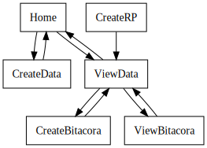

# Power App Documentation \- Portafolio

| Property                   | Value                                    |
| -------------------------- | ---------------------------------------- |
| App Name                   | Portafolio                               |
| App Logo                   |   |
| Documentation generated at | domingo, 30 de abril de 2023 02:46 p. m. |

- [Overview](index-Portafolio.md)
- [App Details](appdetails-Portafolio.md)
- [Variables](variables-Portafolio.md)
- [DataSources](datasources-Portafolio.md)
- [Resources](resources-Portafolio.md)
- [Controls](controls-Portafolio.md)

## Controls Overview

A total of 7 Screens are located in the app.

A total of 3022 Controls are located in the app.

### [Screen: CreateBitacora](screen-CreateBitacora-Portafolio.md)

- [ CreateBitacora](screen-CreateBitacora-Portafolio.md)
- - [ ContainerPage\_3](screen-CreateBitacora-Portafolio.md)
  - - [ ContainerFooter\_3](screen-CreateBitacora-Portafolio.md)
    - - [ NavBar\_3](screen-CreateBitacora-Portafolio.md)
      - - [ Container2\_4](screen-CreateBitacora-Portafolio.md)
        - - [ ButtonCreate\_11](screen-CreateBitacora-Portafolio.md)
      - - [ Container2\_5](screen-CreateBitacora-Portafolio.md)
  - - [ ContainerHeader\_3](screen-CreateBitacora-Portafolio.md)
    - - [ HeaderTitle\_3](screen-CreateBitacora-Portafolio.md)
      - - [ HeaderTitleLogo\_3](screen-CreateBitacora-Portafolio.md)
      - - [ HeaderTitleName\_3](screen-CreateBitacora-Portafolio.md)
    - - [ HeaderUser\_3](screen-CreateBitacora-Portafolio.md)
      - - [ HeaderUserImage\_3](screen-CreateBitacora-Portafolio.md)
      - - [ HeaderUserName\_3](screen-CreateBitacora-Portafolio.md)
  - - [ ContainerInferior\_3](screen-CreateBitacora-Portafolio.md)
    - - [ BasicInfo\_2](screen-CreateBitacora-Portafolio.md)
      - - [ MainInfo\_2](screen-CreateBitacora-Portafolio.md)
        - - [ FormCreateBit](screen-CreateBitacora-Portafolio.md)
          - - [ Agreements\_DataCard1](screen-CreateBitacora-Portafolio.md)
            - - [ DataCardKey75](screen-CreateBitacora-Portafolio.md)
            - - [ DataCardValue66](screen-CreateBitacora-Portafolio.md)
            - - [ ErrorMessage78](screen-CreateBitacora-Portafolio.md)
            - - [ StarVisible78](screen-CreateBitacora-Portafolio.md)
          - - [ DataCard31](screen-CreateBitacora-Portafolio.md)
            - - [ BaseTitleTextO\_24](screen-CreateBitacora-Portafolio.md)
          - - [ DataCard32](screen-CreateBitacora-Portafolio.md)
            - - [ ButtonCreate\_15](screen-CreateBitacora-Portafolio.md)
          - - [ Decisions Required\_DataCard1](screen-CreateBitacora-Portafolio.md)
            - - [ DataCardKey76](screen-CreateBitacora-Portafolio.md)
            - - [ DataCardValue68](screen-CreateBitacora-Portafolio.md)
            - - [ ErrorMessage79](screen-CreateBitacora-Portafolio.md)
            - - [ StarVisible79](screen-CreateBitacora-Portafolio.md)
          - - [ Description\_DataCard1](screen-CreateBitacora-Portafolio.md)
            - - [ DataCardKey74](screen-CreateBitacora-Portafolio.md)
            - - [ DataCardValue61](screen-CreateBitacora-Portafolio.md)
            - - [ ErrorMessage77](screen-CreateBitacora-Portafolio.md)
            - - [ StarVisible77](screen-CreateBitacora-Portafolio.md)
          - - [ Evidence\_DataCard1](screen-CreateBitacora-Portafolio.md)
            - - [ DataCardKey77](screen-CreateBitacora-Portafolio.md)
            - - [ DataCardValue70](screen-CreateBitacora-Portafolio.md)
            - - [ ErrorMessage80](screen-CreateBitacora-Portafolio.md)
            - - [ StarVisible80](screen-CreateBitacora-Portafolio.md)
          - - [ Fecha de Evento\_DataCard1](screen-CreateBitacora-Portafolio.md)
            - - [ DataCardKey73](screen-CreateBitacora-Portafolio.md)
            - - [ DataCardValue16](screen-CreateBitacora-Portafolio.md)
            - - [ ErrorMessage76](screen-CreateBitacora-Portafolio.md)
            - - [ StarVisible76](screen-CreateBitacora-Portafolio.md)
          - - [ Hito de Proceso\_DataCard1](screen-CreateBitacora-Portafolio.md)
            - - [ ComboBox1\_45](screen-CreateBitacora-Portafolio.md)
            - - [ DataCardKey142](screen-CreateBitacora-Portafolio.md)
            - - [ ErrorMessage145](screen-CreateBitacora-Portafolio.md)
            - - [ StarVisible145](screen-CreateBitacora-Portafolio.md)
          - - [ Process Status\_DataCard1](screen-CreateBitacora-Portafolio.md)
            - - [ ComboBox1\_44](screen-CreateBitacora-Portafolio.md)
            - - [ DataCardKey141](screen-CreateBitacora-Portafolio.md)
            - - [ DataCardValue10\_2](screen-CreateBitacora-Portafolio.md)
            - - [ ErrorMessage144](screen-CreateBitacora-Portafolio.md)
            - - [ StarVisible144](screen-CreateBitacora-Portafolio.md)
          - - [ Project Name\_DataCard1](screen-CreateBitacora-Portafolio.md)
            - - [ DataCardKey71](screen-CreateBitacora-Portafolio.md)
            - - [ DataCardValue8](screen-CreateBitacora-Portafolio.md)
            - - [ ErrorMessage74](screen-CreateBitacora-Portafolio.md)
            - - [ StarVisible74](screen-CreateBitacora-Portafolio.md)
          - - [ Título\_DataCard1](screen-CreateBitacora-Portafolio.md)
            - - [ DataCardKey68](screen-CreateBitacora-Portafolio.md)
            - - [ DataCardValue7](screen-CreateBitacora-Portafolio.md)
            - - [ ErrorMessage71](screen-CreateBitacora-Portafolio.md)
          - - [ User\_DataCard1](screen-CreateBitacora-Portafolio.md)
            - - [ DataCardKey72](screen-CreateBitacora-Portafolio.md)
            - - [ DataCardValue10](screen-CreateBitacora-Portafolio.md)
            - - [ ErrorMessage75](screen-CreateBitacora-Portafolio.md)
            - - [ StarVisible75](screen-CreateBitacora-Portafolio.md)

### [Screen: CreateData](screen-CreateData-Portafolio.md)

- [ CreateData](screen-CreateData-Portafolio.md)
- - [ ContainerPage\_2](screen-CreateData-Portafolio.md)
  - - [ ContainerFooter\_2](screen-CreateData-Portafolio.md)
    - - [ NavBar\_2](screen-CreateData-Portafolio.md)
      - - [ Container2\_2](screen-CreateData-Portafolio.md)
        - - [ ButtonCreate\_2](screen-CreateData-Portafolio.md)
      - - [ Container2\_3](screen-CreateData-Portafolio.md)
  - - [ ContainerHeader\_2](screen-CreateData-Portafolio.md)
    - - [ HeaderTitle\_2](screen-CreateData-Portafolio.md)
      - - [ HeaderTitleLogo\_2](screen-CreateData-Portafolio.md)
      - - [ HeaderTitleName\_2](screen-CreateData-Portafolio.md)
    - - [ HeaderUser\_2](screen-CreateData-Portafolio.md)
      - - [ HeaderUserImage\_2](screen-CreateData-Portafolio.md)
      - - [ HeaderUserName\_2](screen-CreateData-Portafolio.md)
  - - [ ContainerInferior\_2](screen-CreateData-Portafolio.md)
    - - [ BasicInfo\_1](screen-CreateData-Portafolio.md)
      - - [ MainInfo\_1](screen-CreateData-Portafolio.md)
        - - [ FormCreate](screen-CreateData-Portafolio.md)
          - - [ Aggregation ID\_DataCard2\_1](screen-CreateData-Portafolio.md)
            - - [ DataCardKey182\_1](screen-CreateData-Portafolio.md)
            - - [ DataCardValue182\_1](screen-CreateData-Portafolio.md)
            - - [ ErrorMessage2\_1](screen-CreateData-Portafolio.md)
            - - [ StarVisible2\_1](screen-CreateData-Portafolio.md)
          - - [ DataCard1\_13](screen-CreateData-Portafolio.md)
            - - [ ButtonCreate\_16](screen-CreateData-Portafolio.md)
          - - [ Mercuria Cycle\_DataCard2\_1](screen-CreateData-Portafolio.md)
            - - [ DataCardKey183\_1](screen-CreateData-Portafolio.md)
            - - [ DataCardValue183\_1](screen-CreateData-Portafolio.md)
            - - [ ErrorMessage3\_1](screen-CreateData-Portafolio.md)
            - - [ StarVisible3\_1](screen-CreateData-Portafolio.md)
          - - [ Project ID\_DataCard2\_1](screen-CreateData-Portafolio.md)
            - - [ DataCardKey184\_1](screen-CreateData-Portafolio.md)
            - - [ DataCardValue184\_1](screen-CreateData-Portafolio.md)
            - - [ ErrorMessage4\_1](screen-CreateData-Portafolio.md)
            - - [ StarVisible4\_1](screen-CreateData-Portafolio.md)
          - - [ Project Name\_DataCard2\_1](screen-CreateData-Portafolio.md)
            - - [ DataCardKey358\_1](screen-CreateData-Portafolio.md)
            - - [ DataCardValue358\_1](screen-CreateData-Portafolio.md)
            - - [ ErrorMessage178\_1](screen-CreateData-Portafolio.md)
            - - [ StarVisible178\_1](screen-CreateData-Portafolio.md)
          - - [ SectionTitleO\_1](screen-CreateData-Portafolio.md)
            - - [ BaseTitleTextO\_23](screen-CreateData-Portafolio.md)

### [Screen: CreateRP](screen-CreateRP-Portafolio.md)

- [ CreateRP](screen-CreateRP-Portafolio.md)
- - [ ContainerPage\_5](screen-CreateRP-Portafolio.md)
  - - [ ContainerFooter\_5](screen-CreateRP-Portafolio.md)
    - - [ NavBar\_5](screen-CreateRP-Portafolio.md)
      - - [ Container2\_8](screen-CreateRP-Portafolio.md)
        - - [ ButtonCreate\_25](screen-CreateRP-Portafolio.md)
      - - [ Container2\_9](screen-CreateRP-Portafolio.md)
  - - [ ContainerHeader\_5](screen-CreateRP-Portafolio.md)
    - - [ HeaderTitle\_5](screen-CreateRP-Portafolio.md)
      - - [ HeaderTitleLogo\_5](screen-CreateRP-Portafolio.md)
      - - [ HeaderTitleName\_5](screen-CreateRP-Portafolio.md)
    - - [ HeaderUser\_5](screen-CreateRP-Portafolio.md)
      - - [ HeaderUserImage\_5](screen-CreateRP-Portafolio.md)
      - - [ HeaderUserName\_5](screen-CreateRP-Portafolio.md)
  - - [ ContainerInferior\_5](screen-CreateRP-Portafolio.md)
    - - [ BasicInfo\_4](screen-CreateRP-Portafolio.md)
      - - [ MainInfo\_4](screen-CreateRP-Portafolio.md)
        - - [ FormCreateRP](screen-CreateRP-Portafolio.md)
          - - [ Component (Project Name)\_DataCard1](screen-CreateRP-Portafolio.md)
            - - [ DataCardKey147](screen-CreateRP-Portafolio.md)
            - - [ DataCardValue75](screen-CreateRP-Portafolio.md)
            - - [ ErrorMessage150](screen-CreateRP-Portafolio.md)
            - - [ StarVisible149](screen-CreateRP-Portafolio.md)
          - - [ DataCard34](screen-CreateRP-Portafolio.md)
            - - [ ButtonCreate\_24](screen-CreateRP-Portafolio.md)
          - - [ Group\_DataCard1](screen-CreateRP-Portafolio.md)
            - - [ DataCardKey149](screen-CreateRP-Portafolio.md)
            - - [ DataCardValue77](screen-CreateRP-Portafolio.md)
            - - [ ErrorMessage152](screen-CreateRP-Portafolio.md)
            - - [ StarVisible151](screen-CreateRP-Portafolio.md)
          - - [ Iss D\_DataCard1](screen-CreateRP-Portafolio.md)
            - - [ DataCardKey169](screen-CreateRP-Portafolio.md)
            - - [ DataCardValue147](screen-CreateRP-Portafolio.md)
            - - [ ErrorMessage172](screen-CreateRP-Portafolio.md)
            - - [ StarVisible171](screen-CreateRP-Portafolio.md)
          - - [ Iss\-D\_DataCard1](screen-CreateRP-Portafolio.md)
            - - [ DataCardKey468](screen-CreateRP-Portafolio.md)
            - - [ DataCardValue414](screen-CreateRP-Portafolio.md)
          - - [ N\_ISS\_VOL APP\_DataCard1](screen-CreateRP-Portafolio.md)
            - - [ DataCardKey143](screen-CreateRP-Portafolio.md)
            - - [ DataCardValue71](screen-CreateRP-Portafolio.md)
            - - [ ErrorMessage146](screen-CreateRP-Portafolio.md)
            - - [ StarVisible71](screen-CreateRP-Portafolio.md)
          - - [ N\-Iss\-Vol\_DataCard1](screen-CreateRP-Portafolio.md)
            - - [ DataCardKey249](screen-CreateRP-Portafolio.md)
            - - [ DataCardValue165](screen-CreateRP-Portafolio.md)
          - - [ Project (Aggregated)\_DataCard1](screen-CreateRP-Portafolio.md)
            - - [ DataCardKey146](screen-CreateRP-Portafolio.md)
            - - [ DataCardValue74](screen-CreateRP-Portafolio.md)
            - - [ ErrorMessage149](screen-CreateRP-Portafolio.md)
            - - [ StarVisible148](screen-CreateRP-Portafolio.md)
          - - [ ProjectID\_DataCard1](screen-CreateRP-Portafolio.md)
            - - [ DataCardKey485](screen-CreateRP-Portafolio.md)
            - - [ DataCardValue431](screen-CreateRP-Portafolio.md)
            - - [ ErrorMessage250](screen-CreateRP-Portafolio.md)
            - - [ StarVisible249](screen-CreateRP-Portafolio.md)
          - - [ RP End\_DataCard1](screen-CreateRP-Portafolio.md)
            - - [ DataCardKey157](screen-CreateRP-Portafolio.md)
            - - [ DataCardValue136](screen-CreateRP-Portafolio.md)
            - - [ ErrorMessage160](screen-CreateRP-Portafolio.md)
            - - [ StarVisible159](screen-CreateRP-Portafolio.md)
          - - [ RP ID\_DataCard1](screen-CreateRP-Portafolio.md)
            - - [ DataCardKey144](screen-CreateRP-Portafolio.md)
            - - [ DataCardValue72](screen-CreateRP-Portafolio.md)
            - - [ ErrorMessage147](screen-CreateRP-Portafolio.md)
            - - [ StarVisible146](screen-CreateRP-Portafolio.md)
          - - [ Rp St\_DataCard1](screen-CreateRP-Portafolio.md)
            - - [ DataCardKey155](screen-CreateRP-Portafolio.md)
            - - [ DataCardValue134](screen-CreateRP-Portafolio.md)
            - - [ ErrorMessage158](screen-CreateRP-Portafolio.md)
            - - [ StarVisible157](screen-CreateRP-Portafolio.md)
          - - [ RP\-st\-status\_DataCard1](screen-CreateRP-Portafolio.md)
            - - [ DataCardKey483](screen-CreateRP-Portafolio.md)
            - - [ DataCardValue429](screen-CreateRP-Portafolio.md)
          - - [ Ve Vol\_DataCard1](screen-CreateRP-Portafolio.md)
            - - [ DataCardKey168](screen-CreateRP-Portafolio.md)
            - - [ DataCardValue146](screen-CreateRP-Portafolio.md)
            - - [ ErrorMessage171](screen-CreateRP-Portafolio.md)
            - - [ StarVisible170](screen-CreateRP-Portafolio.md)
          - - [ Ve\-End\_DataCard1](screen-CreateRP-Portafolio.md)
            - - [ DataCardKey248](screen-CreateRP-Portafolio.md)
            - - [ DataCardValue164](screen-CreateRP-Portafolio.md)
          - - [ Ve\-St\_DataCard1](screen-CreateRP-Portafolio.md)
            - - [ DataCardKey247](screen-CreateRP-Portafolio.md)
            - - [ DataCardValue163](screen-CreateRP-Portafolio.md)

### [Screen: Home](screen-Home-Portafolio.md)

- [ Home](screen-Home-Portafolio.md)
- - [ ContainerPage](screen-Home-Portafolio.md)
  - - [ ContainerFooter](screen-Home-Portafolio.md)
    - - [ NavBar](screen-Home-Portafolio.md)
      - - [ Container4](screen-Home-Portafolio.md)
        - - [ ButtonInspect\_1](screen-Home-Portafolio.md)
      - - [ Container5](screen-Home-Portafolio.md)
        - - [ ButtonInspect](screen-Home-Portafolio.md)
  - - [ ContainerHeader](screen-Home-Portafolio.md)
    - - [ HeaderTitle](screen-Home-Portafolio.md)
      - - [ HeaderTitleLogo](screen-Home-Portafolio.md)
      - - [ HeaderTitleName](screen-Home-Portafolio.md)
    - - [ HeaderUser](screen-Home-Portafolio.md)
      - - [ HeaderUserImage](screen-Home-Portafolio.md)
      - - [ HeaderUserName](screen-Home-Portafolio.md)
  - - [ ContainerInferior](screen-Home-Portafolio.md)
    - - [ SearchFilterBar](screen-Home-Portafolio.md)
      - - [ FilterBar](screen-Home-Portafolio.md)
        - - [ Filter](screen-Home-Portafolio.md)
      - - [ SearchBar](screen-Home-Portafolio.md)
        - - [ Icon1](screen-Home-Portafolio.md)
        - - [ InpSearch](screen-Home-Portafolio.md)
- - [ DataPortafolio](screen-Home-Portafolio.md)
  - - [ ActivityAreahaN\_Column1](screen-Home-Portafolio.md)
  - - [ Additionality\_Columna1](screen-Home-Portafolio.md)
  - - [ Aggregation ID\_Column1](screen-Home-Portafolio.md)
  - - [ ANNUALOMCTSYEAR2021\_Column1](screen-Home-Portafolio.md)
  - - [ ANNUALOMCTSYEAR2022\_Column1](screen-Home-Portafolio.md)
  - - [ ANNUALOMCTSYEAR2023\_Column1](screen-Home-Portafolio.md)
  - - [ ANNUALOMCTSYEAR2024\_Column1](screen-Home-Portafolio.md)
  - - [ ANNUALOMCTSYEAR2025\_Column1](screen-Home-Portafolio.md)
  - - [ ANNUALOMCTSYEAR2026\_Column1](screen-Home-Portafolio.md)
  - - [ ANNUALOMCTSYEAR2027\_Column1](screen-Home-Portafolio.md)
  - - [ ANNUALOMCTSYEAR2028\_Column1](screen-Home-Portafolio.md)
  - - [ ANNUALOMCTSYEAR2029\_Column1](screen-Home-Portafolio.md)
  - - [ ANNUALOMCTSYEAR2030\_Column1](screen-Home-Portafolio.md)
  - - [ ANNUALOMCTSYEAR2031\_Column1](screen-Home-Portafolio.md)
  - - [ AOMCDYEAR2021\_Column1](screen-Home-Portafolio.md)
  - - [ AOMCDYEAR2022\_Column1](screen-Home-Portafolio.md)
  - - [ AOMCDYEAR2023\_Column1](screen-Home-Portafolio.md)
  - - [ AOMCDYEAR2024\_Column1](screen-Home-Portafolio.md)
  - - [ AOMCDYEAR2025\_Column1](screen-Home-Portafolio.md)
  - - [ AOMCDYEAR2026\_Column1](screen-Home-Portafolio.md)
  - - [ AOMCDYEAR2027\_Column1](screen-Home-Portafolio.md)
  - - [ AOMCDYEAR2028\_Column1](screen-Home-Portafolio.md)
  - - [ AOMCDYEAR2029\_Column1](screen-Home-Portafolio.md)
  - - [ AOMCDYEAR2030\_Column1](screen-Home-Portafolio.md)
  - - [ AOMCDYEAR2031\_Column1](screen-Home-Portafolio.md)
  - - [ ApprovedBuyer\_Columna1](screen-Home-Portafolio.md)
  - - [ ApprovedbyCounterpartProjectStar\_Columna1](screen-Home-Portafolio.md)
  - - [ Biodiversity\_Columna1](screen-Home-Portafolio.md)
  - - [ BLInventoryEndDate\_Column1](screen-Home-Portafolio.md)
  - - [ BLInventoryStartDate\_Column1](screen-Home-Portafolio.md)
  - - [ Buyer\_Columna1](screen-Home-Portafolio.md)
  - - [ CAROnsiteVerificationn\_Column1](screen-Home-Portafolio.md)
  - - [ CBACalculatorVersion\_Columna1](screen-Home-Portafolio.md)
  - - [ CBAFile\_x0028\_Reference\_x0029\_\_Columna1](screen-Home-Portafolio.md)
  - - [ CBCompleted\_x003f\_\_Columna1](screen-Home-Portafolio.md)
  - - [ CBRequestedtoRANDate\_Columna1](screen-Home-Portafolio.md)
  - - [ CCBSOnisiteVerificationn\_Column1](screen-Home-Portafolio.md)
  - - [ Confidence\_x0020\_of\_x0020\_Upfron\_Columna1](screen-Home-Portafolio.md)
  - - [ Contingencyn\_Column1](screen-Home-Portafolio.md)
  - - [ Created\_Columna1](screen-Home-Portafolio.md)
  - - [ CreditType\_Columna1](screen-Home-Portafolio.md)
  - - [ CRTs2021\_Column1](screen-Home-Portafolio.md)
  - - [ CRTs2022\_Column1](screen-Home-Portafolio.md)
  - - [ CRTs2023\_Column1](screen-Home-Portafolio.md)
  - - [ CRTs2024\_Column1](screen-Home-Portafolio.md)
  - - [ CRTs2025\_Column1](screen-Home-Portafolio.md)
  - - [ CRTs2026\_Column1](screen-Home-Portafolio.md)
  - - [ CRTs2027\_Column1](screen-Home-Portafolio.md)
  - - [ CRTs2028\_Column1](screen-Home-Portafolio.md)
  - - [ CRTs2029\_Column1](screen-Home-Portafolio.md)
  - - [ CRTs2030\_Column1](screen-Home-Portafolio.md)
  - - [ CRTs2031\_Column1](screen-Home-Portafolio.md)
  - - [ CRTs2032\_Column1](screen-Home-Portafolio.md)
  - - [ CRTs2033\_Column1](screen-Home-Portafolio.md)
  - - [ CRTs2034\_Column1](screen-Home-Portafolio.md)
  - - [ CRTs2035\_Column1](screen-Home-Portafolio.md)
  - - [ CRTs2036\_Column1](screen-Home-Portafolio.md)
  - - [ CRTs2037\_Column1](screen-Home-Portafolio.md)
  - - [ CRTs2038\_Column1](screen-Home-Portafolio.md)
  - - [ CRTs2039\_Column1](screen-Home-Portafolio.md)
  - - [ CRTs2040\_Column1](screen-Home-Portafolio.md)
  - - [ CRTs2041\_Column1](screen-Home-Portafolio.md)
  - - [ CRTs2042\_Column1](screen-Home-Portafolio.md)
  - - [ CRTs2043\_Column1](screen-Home-Portafolio.md)
  - - [ CRTs2044\_Column1](screen-Home-Portafolio.md)
  - - [ CRTs2045\_Column1](screen-Home-Portafolio.md)
  - - [ CRTs2046\_Column1](screen-Home-Portafolio.md)
  - - [ CRTs2047\_Column1](screen-Home-Portafolio.md)
  - - [ CRTs2048\_Column1](screen-Home-Portafolio.md)
  - - [ CRTs2049\_Column1](screen-Home-Portafolio.md)
  - - [ CRTs2050\_Column1](screen-Home-Portafolio.md)
  - - [ DaysofAccreditation1stCreditingP\_Columna1](screen-Home-Portafolio.md)
  - - [ DDPacktoMESubmiDDPacktoMESubmiss\_Columna1](screen-Home-Portafolio.md)
  - - [ Descripcion\_Columna1](screen-Home-Portafolio.md)
  - - [ DevelopmentLead\_Columna1](screen-Home-Portafolio.md)
  - - [ DevelopmentStatus\_Columna1](screen-Home-Portafolio.md)
  - - [ ERPAApprovalDate\_Columna1](screen-Home-Portafolio.md)
  - - [ ERPASignedDate\_Columna1](screen-Home-Portafolio.md)
  - - [ ERsCalculatorVersion\_Columna1](screen-Home-Portafolio.md)
  - - [ EstimatedUpfrontCostUSD\_Column1](screen-Home-Portafolio.md)
  - - [ Expected2ndCreditingPeriodStartD\_Columna1](screen-Home-Portafolio.md)
  - - [ HS\_Columna1](screen-Home-Portafolio.md)
  - - [ Humanrights\_Columna1](screen-Home-Portafolio.md)
  - - [ ImplementationPartner\_Columna1](screen-Home-Portafolio.md)
  - - [ Indigenouspeoples\_x002f\_cultural\_Columna1](screen-Home-Portafolio.md)
  - - [ KYCtoMESubmissionDate\_Column1](screen-Home-Portafolio.md)
  - - [ LandTenureType\_Columna1](screen-Home-Portafolio.md)
  - - [ LastPPTtoProjectCounterpart\_Columna1](screen-Home-Portafolio.md)
  - - [ Leakeage\_Column1](screen-Home-Portafolio.md)
  - - [ LegalDDStatus\_Columna1](screen-Home-Portafolio.md)
  - - [ LegalLead\_Columna1](screen-Home-Portafolio.md)
  - - [ LicensesPermits\_Columna1](screen-Home-Portafolio.md)
  - - [ LoISignedDate\_Columna1](screen-Home-Portafolio.md)
  - - [ MEKYCstatus\_Columna1](screen-Home-Portafolio.md)
  - - [ Mercuria Cycle\_Column1](screen-Home-Portafolio.md)
  - - [ MercuriaDDstatus\_Columna1](screen-Home-Portafolio.md)
  - - [ Methodology\_Columna1](screen-Home-Portafolio.md)
  - - [ MonitoringBaselinen\_Column1](screen-Home-Portafolio.md)
  - - [ MRVLead\_Column1](screen-Home-Portafolio.md)
  - - [ MRVRequirements\_Column1](screen-Home-Portafolio.md)
  - - [ MRVStatus\_Column1](screen-Home-Portafolio.md)
  - - [ Municipality\_x0028\_ies\_x0029\_\_Columna1](screen-Home-Portafolio.md)
  - - [ NegativeEHS\_Columna1](screen-Home-Portafolio.md)
  - - [ No\_x002e\_PHINA\_Columna1](screen-Home-Portafolio.md)
  - - [ OMCostUSD\_Column1](screen-Home-Portafolio.md)
  - - [ OnesiteImplementationn\_Column1](screen-Home-Portafolio.md)
  - - [ OriginationLead\_Columna1](screen-Home-Portafolio.md)
  - - [ OriginationPromoter\_Columna1](screen-Home-Portafolio.md)
  - - [ OriginationStatus\_Columna1](screen-Home-Portafolio.md)
  - - [ Originatonn\_Column1](screen-Home-Portafolio.md)
  - - [ PDDDevelopmentn\_Column1](screen-Home-Portafolio.md)
  - - [ Permanence\_Column1](screen-Home-Portafolio.md)
  - - [ Press\_x002d\_negative\_Columna1](screen-Home-Portafolio.md)
  - - [ Program\_Columna1](screen-Home-Portafolio.md)
  - - [ Project ID\_Column1](screen-Home-Portafolio.md)
  - - [ ProjectAggregator\_Columna1](screen-Home-Portafolio.md)
  - - [ ProjectAlive\_x003f\_\_Columna1](screen-Home-Portafolio.md)
  - - [ ProjectApprovalDate\_Columna1](screen-Home-Portafolio.md)
  - - [ ProjectAreaha\_Column1](screen-Home-Portafolio.md)
  - - [ ProjectCondition\_Columna1](screen-Home-Portafolio.md)
  - - [ ProjectCoordinator\_Column1](screen-Home-Portafolio.md)
  - - [ ProjectCoordinatorTerm\_Column1](screen-Home-Portafolio.md)
  - - [ ProjectCounterpart\_Columna1](screen-Home-Portafolio.md)
  - - [ ProjectDeveloper\_Column1](screen-Home-Portafolio.md)
  - - [ ProjectName\_Column1](screen-Home-Portafolio.md)
  - - [ ProjectoType\_Columna1](screen-Home-Portafolio.md)
  - - [ ProspectPriority\_Columna1](screen-Home-Portafolio.md)
  - - [ RegistrationRoute\_Columna1](screen-Home-Portafolio.md)
  - - [ Registry\_Columna1](screen-Home-Portafolio.md)
  - - [ ReversalRisk\_x0028\_removals\_x002\_Column1](screen-Home-Portafolio.md)
  - - [ Safeguards\_x002f\_noharmapproach\_Columna1](screen-Home-Portafolio.md)
  - - [ SafeguardsLead\_Columna1](screen-Home-Portafolio.md)
  - - [ SampleSize\_Column1](screen-Home-Portafolio.md)
  - - [ SDGclaims\_Columna1](screen-Home-Portafolio.md)
  - - [ Shareholdersengagement\_Columna1](screen-Home-Portafolio.md)
  - - [ Social\_x002f\_Communitynoharm\_Columna1](screen-Home-Portafolio.md)
  - - [ SpecificConditionsPrescendent\_Column1](screen-Home-Portafolio.md)
  - - [ State\_Column1](screen-Home-Portafolio.md)
  - - [ StatusSafeguards\_Columna1](screen-Home-Portafolio.md)
  - - [ TotalCERT10YRStCO2\_Column1](screen-Home-Portafolio.md)
  - - [ Totaln\_Column1](screen-Home-Portafolio.md)
  - - [ TransactionType\_Columna1](screen-Home-Portafolio.md)
  - - [ UCDYEAR2021\_Column1](screen-Home-Portafolio.md)
  - - [ UCDYEAR2022\_Column1](screen-Home-Portafolio.md)
  - - [ UCDYEAR2023\_Column1](screen-Home-Portafolio.md)
  - - [ UCDYEAR2024\_Column1](screen-Home-Portafolio.md)
  - - [ UCDYEAR2025\_Column1](screen-Home-Portafolio.md)
  - - [ UCDYEAR2026\_Column1](screen-Home-Portafolio.md)
  - - [ UCDYEAR2027\_Column1](screen-Home-Portafolio.md)
  - - [ UCDYEAR2028\_Column1](screen-Home-Portafolio.md)
  - - [ UCDYEAR2029\_Column1](screen-Home-Portafolio.md)
  - - [ UCDYEAR2030\_Column1](screen-Home-Portafolio.md)
  - - [ UCDYEAR2031\_Column1](screen-Home-Portafolio.md)
  - - [ UnderlyingActivities\_Columna1](screen-Home-Portafolio.md)
  - - [ VerificationSupportn\_Column1](screen-Home-Portafolio.md)
- - [ LabelMantenimiento](screen-Home-Portafolio.md)

### [Screen: Inventario\_mrv](screen-Inventario_mrv-Portafolio.md)

- [ Inventario\_mrv](screen-Inventario_mrv-Portafolio.md)
- - [ DataTable1](screen-Inventario_mrv-Portafolio.md)
  - - [ altura\_Columna1](screen-Inventario_mrv-Portafolio.md)
  - - [ defecto bajo\_Columna1](screen-Inventario_mrv-Portafolio.md)
  - - [ defecto medio\_Columna1](screen-Inventario_mrv-Portafolio.md)
  - - [ defecto superior\_Columna1](screen-Inventario_mrv-Portafolio.md)
  - - [ diametro\_Columna1](screen-Inventario_mrv-Portafolio.md)
  - - [ especie\_Columna1](screen-Inventario_mrv-Portafolio.md)
  - - [ id muestreo\_Columna1](screen-Inventario_mrv-Portafolio.md)
  - - [ longitud de copa\_Columna1](screen-Inventario_mrv-Portafolio.md)
  - - [ numero de arbol\_Columna1](screen-Inventario_mrv-Portafolio.md)
  - - [ referencia a\_Columna1](screen-Inventario_mrv-Portafolio.md)
  - - [ referencia b\_Columna1](screen-Inventario_mrv-Portafolio.md)
  - - [ vigor\_Columna1](screen-Inventario_mrv-Portafolio.md)
- - [ ScreenContainer1](screen-Inventario_mrv-Portafolio.md)
  - - [ HeaderContainer1](screen-Inventario_mrv-Portafolio.md)
    - - [ HeaderTitle\_6](screen-Inventario_mrv-Portafolio.md)
      - - [ HeaderTitleLogo\_6](screen-Inventario_mrv-Portafolio.md)
      - - [ HeaderTitleName\_6](screen-Inventario_mrv-Portafolio.md)
      - - [ HeaderTitleName\_7](screen-Inventario_mrv-Portafolio.md)

### [Screen: ViewBitacora](screen-ViewBitacora-Portafolio.md)

- [ ViewBitacora](screen-ViewBitacora-Portafolio.md)
- - [ ContainerPage\_4](screen-ViewBitacora-Portafolio.md)
  - - [ ContainerFooter\_4](screen-ViewBitacora-Portafolio.md)
    - - [ NavBar\_4](screen-ViewBitacora-Portafolio.md)
      - - [ Container2\_6](screen-ViewBitacora-Portafolio.md)
        - - [ ButtonCreate\_22](screen-ViewBitacora-Portafolio.md)
      - - [ Container2\_7](screen-ViewBitacora-Portafolio.md)
        - - [ ButtonCreate\_23](screen-ViewBitacora-Portafolio.md)
  - - [ ContainerHeader\_4](screen-ViewBitacora-Portafolio.md)
    - - [ HeaderTitle\_4](screen-ViewBitacora-Portafolio.md)
      - - [ HeaderTitleLogo\_4](screen-ViewBitacora-Portafolio.md)
      - - [ HeaderTitleName\_4](screen-ViewBitacora-Portafolio.md)
    - - [ HeaderUser\_4](screen-ViewBitacora-Portafolio.md)
      - - [ HeaderUserImage\_4](screen-ViewBitacora-Portafolio.md)
      - - [ HeaderUserName\_4](screen-ViewBitacora-Portafolio.md)
  - - [ ContainerInferior\_4](screen-ViewBitacora-Portafolio.md)
    - - [ BasicInfo\_3](screen-ViewBitacora-Portafolio.md)
      - - [ MainInfo\_3](screen-ViewBitacora-Portafolio.md)
        - - [ FormEditBit](screen-ViewBitacora-Portafolio.md)
          - - [ Agreements\_DataCard1\_1](screen-ViewBitacora-Portafolio.md)
            - - [ DataCardKey75\_1](screen-ViewBitacora-Portafolio.md)
            - - [ DataCardValue66\_1](screen-ViewBitacora-Portafolio.md)
            - - [ ErrorMessage78\_1](screen-ViewBitacora-Portafolio.md)
            - - [ StarVisible78\_1](screen-ViewBitacora-Portafolio.md)
          - - [ DataCard31\_1](screen-ViewBitacora-Portafolio.md)
            - - [ BaseTitleTextO\_25](screen-ViewBitacora-Portafolio.md)
          - - [ DataCard33](screen-ViewBitacora-Portafolio.md)
            - - [ ButtonCreate\_17](screen-ViewBitacora-Portafolio.md)
          - - [ Decisions Required\_DataCard1\_1](screen-ViewBitacora-Portafolio.md)
            - - [ DataCardKey76\_1](screen-ViewBitacora-Portafolio.md)
            - - [ DataCardValue68\_1](screen-ViewBitacora-Portafolio.md)
            - - [ ErrorMessage79\_1](screen-ViewBitacora-Portafolio.md)
            - - [ StarVisible79\_1](screen-ViewBitacora-Portafolio.md)
          - - [ Description\_DataCard1\_1](screen-ViewBitacora-Portafolio.md)
            - - [ DataCardKey74\_1](screen-ViewBitacora-Portafolio.md)
            - - [ DataCardValue61\_1](screen-ViewBitacora-Portafolio.md)
            - - [ ErrorMessage77\_1](screen-ViewBitacora-Portafolio.md)
            - - [ StarVisible77\_1](screen-ViewBitacora-Portafolio.md)
          - - [ Evidence\_DataCard1\_1](screen-ViewBitacora-Portafolio.md)
            - - [ DataCardKey77\_1](screen-ViewBitacora-Portafolio.md)
            - - [ DataCardValue70\_1](screen-ViewBitacora-Portafolio.md)
            - - [ ErrorMessage80\_1](screen-ViewBitacora-Portafolio.md)
            - - [ HtmlText2\_40](screen-ViewBitacora-Portafolio.md)
            - - [ StarVisible80\_1](screen-ViewBitacora-Portafolio.md)
          - - [ Fecha de Evento\_DataCard1\_1](screen-ViewBitacora-Portafolio.md)
            - - [ DataCardKey73\_1](screen-ViewBitacora-Portafolio.md)
            - - [ DataCardValue16\_1](screen-ViewBitacora-Portafolio.md)
            - - [ ErrorMessage76\_1](screen-ViewBitacora-Portafolio.md)
            - - [ StarVisible76\_1](screen-ViewBitacora-Portafolio.md)
          - - [ Hito de Proceso\_DataCard1\_1](screen-ViewBitacora-Portafolio.md)
            - - [ ComboBox1\_47](screen-ViewBitacora-Portafolio.md)
            - - [ DataCardKey142\_1](screen-ViewBitacora-Portafolio.md)
            - - [ ErrorMessage145\_1](screen-ViewBitacora-Portafolio.md)
            - - [ StarVisible145\_1](screen-ViewBitacora-Portafolio.md)
          - - [ Process Status\_DataCard1\_1](screen-ViewBitacora-Portafolio.md)
            - - [ ComboBox1\_46](screen-ViewBitacora-Portafolio.md)
            - - [ DataCardKey141\_1](screen-ViewBitacora-Portafolio.md)
            - - [ DataCardValue10\_3](screen-ViewBitacora-Portafolio.md)
            - - [ ErrorMessage144\_1](screen-ViewBitacora-Portafolio.md)
            - - [ StarVisible144\_1](screen-ViewBitacora-Portafolio.md)
          - - [ Project Name\_DataCard1\_1](screen-ViewBitacora-Portafolio.md)
            - - [ DataCardKey71\_1](screen-ViewBitacora-Portafolio.md)
            - - [ DataCardValue8\_1](screen-ViewBitacora-Portafolio.md)
            - - [ ErrorMessage74\_1](screen-ViewBitacora-Portafolio.md)
            - - [ StarVisible74\_1](screen-ViewBitacora-Portafolio.md)
          - - [ Título\_DataCard1\_1](screen-ViewBitacora-Portafolio.md)
            - - [ DataCardKey68\_1](screen-ViewBitacora-Portafolio.md)
            - - [ DataCardValue7\_1](screen-ViewBitacora-Portafolio.md)
            - - [ ErrorMessage71\_1](screen-ViewBitacora-Portafolio.md)
          - - [ User\_DataCard1\_1](screen-ViewBitacora-Portafolio.md)
            - - [ DataCardKey72\_1](screen-ViewBitacora-Portafolio.md)
            - - [ DataCardValue10\_1](screen-ViewBitacora-Portafolio.md)
            - - [ ErrorMessage75\_1](screen-ViewBitacora-Portafolio.md)
            - - [ StarVisible75\_1](screen-ViewBitacora-Portafolio.md)

### [Screen: ViewData](screen-ViewData-Portafolio.md)

- [ ViewData](screen-ViewData-Portafolio.md)
- - [ ContainerPage\_1](screen-ViewData-Portafolio.md)
  - - [ ContainerFooter\_1](screen-ViewData-Portafolio.md)
    - - [ NavBar\_1](screen-ViewData-Portafolio.md)
      - - [ Container2](screen-ViewData-Portafolio.md)
        - - [ ButtonReturn](screen-ViewData-Portafolio.md)
      - - [ Container2\_1](screen-ViewData-Portafolio.md)
        - - [ ButtonReturn\_1](screen-ViewData-Portafolio.md)
        - - [ ButtonReturn\_2](screen-ViewData-Portafolio.md)
  - - [ ContainerHeader\_1](screen-ViewData-Portafolio.md)
    - - [ HeaderTitle\_1](screen-ViewData-Portafolio.md)
      - - [ HeaderTitleLogo\_1](screen-ViewData-Portafolio.md)
      - - [ HeaderTitleName\_1](screen-ViewData-Portafolio.md)
    - - [ HeaderUser\_1](screen-ViewData-Portafolio.md)
      - - [ HeaderUserImage\_1](screen-ViewData-Portafolio.md)
      - - [ HeaderUserName\_1](screen-ViewData-Portafolio.md)
  - - [ ContainerInferior\_1](screen-ViewData-Portafolio.md)
    - - [ BasicInfo](screen-ViewData-Portafolio.md)
      - - [ MainInfo](screen-ViewData-Portafolio.md)
        - - [ BarraSuperiorBitacora](screen-ViewData-Portafolio.md)
          - - [ SearchBar\_1](screen-ViewData-Portafolio.md)
            - - [ InpSearchBit](screen-ViewData-Portafolio.md)
            - - [ LabelBitacora](screen-ViewData-Portafolio.md)
        - - [ BarraSuperiorRP](screen-ViewData-Portafolio.md)
          - - [ InpSearchRP](screen-ViewData-Portafolio.md)
          - - [ LabelRPs](screen-ViewData-Portafolio.md)
        - - [ FormAnnualO&MCostsC3](screen-ViewData-Portafolio.md)
          - - [ Aggregation ID\_DataCard2\_10](screen-ViewData-Portafolio.md)
            - - [ DataCardKey182\_10](screen-ViewData-Portafolio.md)
            - - [ DataCardValue182\_10](screen-ViewData-Portafolio.md)
            - - [ ErrorMessage2\_10](screen-ViewData-Portafolio.md)
            - - [ StarVisible2\_10](screen-ViewData-Portafolio.md)
          - - [ ANNUAL O&M CTS YEAR 2021\_DataCard1](screen-ViewData-Portafolio.md)
            - - [ DataCardKey97](screen-ViewData-Portafolio.md)
            - - [ DataCardValue86](screen-ViewData-Portafolio.md)
            - - [ ErrorMessage100](screen-ViewData-Portafolio.md)
            - - [ StarVisible100](screen-ViewData-Portafolio.md)
          - - [ ANNUAL O&M CTS YEAR 2022\_DataCard1](screen-ViewData-Portafolio.md)
            - - [ DataCardKey98](screen-ViewData-Portafolio.md)
            - - [ DataCardValue87](screen-ViewData-Portafolio.md)
            - - [ ErrorMessage101](screen-ViewData-Portafolio.md)
            - - [ StarVisible101](screen-ViewData-Portafolio.md)
          - - [ ANNUAL O&M CTS YEAR 2023\_DataCard1](screen-ViewData-Portafolio.md)
            - - [ DataCardKey99](screen-ViewData-Portafolio.md)
            - - [ DataCardValue88](screen-ViewData-Portafolio.md)
            - - [ ErrorMessage102](screen-ViewData-Portafolio.md)
            - - [ StarVisible102](screen-ViewData-Portafolio.md)
          - - [ ANNUAL O&M CTS YEAR 2024\_DataCard1](screen-ViewData-Portafolio.md)
            - - [ DataCardKey100](screen-ViewData-Portafolio.md)
            - - [ DataCardValue89](screen-ViewData-Portafolio.md)
            - - [ ErrorMessage103](screen-ViewData-Portafolio.md)
            - - [ StarVisible103](screen-ViewData-Portafolio.md)
          - - [ ANNUAL O&M CTS YEAR 2025\_DataCard1](screen-ViewData-Portafolio.md)
            - - [ DataCardKey101](screen-ViewData-Portafolio.md)
            - - [ DataCardValue90](screen-ViewData-Portafolio.md)
            - - [ ErrorMessage104](screen-ViewData-Portafolio.md)
            - - [ StarVisible104](screen-ViewData-Portafolio.md)
          - - [ ANNUAL O&M CTS YEAR 2026\_DataCard1](screen-ViewData-Portafolio.md)
            - - [ DataCardKey102](screen-ViewData-Portafolio.md)
            - - [ DataCardValue91](screen-ViewData-Portafolio.md)
            - - [ ErrorMessage105](screen-ViewData-Portafolio.md)
            - - [ StarVisible105](screen-ViewData-Portafolio.md)
          - - [ ANNUAL O&M CTS YEAR 2027\_DataCard1](screen-ViewData-Portafolio.md)
            - - [ DataCardKey103](screen-ViewData-Portafolio.md)
            - - [ DataCardValue92](screen-ViewData-Portafolio.md)
            - - [ ErrorMessage106](screen-ViewData-Portafolio.md)
            - - [ StarVisible106](screen-ViewData-Portafolio.md)
          - - [ ANNUAL O&M CTS YEAR 2028\_DataCard1](screen-ViewData-Portafolio.md)
            - - [ DataCardKey104](screen-ViewData-Portafolio.md)
            - - [ DataCardValue93](screen-ViewData-Portafolio.md)
            - - [ ErrorMessage107](screen-ViewData-Portafolio.md)
            - - [ StarVisible107](screen-ViewData-Portafolio.md)
          - - [ ANNUAL O&M CTS YEAR 2029\_DataCard1](screen-ViewData-Portafolio.md)
            - - [ DataCardKey105](screen-ViewData-Portafolio.md)
            - - [ DataCardValue94](screen-ViewData-Portafolio.md)
            - - [ ErrorMessage108](screen-ViewData-Portafolio.md)
            - - [ StarVisible108](screen-ViewData-Portafolio.md)
          - - [ ANNUAL O&M CTS YEAR 2030\_DataCard1](screen-ViewData-Portafolio.md)
            - - [ DataCardKey106](screen-ViewData-Portafolio.md)
            - - [ DataCardValue95](screen-ViewData-Portafolio.md)
            - - [ ErrorMessage109](screen-ViewData-Portafolio.md)
            - - [ StarVisible109](screen-ViewData-Portafolio.md)
          - - [ ANNUAL O&M CTS YEAR 2031\_DataCard1](screen-ViewData-Portafolio.md)
            - - [ DataCardKey107](screen-ViewData-Portafolio.md)
            - - [ DataCardValue96](screen-ViewData-Portafolio.md)
            - - [ ErrorMessage110](screen-ViewData-Portafolio.md)
            - - [ StarVisible110](screen-ViewData-Portafolio.md)
          - - [ AO&MCD 2023\_DataCard1](screen-ViewData-Portafolio.md)
            - - [ DataCardKey258](screen-ViewData-Portafolio.md)
            - - [ DataCardValue173](screen-ViewData-Portafolio.md)
            - - [ ErrorMessage259](screen-ViewData-Portafolio.md)
            - - [ StarVisible259](screen-ViewData-Portafolio.md)
          - - [ AO&MCD 2024\_DataCard1](screen-ViewData-Portafolio.md)
            - - [ DataCardKey259](screen-ViewData-Portafolio.md)
            - - [ DataCardValue174](screen-ViewData-Portafolio.md)
            - - [ ErrorMessage260](screen-ViewData-Portafolio.md)
            - - [ StarVisible260](screen-ViewData-Portafolio.md)
          - - [ AO&MCD 2025\_DataCard1](screen-ViewData-Portafolio.md)
            - - [ DataCardKey260](screen-ViewData-Portafolio.md)
            - - [ DataCardValue175](screen-ViewData-Portafolio.md)
            - - [ ErrorMessage261](screen-ViewData-Portafolio.md)
            - - [ StarVisible261](screen-ViewData-Portafolio.md)
          - - [ AO&MCD 2026\_DataCard1](screen-ViewData-Portafolio.md)
            - - [ DataCardKey261](screen-ViewData-Portafolio.md)
            - - [ DataCardValue218](screen-ViewData-Portafolio.md)
            - - [ ErrorMessage262](screen-ViewData-Portafolio.md)
            - - [ StarVisible262](screen-ViewData-Portafolio.md)
          - - [ AO&MCD 2027\_DataCard1](screen-ViewData-Portafolio.md)
            - - [ DataCardKey262](screen-ViewData-Portafolio.md)
            - - [ DataCardValue219](screen-ViewData-Portafolio.md)
            - - [ ErrorMessage263](screen-ViewData-Portafolio.md)
            - - [ StarVisible263](screen-ViewData-Portafolio.md)
          - - [ AO&MCD 2028\_DataCard1](screen-ViewData-Portafolio.md)
            - - [ DataCardKey263](screen-ViewData-Portafolio.md)
            - - [ DataCardValue220](screen-ViewData-Portafolio.md)
            - - [ ErrorMessage264](screen-ViewData-Portafolio.md)
            - - [ StarVisible264](screen-ViewData-Portafolio.md)
          - - [ AO&MCD 2029\_DataCard1](screen-ViewData-Portafolio.md)
            - - [ DataCardKey264](screen-ViewData-Portafolio.md)
            - - [ DataCardValue223](screen-ViewData-Portafolio.md)
            - - [ ErrorMessage265](screen-ViewData-Portafolio.md)
            - - [ StarVisible265](screen-ViewData-Portafolio.md)
          - - [ AO&MCD 2030\_DataCard1](screen-ViewData-Portafolio.md)
            - - [ DataCardKey265](screen-ViewData-Portafolio.md)
            - - [ DataCardValue226](screen-ViewData-Portafolio.md)
            - - [ ErrorMessage266](screen-ViewData-Portafolio.md)
            - - [ StarVisible266](screen-ViewData-Portafolio.md)
          - - [ AO&MCD 2031\_DataCard1](screen-ViewData-Portafolio.md)
            - - [ DataCardKey266](screen-ViewData-Portafolio.md)
            - - [ DataCardValue229](screen-ViewData-Portafolio.md)
            - - [ ErrorMessage267](screen-ViewData-Portafolio.md)
            - - [ StarVisible267](screen-ViewData-Portafolio.md)
          - - [ AO&MCD 2032\_DataCard1](screen-ViewData-Portafolio.md)
            - - [ DataCardKey267](screen-ViewData-Portafolio.md)
            - - [ DataCardValue232](screen-ViewData-Portafolio.md)
            - - [ ErrorMessage268](screen-ViewData-Portafolio.md)
            - - [ StarVisible268](screen-ViewData-Portafolio.md)
          - - [ AO&MCD 2033\_DataCard1](screen-ViewData-Portafolio.md)
            - - [ DataCardKey268](screen-ViewData-Portafolio.md)
            - - [ DataCardValue233](screen-ViewData-Portafolio.md)
            - - [ ErrorMessage269](screen-ViewData-Portafolio.md)
            - - [ StarVisible269](screen-ViewData-Portafolio.md)
          - - [ DataCard1\_9](screen-ViewData-Portafolio.md)
            - - [ ButtonCreate\_12](screen-ViewData-Portafolio.md)
          - - [ DataCard16](screen-ViewData-Portafolio.md)
            - - [ BaseTitleTextO\_16](screen-ViewData-Portafolio.md)
          - - [ DataCard17](screen-ViewData-Portafolio.md)
            - - [ BaseTitleTextO\_17](screen-ViewData-Portafolio.md)
            - - [ BaseTitleTextO\_18](screen-ViewData-Portafolio.md)
          - - [ Mercuria Cycle\_DataCard2\_10](screen-ViewData-Portafolio.md)
            - - [ DataCardKey183\_10](screen-ViewData-Portafolio.md)
            - - [ DataCardValue183\_10](screen-ViewData-Portafolio.md)
            - - [ ErrorMessage3\_10](screen-ViewData-Portafolio.md)
            - - [ StarVisible3\_10](screen-ViewData-Portafolio.md)
          - - [ Project ID\_DataCard2\_10](screen-ViewData-Portafolio.md)
            - - [ DataCardKey184\_10](screen-ViewData-Portafolio.md)
            - - [ DataCardValue184\_10](screen-ViewData-Portafolio.md)
            - - [ ErrorMessage4\_10](screen-ViewData-Portafolio.md)
            - - [ StarVisible4\_10](screen-ViewData-Portafolio.md)
          - - [ Project Name\_DataCard2\_10](screen-ViewData-Portafolio.md)
            - - [ DataCardKey358\_10](screen-ViewData-Portafolio.md)
            - - [ DataCardValue358\_10](screen-ViewData-Portafolio.md)
            - - [ ErrorMessage178\_10](screen-ViewData-Portafolio.md)
            - - [ StarVisible178\_10](screen-ViewData-Portafolio.md)
        - - [ FormAnnualO&MCostsC4](screen-ViewData-Portafolio.md)
          - - [ Aggregation ID\_DataCard2\_12](screen-ViewData-Portafolio.md)
            - - [ DataCardKey182\_12](screen-ViewData-Portafolio.md)
            - - [ DataCardValue182\_12](screen-ViewData-Portafolio.md)
            - - [ ErrorMessage2\_12](screen-ViewData-Portafolio.md)
            - - [ StarVisible2\_12](screen-ViewData-Portafolio.md)
          - - [ DataCard1\_11](screen-ViewData-Portafolio.md)
            - - [ ButtonCreate\_14](screen-ViewData-Portafolio.md)
          - - [ DataCard18](screen-ViewData-Portafolio.md)
            - - [ BaseTitleTextO\_19](screen-ViewData-Portafolio.md)
          - - [ DataCard19](screen-ViewData-Portafolio.md)
            - - [ BaseTitleTextO\_20](screen-ViewData-Portafolio.md)
          - - [ Mercuria Cycle\_DataCard2\_12](screen-ViewData-Portafolio.md)
            - - [ DataCardKey183\_12](screen-ViewData-Portafolio.md)
            - - [ DataCardValue183\_12](screen-ViewData-Portafolio.md)
            - - [ ErrorMessage3\_12](screen-ViewData-Portafolio.md)
            - - [ StarVisible3\_12](screen-ViewData-Portafolio.md)
          - - [ Project ID\_DataCard2\_12](screen-ViewData-Portafolio.md)
            - - [ DataCardKey184\_12](screen-ViewData-Portafolio.md)
            - - [ DataCardValue184\_12](screen-ViewData-Portafolio.md)
            - - [ ErrorMessage4\_12](screen-ViewData-Portafolio.md)
            - - [ StarVisible4\_12](screen-ViewData-Portafolio.md)
          - - [ Project Name\_DataCard2\_12](screen-ViewData-Portafolio.md)
            - - [ DataCardKey358\_12](screen-ViewData-Portafolio.md)
            - - [ DataCardValue358\_12](screen-ViewData-Portafolio.md)
            - - [ ErrorMessage178\_12](screen-ViewData-Portafolio.md)
            - - [ StarVisible178\_12](screen-ViewData-Portafolio.md)
          - - [ UCD YEAR 2021\_DataCard1](screen-ViewData-Portafolio.md)
            - - [ DataCardKey108](screen-ViewData-Portafolio.md)
            - - [ DataCardValue97](screen-ViewData-Portafolio.md)
            - - [ ErrorMessage111](screen-ViewData-Portafolio.md)
            - - [ StarVisible111](screen-ViewData-Portafolio.md)
          - - [ UCD YEAR 2022\_DataCard1](screen-ViewData-Portafolio.md)
            - - [ DataCardKey109](screen-ViewData-Portafolio.md)
            - - [ DataCardValue98](screen-ViewData-Portafolio.md)
            - - [ ErrorMessage112](screen-ViewData-Portafolio.md)
            - - [ StarVisible112](screen-ViewData-Portafolio.md)
          - - [ UCD YEAR 2023\_DataCard1](screen-ViewData-Portafolio.md)
            - - [ DataCardKey121](screen-ViewData-Portafolio.md)
            - - [ DataCardValue99](screen-ViewData-Portafolio.md)
            - - [ ErrorMessage124](screen-ViewData-Portafolio.md)
            - - [ StarVisible124](screen-ViewData-Portafolio.md)
          - - [ UCD YEAR 2024\_DataCard1](screen-ViewData-Portafolio.md)
            - - [ DataCardKey122](screen-ViewData-Portafolio.md)
            - - [ DataCardValue100](screen-ViewData-Portafolio.md)
            - - [ ErrorMessage125](screen-ViewData-Portafolio.md)
            - - [ StarVisible125](screen-ViewData-Portafolio.md)
          - - [ UCD YEAR 2025\_DataCard1](screen-ViewData-Portafolio.md)
            - - [ DataCardKey123](screen-ViewData-Portafolio.md)
            - - [ DataCardValue101](screen-ViewData-Portafolio.md)
            - - [ ErrorMessage126](screen-ViewData-Portafolio.md)
            - - [ StarVisible126](screen-ViewData-Portafolio.md)
          - - [ UCD YEAR 2026\_DataCard1](screen-ViewData-Portafolio.md)
            - - [ DataCardKey124](screen-ViewData-Portafolio.md)
            - - [ DataCardValue102](screen-ViewData-Portafolio.md)
            - - [ ErrorMessage127](screen-ViewData-Portafolio.md)
            - - [ StarVisible127](screen-ViewData-Portafolio.md)
          - - [ UCD YEAR 2027\_DataCard1](screen-ViewData-Portafolio.md)
            - - [ DataCardKey125](screen-ViewData-Portafolio.md)
            - - [ DataCardValue103](screen-ViewData-Portafolio.md)
            - - [ ErrorMessage128](screen-ViewData-Portafolio.md)
            - - [ StarVisible128](screen-ViewData-Portafolio.md)
          - - [ UCD YEAR 2028\_DataCard1](screen-ViewData-Portafolio.md)
            - - [ DataCardKey126](screen-ViewData-Portafolio.md)
            - - [ DataCardValue104](screen-ViewData-Portafolio.md)
            - - [ ErrorMessage129](screen-ViewData-Portafolio.md)
            - - [ StarVisible129](screen-ViewData-Portafolio.md)
          - - [ UCD YEAR 2029\_DataCard1](screen-ViewData-Portafolio.md)
            - - [ DataCardKey127](screen-ViewData-Portafolio.md)
            - - [ DataCardValue105](screen-ViewData-Portafolio.md)
            - - [ ErrorMessage130](screen-ViewData-Portafolio.md)
            - - [ StarVisible130](screen-ViewData-Portafolio.md)
          - - [ UCD YEAR 2030\_DataCard1](screen-ViewData-Portafolio.md)
            - - [ DataCardKey128](screen-ViewData-Portafolio.md)
            - - [ DataCardValue106](screen-ViewData-Portafolio.md)
            - - [ ErrorMessage131](screen-ViewData-Portafolio.md)
            - - [ StarVisible131](screen-ViewData-Portafolio.md)
          - - [ UCD YEAR 2031\_DataCard1](screen-ViewData-Portafolio.md)
            - - [ DataCardKey129](screen-ViewData-Portafolio.md)
            - - [ DataCardValue107](screen-ViewData-Portafolio.md)
            - - [ ErrorMessage132](screen-ViewData-Portafolio.md)
            - - [ StarVisible132](screen-ViewData-Portafolio.md)
        - - [ FormAnnualO&MCostsDeduc](screen-ViewData-Portafolio.md)
          - - [ Aggregation ID\_DataCard2\_11](screen-ViewData-Portafolio.md)
            - - [ DataCardKey182\_11](screen-ViewData-Portafolio.md)
            - - [ DataCardValue182\_11](screen-ViewData-Portafolio.md)
            - - [ ErrorMessage2\_11](screen-ViewData-Portafolio.md)
            - - [ StarVisible2\_11](screen-ViewData-Portafolio.md)
          - - [ AO&MCD YEAR 2021\_DataCard1](screen-ViewData-Portafolio.md)
            - - [ DataCardKey130](screen-ViewData-Portafolio.md)
            - - [ DataCardValue108](screen-ViewData-Portafolio.md)
            - - [ ErrorMessage133](screen-ViewData-Portafolio.md)
            - - [ StarVisible133](screen-ViewData-Portafolio.md)
          - - [ AO&MCD YEAR 2022\_DataCard1](screen-ViewData-Portafolio.md)
            - - [ DataCardKey131](screen-ViewData-Portafolio.md)
            - - [ DataCardValue109](screen-ViewData-Portafolio.md)
            - - [ ErrorMessage134](screen-ViewData-Portafolio.md)
            - - [ StarVisible134](screen-ViewData-Portafolio.md)
          - - [ AO&MCD YEAR 2023\_DataCard1](screen-ViewData-Portafolio.md)
            - - [ DataCardKey132](screen-ViewData-Portafolio.md)
            - - [ DataCardValue121](screen-ViewData-Portafolio.md)
            - - [ ErrorMessage135](screen-ViewData-Portafolio.md)
            - - [ StarVisible135](screen-ViewData-Portafolio.md)
          - - [ AO&MCD YEAR 2024\_DataCard1](screen-ViewData-Portafolio.md)
            - - [ DataCardKey133](screen-ViewData-Portafolio.md)
            - - [ DataCardValue122](screen-ViewData-Portafolio.md)
            - - [ ErrorMessage136](screen-ViewData-Portafolio.md)
            - - [ StarVisible136](screen-ViewData-Portafolio.md)
          - - [ AO&MCD YEAR 2025\_DataCard1](screen-ViewData-Portafolio.md)
            - - [ DataCardKey134](screen-ViewData-Portafolio.md)
            - - [ DataCardValue123](screen-ViewData-Portafolio.md)
            - - [ ErrorMessage137](screen-ViewData-Portafolio.md)
            - - [ StarVisible137](screen-ViewData-Portafolio.md)
          - - [ AO&MCD YEAR 2026\_DataCard1](screen-ViewData-Portafolio.md)
            - - [ DataCardKey135](screen-ViewData-Portafolio.md)
            - - [ DataCardValue124](screen-ViewData-Portafolio.md)
            - - [ ErrorMessage138](screen-ViewData-Portafolio.md)
            - - [ StarVisible138](screen-ViewData-Portafolio.md)
          - - [ AO&MCD YEAR 2027\_DataCard1](screen-ViewData-Portafolio.md)
            - - [ DataCardKey136](screen-ViewData-Portafolio.md)
            - - [ DataCardValue125](screen-ViewData-Portafolio.md)
            - - [ ErrorMessage139](screen-ViewData-Portafolio.md)
            - - [ StarVisible139](screen-ViewData-Portafolio.md)
          - - [ AO&MCD YEAR 2028\_DataCard1](screen-ViewData-Portafolio.md)
            - - [ DataCardKey137](screen-ViewData-Portafolio.md)
            - - [ DataCardValue126](screen-ViewData-Portafolio.md)
            - - [ ErrorMessage140](screen-ViewData-Portafolio.md)
            - - [ StarVisible140](screen-ViewData-Portafolio.md)
          - - [ AO&MCD YEAR 2029\_DataCard1](screen-ViewData-Portafolio.md)
            - - [ DataCardKey138](screen-ViewData-Portafolio.md)
            - - [ DataCardValue127](screen-ViewData-Portafolio.md)
            - - [ ErrorMessage141](screen-ViewData-Portafolio.md)
            - - [ StarVisible141](screen-ViewData-Portafolio.md)
          - - [ AO&MCD YEAR 2030\_DataCard1](screen-ViewData-Portafolio.md)
            - - [ DataCardKey139](screen-ViewData-Portafolio.md)
            - - [ DataCardValue128](screen-ViewData-Portafolio.md)
            - - [ ErrorMessage142](screen-ViewData-Portafolio.md)
            - - [ StarVisible142](screen-ViewData-Portafolio.md)
          - - [ AO&MCD YEAR 2031\_DataCard1](screen-ViewData-Portafolio.md)
            - - [ DataCardKey140](screen-ViewData-Portafolio.md)
            - - [ DataCardValue129](screen-ViewData-Portafolio.md)
            - - [ ErrorMessage143](screen-ViewData-Portafolio.md)
            - - [ StarVisible143](screen-ViewData-Portafolio.md)
          - - [ DataCard1\_10](screen-ViewData-Portafolio.md)
            - - [ ButtonCreate\_13](screen-ViewData-Portafolio.md)
          - - [ DataCard20](screen-ViewData-Portafolio.md)
            - - [ BaseTitleTextO\_21](screen-ViewData-Portafolio.md)
          - - [ DataCard21](screen-ViewData-Portafolio.md)
            - - [ BaseTitleTextO\_22](screen-ViewData-Portafolio.md)
          - - [ DD Pack to ME Submission Date\_DataCard2](screen-ViewData-Portafolio.md)
            - - [ DataCardKey164](screen-ViewData-Portafolio.md)
            - - [ DataCardValue22](screen-ViewData-Portafolio.md)
            - - [ ErrorMessage167](screen-ViewData-Portafolio.md)
            - - [ StarVisible167](screen-ViewData-Portafolio.md)
          - - [ Mercuria Cycle\_DataCard2\_11](screen-ViewData-Portafolio.md)
            - - [ DataCardKey183\_11](screen-ViewData-Portafolio.md)
            - - [ DataCardValue183\_11](screen-ViewData-Portafolio.md)
            - - [ ErrorMessage3\_11](screen-ViewData-Portafolio.md)
            - - [ StarVisible3\_11](screen-ViewData-Portafolio.md)
          - - [ Project ID\_DataCard2\_11](screen-ViewData-Portafolio.md)
            - - [ DataCardKey184\_11](screen-ViewData-Portafolio.md)
            - - [ DataCardValue184\_11](screen-ViewData-Portafolio.md)
            - - [ ErrorMessage4\_11](screen-ViewData-Portafolio.md)
            - - [ StarVisible4\_11](screen-ViewData-Portafolio.md)
          - - [ Project Name\_DataCard2\_11](screen-ViewData-Portafolio.md)
            - - [ DataCardKey358\_11](screen-ViewData-Portafolio.md)
            - - [ DataCardValue358\_11](screen-ViewData-Portafolio.md)
            - - [ ErrorMessage178\_11](screen-ViewData-Portafolio.md)
            - - [ StarVisible178\_11](screen-ViewData-Portafolio.md)
        - - [ FormAppendixERPA](screen-ViewData-Portafolio.md)
          - - [ ANNUAL O&M CTS 2023\_DataCard1](screen-ViewData-Portafolio.md)
            - - [ DataCardKey285](screen-ViewData-Portafolio.md)
            - - [ DataCardValue243](screen-ViewData-Portafolio.md)
            - - [ ErrorMessage286](screen-ViewData-Portafolio.md)
            - - [ StarVisible286](screen-ViewData-Portafolio.md)
          - - [ ANNUAL O&M CTS 2024\_DataCard1](screen-ViewData-Portafolio.md)
            - - [ DataCardKey286](screen-ViewData-Portafolio.md)
            - - [ DataCardValue244](screen-ViewData-Portafolio.md)
            - - [ ErrorMessage287](screen-ViewData-Portafolio.md)
            - - [ StarVisible287](screen-ViewData-Portafolio.md)
          - - [ ANNUAL O&M CTS 2025\_DataCard1](screen-ViewData-Portafolio.md)
            - - [ DataCardKey287](screen-ViewData-Portafolio.md)
            - - [ DataCardValue245](screen-ViewData-Portafolio.md)
            - - [ ErrorMessage288](screen-ViewData-Portafolio.md)
            - - [ StarVisible288](screen-ViewData-Portafolio.md)
          - - [ ANNUAL O&M CTS 2026\_DataCard1](screen-ViewData-Portafolio.md)
            - - [ DataCardKey288](screen-ViewData-Portafolio.md)
            - - [ DataCardValue246](screen-ViewData-Portafolio.md)
            - - [ ErrorMessage289](screen-ViewData-Portafolio.md)
            - - [ StarVisible289](screen-ViewData-Portafolio.md)
          - - [ ANNUAL O&M CTS 2027\_DataCard1](screen-ViewData-Portafolio.md)
            - - [ DataCardKey289](screen-ViewData-Portafolio.md)
            - - [ DataCardValue247](screen-ViewData-Portafolio.md)
            - - [ ErrorMessage290](screen-ViewData-Portafolio.md)
            - - [ StarVisible290](screen-ViewData-Portafolio.md)
          - - [ ANNUAL O&M CTS 2028\_DataCard1](screen-ViewData-Portafolio.md)
            - - [ DataCardKey290](screen-ViewData-Portafolio.md)
            - - [ DataCardValue248](screen-ViewData-Portafolio.md)
            - - [ ErrorMessage291](screen-ViewData-Portafolio.md)
            - - [ StarVisible291](screen-ViewData-Portafolio.md)
          - - [ ANNUAL O&M CTS 2029\_DataCard1](screen-ViewData-Portafolio.md)
            - - [ DataCardKey291](screen-ViewData-Portafolio.md)
            - - [ DataCardValue249](screen-ViewData-Portafolio.md)
            - - [ ErrorMessage292](screen-ViewData-Portafolio.md)
            - - [ StarVisible292](screen-ViewData-Portafolio.md)
          - - [ ANNUAL O&M CTS 2030\_DataCard1](screen-ViewData-Portafolio.md)
            - - [ DataCardKey292](screen-ViewData-Portafolio.md)
            - - [ DataCardValue250](screen-ViewData-Portafolio.md)
            - - [ ErrorMessage293](screen-ViewData-Portafolio.md)
            - - [ StarVisible293](screen-ViewData-Portafolio.md)
          - - [ ANNUAL O&M CTS 2031\_DataCard1](screen-ViewData-Portafolio.md)
            - - [ DataCardKey293](screen-ViewData-Portafolio.md)
            - - [ DataCardValue251](screen-ViewData-Portafolio.md)
            - - [ ErrorMessage294](screen-ViewData-Portafolio.md)
            - - [ StarVisible294](screen-ViewData-Portafolio.md)
          - - [ ANNUAL O&M CTS 2032\_DataCard1](screen-ViewData-Portafolio.md)
            - - [ DataCardKey294](screen-ViewData-Portafolio.md)
            - - [ DataCardValue252](screen-ViewData-Portafolio.md)
            - - [ ErrorMessage295](screen-ViewData-Portafolio.md)
            - - [ StarVisible295](screen-ViewData-Portafolio.md)
          - - [ ANNUAL O&M CTS 2033\_DataCard1](screen-ViewData-Portafolio.md)
            - - [ DataCardKey295](screen-ViewData-Portafolio.md)
            - - [ DataCardValue253](screen-ViewData-Portafolio.md)
            - - [ ErrorMessage296](screen-ViewData-Portafolio.md)
            - - [ StarVisible296](screen-ViewData-Portafolio.md)
          - - [ CAR Onsite Verification\_DataCard1](screen-ViewData-Portafolio.md)
            - - [ DataCardKey275](screen-ViewData-Portafolio.md)
            - - [ DataCardValue55](screen-ViewData-Portafolio.md)
            - - [ ErrorMessage276](screen-ViewData-Portafolio.md)
            - - [ StarVisible276](screen-ViewData-Portafolio.md)
          - - [ CCBS Onsite Verification\_DataCard1](screen-ViewData-Portafolio.md)
            - - [ DataCardKey276](screen-ViewData-Portafolio.md)
            - - [ DataCardValue234](screen-ViewData-Portafolio.md)
            - - [ ErrorMessage277](screen-ViewData-Portafolio.md)
            - - [ StarVisible277](screen-ViewData-Portafolio.md)
          - - [ Contingency\_DataCard1](screen-ViewData-Portafolio.md)
            - - [ DataCardKey283](screen-ViewData-Portafolio.md)
            - - [ DataCardValue241](screen-ViewData-Portafolio.md)
            - - [ ErrorMessage284](screen-ViewData-Portafolio.md)
            - - [ StarVisible284](screen-ViewData-Portafolio.md)
          - - [ CRTs 2022\_DataCard2](screen-ViewData-Portafolio.md)
            - - [ DataCardKey82](screen-ViewData-Portafolio.md)
            - - [ DataCardValueCRTs2022](screen-ViewData-Portafolio.md)
            - - [ ErrorMessage85](screen-ViewData-Portafolio.md)
            - - [ StarVisible85](screen-ViewData-Portafolio.md)
          - - [ CRTs 2023\_DataCard2](screen-ViewData-Portafolio.md)
            - - [ DataCardKey83](screen-ViewData-Portafolio.md)
            - - [ DataCardValue33](screen-ViewData-Portafolio.md)
            - - [ ErrorMessage86](screen-ViewData-Portafolio.md)
            - - [ StarVisible86](screen-ViewData-Portafolio.md)
          - - [ CRTs 2024\_DataCard2](screen-ViewData-Portafolio.md)
            - - [ DataCardKey84](screen-ViewData-Portafolio.md)
            - - [ DataCardValue34](screen-ViewData-Portafolio.md)
            - - [ ErrorMessage87](screen-ViewData-Portafolio.md)
            - - [ StarVisible87](screen-ViewData-Portafolio.md)
          - - [ CRTs 2025\_DataCard2](screen-ViewData-Portafolio.md)
            - - [ DataCardKey85](screen-ViewData-Portafolio.md)
            - - [ DataCardValue41](screen-ViewData-Portafolio.md)
            - - [ ErrorMessage88](screen-ViewData-Portafolio.md)
            - - [ StarVisible88](screen-ViewData-Portafolio.md)
          - - [ CRTs 2026\_DataCard2](screen-ViewData-Portafolio.md)
            - - [ DataCardKey86](screen-ViewData-Portafolio.md)
            - - [ DataCardValue47](screen-ViewData-Portafolio.md)
            - - [ ErrorMessage89](screen-ViewData-Portafolio.md)
            - - [ StarVisible89](screen-ViewData-Portafolio.md)
          - - [ CRTs 2027\_DataCard2](screen-ViewData-Portafolio.md)
            - - [ DataCardKey269](screen-ViewData-Portafolio.md)
            - - [ DataCardValue48](screen-ViewData-Portafolio.md)
            - - [ ErrorMessage270](screen-ViewData-Portafolio.md)
            - - [ StarVisible270](screen-ViewData-Portafolio.md)
          - - [ CRTs 2028\_DataCard2](screen-ViewData-Portafolio.md)
            - - [ DataCardKey270](screen-ViewData-Portafolio.md)
            - - [ DataCardValue49](screen-ViewData-Portafolio.md)
            - - [ ErrorMessage271](screen-ViewData-Portafolio.md)
            - - [ StarVisible271](screen-ViewData-Portafolio.md)
          - - [ CRTs 2029\_DataCard2](screen-ViewData-Portafolio.md)
            - - [ DataCardKey271](screen-ViewData-Portafolio.md)
            - - [ DataCardValue50](screen-ViewData-Portafolio.md)
            - - [ ErrorMessage272](screen-ViewData-Portafolio.md)
            - - [ StarVisible272](screen-ViewData-Portafolio.md)
          - - [ CRTs 2030\_DataCard2](screen-ViewData-Portafolio.md)
            - - [ DataCardKey272](screen-ViewData-Portafolio.md)
            - - [ DataCardValue51](screen-ViewData-Portafolio.md)
            - - [ ErrorMessage273](screen-ViewData-Portafolio.md)
            - - [ StarVisible273](screen-ViewData-Portafolio.md)
          - - [ CRTs 2031\_DataCard2](screen-ViewData-Portafolio.md)
            - - [ DataCardKey273](screen-ViewData-Portafolio.md)
            - - [ DataCardValue52](screen-ViewData-Portafolio.md)
            - - [ ErrorMessage274](screen-ViewData-Portafolio.md)
            - - [ StarVisible274](screen-ViewData-Portafolio.md)
          - - [ CRTs 2032\_DataCard2](screen-ViewData-Portafolio.md)
            - - [ DataCardKey274](screen-ViewData-Portafolio.md)
            - - [ DataCardValue53](screen-ViewData-Portafolio.md)
            - - [ ErrorMessage275](screen-ViewData-Portafolio.md)
            - - [ StarVisible275](screen-ViewData-Portafolio.md)
          - - [ DataCard20\_6](screen-ViewData-Portafolio.md)
            - - [ BaseTitleTextO\_32](screen-ViewData-Portafolio.md)
          - - [ ERPA Signed Date\_DataCard1](screen-ViewData-Portafolio.md)
            - - [ DataCardKey454](screen-ViewData-Portafolio.md)
            - - [ DataCardValue404](screen-ViewData-Portafolio.md)
            - - [ ErrorMessage454](screen-ViewData-Portafolio.md)
            - - [ StarVisible454](screen-ViewData-Portafolio.md)
          - - [ Estimated Upfront Cost USD\_DataCard1](screen-ViewData-Portafolio.md)
            - - [ DataCardKey81](screen-ViewData-Portafolio.md)
            - - [ DataCardValueEstUp](screen-ViewData-Portafolio.md)
            - - [ ErrorMessage84](screen-ViewData-Portafolio.md)
            - - [ StarVisible84](screen-ViewData-Portafolio.md)
          - - [ Monitoring Baseline\_DataCard1](screen-ViewData-Portafolio.md)
            - - [ DataCardKey277](screen-ViewData-Portafolio.md)
            - - [ DataCardValue235](screen-ViewData-Portafolio.md)
            - - [ ErrorMessage278](screen-ViewData-Portafolio.md)
            - - [ StarVisible278](screen-ViewData-Portafolio.md)
          - - [ No. PHINA\_DataCard2](screen-ViewData-Portafolio.md)
            - - [ DataCardKey30](screen-ViewData-Portafolio.md)
            - - [ DataCardValueNoPHINA](screen-ViewData-Portafolio.md)
            - - [ ErrorMessage33](screen-ViewData-Portafolio.md)
            - - [ StarVisible33](screen-ViewData-Portafolio.md)
          - - [ Onsite Implementation\_DataCard1](screen-ViewData-Portafolio.md)
            - - [ DataCardKey278](screen-ViewData-Portafolio.md)
            - - [ DataCardValue236](screen-ViewData-Portafolio.md)
            - - [ ErrorMessage279](screen-ViewData-Portafolio.md)
            - - [ StarVisible279](screen-ViewData-Portafolio.md)
          - - [ Originaton\_DataCard1](screen-ViewData-Portafolio.md)
            - - [ DataCardKey279](screen-ViewData-Portafolio.md)
            - - [ DataCardValue237](screen-ViewData-Portafolio.md)
            - - [ ErrorMessage280](screen-ViewData-Portafolio.md)
            - - [ StarVisible280](screen-ViewData-Portafolio.md)
          - - [ PDD Development\_DataCard1](screen-ViewData-Portafolio.md)
            - - [ DataCardKey280](screen-ViewData-Portafolio.md)
            - - [ DataCardValue238](screen-ViewData-Portafolio.md)
            - - [ ErrorMessage281](screen-ViewData-Portafolio.md)
            - - [ StarVisible281](screen-ViewData-Portafolio.md)
          - - [ Project Approval Date\_DataCard1](screen-ViewData-Portafolio.md)
            - - [ DataCardKey79](screen-ViewData-Portafolio.md)
            - - [ DataCardValueProjApprDate](screen-ViewData-Portafolio.md)
            - - [ ErrorMessage82](screen-ViewData-Portafolio.md)
            - - [ StarVisible82](screen-ViewData-Portafolio.md)
          - - [ Project Coordinator\_DataCard3](screen-ViewData-Portafolio.md)
            - - [ DataCardKey33](screen-ViewData-Portafolio.md)
            - - [ DataCardValueProjCoor](screen-ViewData-Portafolio.md)
            - - [ ErrorMessage36](screen-ViewData-Portafolio.md)
            - - [ StarVisible36](screen-ViewData-Portafolio.md)
          - - [ Project Counterpart\_DataCard1](screen-ViewData-Portafolio.md)
            - - [ DataCardKey29](screen-ViewData-Portafolio.md)
            - - [ DataCardValueProjCoun](screen-ViewData-Portafolio.md)
            - - [ ErrorMessage32](screen-ViewData-Portafolio.md)
            - - [ StarVisible32](screen-ViewData-Portafolio.md)
          - - [ Project Name\_DataCard2\_19](screen-ViewData-Portafolio.md)
            - - [ DataCardKey358\_19](screen-ViewData-Portafolio.md)
            - - [ DataCardValueProjNam](screen-ViewData-Portafolio.md)
            - - [ ErrorMessage178\_19](screen-ViewData-Portafolio.md)
            - - [ StarVisible178\_19](screen-ViewData-Portafolio.md)
          - - [ Registration\_DataCard1](screen-ViewData-Portafolio.md)
            - - [ DataCardKey281](screen-ViewData-Portafolio.md)
            - - [ DataCardValue239](screen-ViewData-Portafolio.md)
            - - [ ErrorMessage282](screen-ViewData-Portafolio.md)
            - - [ StarVisible282](screen-ViewData-Portafolio.md)
          - - [ Specific Conditions Prescendent\_DataCard2](screen-ViewData-Portafolio.md)
            - - [ DataCardKey80](screen-ViewData-Portafolio.md)
            - - [ DataCardValueSpecCond](screen-ViewData-Portafolio.md)
            - - [ ErrorMessage83](screen-ViewData-Portafolio.md)
            - - [ StarVisible83](screen-ViewData-Portafolio.md)
          - - [ Total CERT 10 YRS tCO2\_DataCard2](screen-ViewData-Portafolio.md)
            - - [ DataCardKey34](screen-ViewData-Portafolio.md)
            - - [ DataCardValueTotalCert](screen-ViewData-Portafolio.md)
            - - [ ErrorMessage37](screen-ViewData-Portafolio.md)
            - - [ StarVisible37](screen-ViewData-Portafolio.md)
          - - [ Total\_DataCard1](screen-ViewData-Portafolio.md)
            - - [ DataCardKey284](screen-ViewData-Portafolio.md)
            - - [ DataCardValue242](screen-ViewData-Portafolio.md)
            - - [ ErrorMessage285](screen-ViewData-Portafolio.md)
            - - [ StarVisible285](screen-ViewData-Portafolio.md)
          - - [ UCD 2022\_DataCard1](screen-ViewData-Portafolio.md)
            - - [ DataCardKey296](screen-ViewData-Portafolio.md)
            - - [ DataCardValue254](screen-ViewData-Portafolio.md)
            - - [ ErrorMessage297](screen-ViewData-Portafolio.md)
            - - [ StarVisible297](screen-ViewData-Portafolio.md)
          - - [ UCD 2023\_DataCard1](screen-ViewData-Portafolio.md)
            - - [ DataCardKey297](screen-ViewData-Portafolio.md)
            - - [ DataCardValue255](screen-ViewData-Portafolio.md)
            - - [ ErrorMessage298](screen-ViewData-Portafolio.md)
            - - [ StarVisible298](screen-ViewData-Portafolio.md)
          - - [ UCD 2024\_DataCard1](screen-ViewData-Portafolio.md)
            - - [ DataCardKey298](screen-ViewData-Portafolio.md)
            - - [ DataCardValue256](screen-ViewData-Portafolio.md)
            - - [ ErrorMessage299](screen-ViewData-Portafolio.md)
            - - [ StarVisible299](screen-ViewData-Portafolio.md)
          - - [ UCD 2025\_DataCard1](screen-ViewData-Portafolio.md)
            - - [ DataCardKey299](screen-ViewData-Portafolio.md)
            - - [ DataCardValue257](screen-ViewData-Portafolio.md)
            - - [ ErrorMessage300](screen-ViewData-Portafolio.md)
            - - [ StarVisible300](screen-ViewData-Portafolio.md)
          - - [ UCD 2026\_DataCard1](screen-ViewData-Portafolio.md)
            - - [ DataCardKey300](screen-ViewData-Portafolio.md)
            - - [ DataCardValue258](screen-ViewData-Portafolio.md)
            - - [ ErrorMessage301](screen-ViewData-Portafolio.md)
            - - [ StarVisible301](screen-ViewData-Portafolio.md)
          - - [ UCD 2027\_DataCard1](screen-ViewData-Portafolio.md)
            - - [ DataCardKey301](screen-ViewData-Portafolio.md)
            - - [ DataCardValue259](screen-ViewData-Portafolio.md)
            - - [ ErrorMessage302](screen-ViewData-Portafolio.md)
            - - [ StarVisible302](screen-ViewData-Portafolio.md)
          - - [ UCD 2028\_DataCard1](screen-ViewData-Portafolio.md)
            - - [ DataCardKey302](screen-ViewData-Portafolio.md)
            - - [ DataCardValue260](screen-ViewData-Portafolio.md)
            - - [ ErrorMessage303](screen-ViewData-Portafolio.md)
            - - [ StarVisible303](screen-ViewData-Portafolio.md)
          - - [ UCD 2029\_DataCard1](screen-ViewData-Portafolio.md)
            - - [ DataCardKey303](screen-ViewData-Portafolio.md)
            - - [ DataCardValue261](screen-ViewData-Portafolio.md)
            - - [ ErrorMessage304](screen-ViewData-Portafolio.md)
            - - [ StarVisible304](screen-ViewData-Portafolio.md)
          - - [ UCD 2030\_DataCard1](screen-ViewData-Portafolio.md)
            - - [ DataCardKey304](screen-ViewData-Portafolio.md)
            - - [ DataCardValue262](screen-ViewData-Portafolio.md)
            - - [ ErrorMessage305](screen-ViewData-Portafolio.md)
            - - [ StarVisible305](screen-ViewData-Portafolio.md)
          - - [ UCD 2031\_DataCard1](screen-ViewData-Portafolio.md)
            - - [ DataCardKey305](screen-ViewData-Portafolio.md)
            - - [ DataCardValue263](screen-ViewData-Portafolio.md)
            - - [ ErrorMessage306](screen-ViewData-Portafolio.md)
            - - [ StarVisible306](screen-ViewData-Portafolio.md)
          - - [ UCD 2032\_DataCard1](screen-ViewData-Portafolio.md)
            - - [ DataCardKey306](screen-ViewData-Portafolio.md)
            - - [ DataCardValue264](screen-ViewData-Portafolio.md)
            - - [ ErrorMessage307](screen-ViewData-Portafolio.md)
            - - [ StarVisible307](screen-ViewData-Portafolio.md)
          - - [ Verification Support\_DataCard1](screen-ViewData-Portafolio.md)
            - - [ DataCardKey282](screen-ViewData-Portafolio.md)
            - - [ DataCardValue240](screen-ViewData-Portafolio.md)
            - - [ ErrorMessage283](screen-ViewData-Portafolio.md)
            - - [ StarVisible283](screen-ViewData-Portafolio.md)
        - - [ FormCECs](screen-ViewData-Portafolio.md)
          - - [ Aggregation ID\_DataCard2\_8](screen-ViewData-Portafolio.md)
            - - [ DataCardKey182\_8](screen-ViewData-Portafolio.md)
            - - [ DataCardValue182\_8](screen-ViewData-Portafolio.md)
            - - [ ErrorMessage2\_8](screen-ViewData-Portafolio.md)
            - - [ StarVisible2\_8](screen-ViewData-Portafolio.md)
          - - [ CECs 2022\_DataCard1](screen-ViewData-Portafolio.md)
            - - [ DataCardKey170](screen-ViewData-Portafolio.md)
            - - [ DataCardValue149](screen-ViewData-Portafolio.md)
            - - [ ErrorMessage173](screen-ViewData-Portafolio.md)
            - - [ StarVisible173](screen-ViewData-Portafolio.md)
          - - [ CECs 2023\_DataCard1](screen-ViewData-Portafolio.md)
            - - [ DataCardKey171](screen-ViewData-Portafolio.md)
            - - [ DataCardValue150](screen-ViewData-Portafolio.md)
            - - [ ErrorMessage174](screen-ViewData-Portafolio.md)
            - - [ StarVisible174](screen-ViewData-Portafolio.md)
          - - [ CECs 2024\_DataCard1](screen-ViewData-Portafolio.md)
            - - [ DataCardKey172](screen-ViewData-Portafolio.md)
            - - [ DataCardValue151](screen-ViewData-Portafolio.md)
            - - [ ErrorMessage175](screen-ViewData-Portafolio.md)
            - - [ StarVisible175](screen-ViewData-Portafolio.md)
          - - [ CECs 2025\_DataCard1](screen-ViewData-Portafolio.md)
            - - [ DataCardKey173](screen-ViewData-Portafolio.md)
            - - [ DataCardValue152](screen-ViewData-Portafolio.md)
            - - [ ErrorMessage176](screen-ViewData-Portafolio.md)
            - - [ StarVisible176](screen-ViewData-Portafolio.md)
          - - [ CECs 2026\_DataCard1](screen-ViewData-Portafolio.md)
            - - [ DataCardKey174](screen-ViewData-Portafolio.md)
            - - [ DataCardValue153](screen-ViewData-Portafolio.md)
            - - [ ErrorMessage177](screen-ViewData-Portafolio.md)
            - - [ StarVisible177](screen-ViewData-Portafolio.md)
          - - [ CECs 2027\_DataCard1](screen-ViewData-Portafolio.md)
            - - [ DataCardKey175](screen-ViewData-Portafolio.md)
            - - [ DataCardValue154](screen-ViewData-Portafolio.md)
            - - [ ErrorMessage179](screen-ViewData-Portafolio.md)
            - - [ StarVisible179](screen-ViewData-Portafolio.md)
          - - [ CECs 2028\_DataCard1](screen-ViewData-Portafolio.md)
            - - [ DataCardKey220](screen-ViewData-Portafolio.md)
            - - [ DataCardValue155](screen-ViewData-Portafolio.md)
            - - [ ErrorMessage221](screen-ViewData-Portafolio.md)
            - - [ StarVisible221](screen-ViewData-Portafolio.md)
          - - [ CECs 2029\_DataCard1](screen-ViewData-Portafolio.md)
            - - [ DataCardKey241](screen-ViewData-Portafolio.md)
            - - [ DataCardValue156](screen-ViewData-Portafolio.md)
            - - [ ErrorMessage242](screen-ViewData-Portafolio.md)
            - - [ StarVisible242](screen-ViewData-Portafolio.md)
          - - [ CECs 2030\_DataCard1](screen-ViewData-Portafolio.md)
            - - [ DataCardKey242](screen-ViewData-Portafolio.md)
            - - [ DataCardValue157](screen-ViewData-Portafolio.md)
            - - [ ErrorMessage243](screen-ViewData-Portafolio.md)
            - - [ StarVisible243](screen-ViewData-Portafolio.md)
          - - [ CECs 2031\_DataCard1](screen-ViewData-Portafolio.md)
            - - [ DataCardKey243](screen-ViewData-Portafolio.md)
            - - [ DataCardValue158](screen-ViewData-Portafolio.md)
            - - [ ErrorMessage244](screen-ViewData-Portafolio.md)
            - - [ StarVisible244](screen-ViewData-Portafolio.md)
          - - [ CECs 2032\_DataCard1](screen-ViewData-Portafolio.md)
            - - [ DataCardKey244](screen-ViewData-Portafolio.md)
            - - [ DataCardValue159](screen-ViewData-Portafolio.md)
            - - [ ErrorMessage245](screen-ViewData-Portafolio.md)
            - - [ StarVisible245](screen-ViewData-Portafolio.md)
          - - [ CECs 2033\_DataCard1](screen-ViewData-Portafolio.md)
            - - [ DataCardKey245](screen-ViewData-Portafolio.md)
            - - [ DataCardValue160](screen-ViewData-Portafolio.md)
            - - [ ErrorMessage246](screen-ViewData-Portafolio.md)
            - - [ StarVisible246](screen-ViewData-Portafolio.md)
          - - [ DataCard1\_7](screen-ViewData-Portafolio.md)
            - - [ ButtonCreate\_10](screen-ViewData-Portafolio.md)
          - - [ DataCard2](screen-ViewData-Portafolio.md)
            - - [ BaseTitleTextO\_12](screen-ViewData-Portafolio.md)
          - - [ DataCard3](screen-ViewData-Portafolio.md)
            - - [ BaseTitleTextO\_13](screen-ViewData-Portafolio.md)
          - - [ Mercuria Cycle\_DataCard2\_8](screen-ViewData-Portafolio.md)
            - - [ DataCardKey183\_8](screen-ViewData-Portafolio.md)
            - - [ DataCardValue183\_8](screen-ViewData-Portafolio.md)
            - - [ ErrorMessage3\_8](screen-ViewData-Portafolio.md)
            - - [ StarVisible3\_8](screen-ViewData-Portafolio.md)
          - - [ Project ID\_DataCard2\_8](screen-ViewData-Portafolio.md)
            - - [ DataCardKey184\_8](screen-ViewData-Portafolio.md)
            - - [ DataCardValue184\_8](screen-ViewData-Portafolio.md)
            - - [ ErrorMessage4\_8](screen-ViewData-Portafolio.md)
            - - [ StarVisible4\_8](screen-ViewData-Portafolio.md)
          - - [ Project Name\_DataCard2\_8](screen-ViewData-Portafolio.md)
            - - [ DataCardKey358\_8](screen-ViewData-Portafolio.md)
            - - [ DataCardValue358\_8](screen-ViewData-Portafolio.md)
            - - [ ErrorMessage178\_8](screen-ViewData-Portafolio.md)
            - - [ StarVisible178\_8](screen-ViewData-Portafolio.md)
        - - [ FormDesarrollo](screen-ViewData-Portafolio.md)
          - - [ Activity Area (ha) N\_DataCard1](screen-ViewData-Portafolio.md)
            - - [ DataCardKey66](screen-ViewData-Portafolio.md)
            - - [ DataCardValue46](screen-ViewData-Portafolio.md)
            - - [ ErrorMessage69](screen-ViewData-Portafolio.md)
            - - [ StarVisible69](screen-ViewData-Portafolio.md)
          - - [ Additionality\_DataCard1](screen-ViewData-Portafolio.md)
            - - [ DataCardKey21](screen-ViewData-Portafolio.md)
            - - [ DataCardValue21](screen-ViewData-Portafolio.md)
            - - [ ErrorMessage24](screen-ViewData-Portafolio.md)
            - - [ StarVisible24](screen-ViewData-Portafolio.md)
          - - [ Aggregation ID\_DataCard2\_3](screen-ViewData-Portafolio.md)
            - - [ DataCardKey182\_3](screen-ViewData-Portafolio.md)
            - - [ DataCardValue182\_3](screen-ViewData-Portafolio.md)
            - - [ ErrorMessage2\_3](screen-ViewData-Portafolio.md)
            - - [ StarVisible2\_3](screen-ViewData-Portafolio.md)
          - - [ Approved by Counterpart Project Start Date for CAR\_DataCard2](screen-ViewData-Portafolio.md)
            - - [ DataCardKey238](screen-ViewData-Portafolio.md)
            - - [ DataCardValue37](screen-ViewData-Portafolio.md)
            - - [ ErrorMessage239](screen-ViewData-Portafolio.md)
            - - [ StarVisible239](screen-ViewData-Portafolio.md)
          - - [ CBA Calculator Version\_DataCard1](screen-ViewData-Portafolio.md)
            - - [ ComboBox1\_9](screen-ViewData-Portafolio.md)
            - - [ DataCardKey31](screen-ViewData-Portafolio.md)
            - - [ ErrorMessage34](screen-ViewData-Portafolio.md)
            - - [ StarVisible34](screen-ViewData-Portafolio.md)
          - - [ CBA File (Reference)\_DataCard1](screen-ViewData-Portafolio.md)
            - - [ DataCardKey32](screen-ViewData-Portafolio.md)
            - - [ DataCardValue32](screen-ViewData-Portafolio.md)
            - - [ ErrorMessage35](screen-ViewData-Portafolio.md)
            - - [ HtmlText2](screen-ViewData-Portafolio.md)
            - - [ StarVisible35](screen-ViewData-Portafolio.md)
          - - [ CECs 2022\_DataCard2](screen-ViewData-Portafolio.md)
            - - [ DataCardKey416](screen-ViewData-Portafolio.md)
            - - [ DataCardValue366](screen-ViewData-Portafolio.md)
            - - [ ErrorMessage416](screen-ViewData-Portafolio.md)
            - - [ StarVisible416](screen-ViewData-Portafolio.md)
          - - [ CECs 2023\_DataCard2](screen-ViewData-Portafolio.md)
            - - [ DataCardKey417](screen-ViewData-Portafolio.md)
            - - [ DataCardValue367](screen-ViewData-Portafolio.md)
            - - [ ErrorMessage417](screen-ViewData-Portafolio.md)
            - - [ StarVisible417](screen-ViewData-Portafolio.md)
          - - [ CECs 2024\_DataCard2](screen-ViewData-Portafolio.md)
            - - [ DataCardKey418](screen-ViewData-Portafolio.md)
            - - [ DataCardValue368](screen-ViewData-Portafolio.md)
            - - [ ErrorMessage418](screen-ViewData-Portafolio.md)
            - - [ StarVisible418](screen-ViewData-Portafolio.md)
          - - [ CECs 2025\_DataCard2](screen-ViewData-Portafolio.md)
            - - [ DataCardKey419](screen-ViewData-Portafolio.md)
            - - [ DataCardValue369](screen-ViewData-Portafolio.md)
            - - [ ErrorMessage419](screen-ViewData-Portafolio.md)
            - - [ StarVisible419](screen-ViewData-Portafolio.md)
          - - [ CECs 2026\_DataCard2](screen-ViewData-Portafolio.md)
            - - [ DataCardKey420](screen-ViewData-Portafolio.md)
            - - [ DataCardValue370](screen-ViewData-Portafolio.md)
            - - [ ErrorMessage420](screen-ViewData-Portafolio.md)
            - - [ StarVisible420](screen-ViewData-Portafolio.md)
          - - [ CECs 2027\_DataCard2](screen-ViewData-Portafolio.md)
            - - [ DataCardKey421](screen-ViewData-Portafolio.md)
            - - [ DataCardValue371](screen-ViewData-Portafolio.md)
            - - [ ErrorMessage421](screen-ViewData-Portafolio.md)
            - - [ StarVisible421](screen-ViewData-Portafolio.md)
          - - [ CECs 2028\_DataCard2](screen-ViewData-Portafolio.md)
            - - [ DataCardKey422](screen-ViewData-Portafolio.md)
            - - [ DataCardValue372](screen-ViewData-Portafolio.md)
            - - [ ErrorMessage422](screen-ViewData-Portafolio.md)
            - - [ StarVisible422](screen-ViewData-Portafolio.md)
          - - [ CECs 2029\_DataCard2](screen-ViewData-Portafolio.md)
            - - [ DataCardKey423](screen-ViewData-Portafolio.md)
            - - [ DataCardValue373](screen-ViewData-Portafolio.md)
            - - [ ErrorMessage423](screen-ViewData-Portafolio.md)
            - - [ StarVisible423](screen-ViewData-Portafolio.md)
          - - [ CECs 2030\_DataCard2](screen-ViewData-Portafolio.md)
            - - [ DataCardKey424](screen-ViewData-Portafolio.md)
            - - [ DataCardValue374](screen-ViewData-Portafolio.md)
            - - [ ErrorMessage424](screen-ViewData-Portafolio.md)
            - - [ StarVisible424](screen-ViewData-Portafolio.md)
          - - [ CECs 2031\_DataCard2](screen-ViewData-Portafolio.md)
            - - [ DataCardKey425](screen-ViewData-Portafolio.md)
            - - [ DataCardValue375](screen-ViewData-Portafolio.md)
            - - [ ErrorMessage425](screen-ViewData-Portafolio.md)
            - - [ StarVisible425](screen-ViewData-Portafolio.md)
          - - [ CECs 2032\_DataCard2](screen-ViewData-Portafolio.md)
            - - [ DataCardKey426](screen-ViewData-Portafolio.md)
            - - [ DataCardValue376](screen-ViewData-Portafolio.md)
            - - [ ErrorMessage426](screen-ViewData-Portafolio.md)
            - - [ StarVisible426](screen-ViewData-Portafolio.md)
          - - [ CECs 2033\_DataCard2](screen-ViewData-Portafolio.md)
            - - [ DataCardKey427](screen-ViewData-Portafolio.md)
            - - [ DataCardValue377](screen-ViewData-Portafolio.md)
            - - [ ErrorMessage427](screen-ViewData-Portafolio.md)
            - - [ StarVisible427](screen-ViewData-Portafolio.md)
          - - [ Comentarios por Versión\_DataCard2](screen-ViewData-Portafolio.md)
            - - [ DataCardKey224](screen-ViewData-Portafolio.md)
            - - [ DataCardValue224](screen-ViewData-Portafolio.md)
            - - [ DataCardValue224\_1](screen-ViewData-Portafolio.md)
            - - [ ErrorMessage225](screen-ViewData-Portafolio.md)
            - - [ StarVisible225](screen-ViewData-Portafolio.md)
          - - [ Confidence of Crediting Activity Area\_DataCard1](screen-ViewData-Portafolio.md)
            - - [ ComboBox1\_11](screen-ViewData-Portafolio.md)
            - - [ DataCardKey219](screen-ViewData-Portafolio.md)
            - - [ ErrorMessage220](screen-ViewData-Portafolio.md)
            - - [ StarVisible220](screen-ViewData-Portafolio.md)
          - - [ Confidence of Upfront Cost\_DataCard1](screen-ViewData-Portafolio.md)
            - - [ ComboBox1\_8](screen-ViewData-Portafolio.md)
            - - [ DataCardKey218](screen-ViewData-Portafolio.md)
            - - [ ErrorMessage219](screen-ViewData-Portafolio.md)
            - - [ StarVisible219](screen-ViewData-Portafolio.md)
          - - [ Credit Type\_DataCard1](screen-ViewData-Portafolio.md)
            - - [ DataCardKey28](screen-ViewData-Portafolio.md)
            - - [ DataCardValue28](screen-ViewData-Portafolio.md)
            - - [ ErrorMessage31](screen-ViewData-Portafolio.md)
            - - [ StarVisible31](screen-ViewData-Portafolio.md)
          - - [ CRTs 2022\_DataCard4](screen-ViewData-Portafolio.md)
            - - [ DataCardKey381](screen-ViewData-Portafolio.md)
            - - [ DataCardValue30](screen-ViewData-Portafolio.md)
            - - [ ErrorMessage381](screen-ViewData-Portafolio.md)
            - - [ StarVisible381](screen-ViewData-Portafolio.md)
          - - [ CRTs 2023\_DataCard4](screen-ViewData-Portafolio.md)
            - - [ DataCardKey382](screen-ViewData-Portafolio.md)
            - - [ DataCardValue329](screen-ViewData-Portafolio.md)
            - - [ ErrorMessage382](screen-ViewData-Portafolio.md)
            - - [ StarVisible382](screen-ViewData-Portafolio.md)
          - - [ CRTs 2024\_DataCard4](screen-ViewData-Portafolio.md)
            - - [ DataCardKey383](screen-ViewData-Portafolio.md)
            - - [ DataCardValue332](screen-ViewData-Portafolio.md)
            - - [ ErrorMessage383](screen-ViewData-Portafolio.md)
            - - [ StarVisible383](screen-ViewData-Portafolio.md)
          - - [ CRTs 2025\_DataCard4](screen-ViewData-Portafolio.md)
            - - [ DataCardKey384](screen-ViewData-Portafolio.md)
            - - [ DataCardValue333](screen-ViewData-Portafolio.md)
            - - [ ErrorMessage384](screen-ViewData-Portafolio.md)
            - - [ StarVisible384](screen-ViewData-Portafolio.md)
          - - [ CRTs 2026\_DataCard4](screen-ViewData-Portafolio.md)
            - - [ DataCardKey385](screen-ViewData-Portafolio.md)
            - - [ DataCardValue334](screen-ViewData-Portafolio.md)
            - - [ ErrorMessage385](screen-ViewData-Portafolio.md)
            - - [ StarVisible385](screen-ViewData-Portafolio.md)
          - - [ CRTs 2027\_DataCard4](screen-ViewData-Portafolio.md)
            - - [ DataCardKey386](screen-ViewData-Portafolio.md)
            - - [ DataCardValue335](screen-ViewData-Portafolio.md)
            - - [ ErrorMessage386](screen-ViewData-Portafolio.md)
            - - [ StarVisible386](screen-ViewData-Portafolio.md)
          - - [ CRTs 2028\_DataCard4](screen-ViewData-Portafolio.md)
            - - [ DataCardKey387](screen-ViewData-Portafolio.md)
            - - [ DataCardValue336](screen-ViewData-Portafolio.md)
            - - [ ErrorMessage387](screen-ViewData-Portafolio.md)
            - - [ StarVisible387](screen-ViewData-Portafolio.md)
          - - [ CRTs 2029\_DataCard4](screen-ViewData-Portafolio.md)
            - - [ DataCardKey388](screen-ViewData-Portafolio.md)
            - - [ DataCardValue337](screen-ViewData-Portafolio.md)
            - - [ ErrorMessage388](screen-ViewData-Portafolio.md)
            - - [ StarVisible388](screen-ViewData-Portafolio.md)
          - - [ CRTs 2030\_DataCard4](screen-ViewData-Portafolio.md)
            - - [ DataCardKey389](screen-ViewData-Portafolio.md)
            - - [ DataCardValue338](screen-ViewData-Portafolio.md)
            - - [ ErrorMessage389](screen-ViewData-Portafolio.md)
            - - [ StarVisible389](screen-ViewData-Portafolio.md)
          - - [ CRTs 2031\_DataCard4](screen-ViewData-Portafolio.md)
            - - [ DataCardKey390](screen-ViewData-Portafolio.md)
            - - [ DataCardValue339](screen-ViewData-Portafolio.md)
            - - [ ErrorMessage390](screen-ViewData-Portafolio.md)
            - - [ StarVisible390](screen-ViewData-Portafolio.md)
          - - [ CRTs 2032\_DataCard4](screen-ViewData-Portafolio.md)
            - - [ DataCardKey391](screen-ViewData-Portafolio.md)
            - - [ DataCardValue340](screen-ViewData-Portafolio.md)
            - - [ ErrorMessage391](screen-ViewData-Portafolio.md)
            - - [ StarVisible391](screen-ViewData-Portafolio.md)
          - - [ CRTs 2033\_DataCard2](screen-ViewData-Portafolio.md)
            - - [ DataCardKey392](screen-ViewData-Portafolio.md)
            - - [ DataCardValue341](screen-ViewData-Portafolio.md)
            - - [ ErrorMessage392](screen-ViewData-Portafolio.md)
            - - [ StarVisible392](screen-ViewData-Portafolio.md)
          - - [ CRTs 2034\_DataCard2](screen-ViewData-Portafolio.md)
            - - [ DataCardKey393](screen-ViewData-Portafolio.md)
            - - [ DataCardValue342](screen-ViewData-Portafolio.md)
            - - [ ErrorMessage393](screen-ViewData-Portafolio.md)
            - - [ StarVisible393](screen-ViewData-Portafolio.md)
          - - [ CRTs 2035\_DataCard2](screen-ViewData-Portafolio.md)
            - - [ DataCardKey394](screen-ViewData-Portafolio.md)
            - - [ DataCardValue343](screen-ViewData-Portafolio.md)
            - - [ ErrorMessage394](screen-ViewData-Portafolio.md)
            - - [ StarVisible394](screen-ViewData-Portafolio.md)
          - - [ CRTs 2036\_DataCard2](screen-ViewData-Portafolio.md)
            - - [ DataCardKey395](screen-ViewData-Portafolio.md)
            - - [ DataCardValue344](screen-ViewData-Portafolio.md)
            - - [ ErrorMessage395](screen-ViewData-Portafolio.md)
            - - [ StarVisible395](screen-ViewData-Portafolio.md)
          - - [ CRTs 2037\_DataCard2](screen-ViewData-Portafolio.md)
            - - [ DataCardKey396](screen-ViewData-Portafolio.md)
            - - [ DataCardValue345](screen-ViewData-Portafolio.md)
            - - [ ErrorMessage396](screen-ViewData-Portafolio.md)
            - - [ StarVisible396](screen-ViewData-Portafolio.md)
          - - [ CRTs 2038\_DataCard2](screen-ViewData-Portafolio.md)
            - - [ DataCardKey397](screen-ViewData-Portafolio.md)
            - - [ DataCardValue346](screen-ViewData-Portafolio.md)
            - - [ ErrorMessage397](screen-ViewData-Portafolio.md)
            - - [ StarVisible397](screen-ViewData-Portafolio.md)
          - - [ CRTs 2039\_DataCard2](screen-ViewData-Portafolio.md)
            - - [ DataCardKey398](screen-ViewData-Portafolio.md)
            - - [ DataCardValue347](screen-ViewData-Portafolio.md)
            - - [ ErrorMessage398](screen-ViewData-Portafolio.md)
            - - [ StarVisible398](screen-ViewData-Portafolio.md)
          - - [ CRTs 2040\_DataCard2](screen-ViewData-Portafolio.md)
            - - [ DataCardKey399](screen-ViewData-Portafolio.md)
            - - [ DataCardValue348](screen-ViewData-Portafolio.md)
            - - [ ErrorMessage399](screen-ViewData-Portafolio.md)
            - - [ StarVisible399](screen-ViewData-Portafolio.md)
          - - [ CRTs 2041\_DataCard2](screen-ViewData-Portafolio.md)
            - - [ DataCardKey400](screen-ViewData-Portafolio.md)
            - - [ DataCardValue349](screen-ViewData-Portafolio.md)
            - - [ ErrorMessage400](screen-ViewData-Portafolio.md)
            - - [ StarVisible400](screen-ViewData-Portafolio.md)
          - - [ CRTs 2042\_DataCard2](screen-ViewData-Portafolio.md)
            - - [ DataCardKey401](screen-ViewData-Portafolio.md)
            - - [ DataCardValue350](screen-ViewData-Portafolio.md)
            - - [ ErrorMessage401](screen-ViewData-Portafolio.md)
            - - [ StarVisible401](screen-ViewData-Portafolio.md)
          - - [ CRTs 2043\_DataCard2](screen-ViewData-Portafolio.md)
            - - [ DataCardKey402](screen-ViewData-Portafolio.md)
            - - [ DataCardValue351](screen-ViewData-Portafolio.md)
            - - [ ErrorMessage402](screen-ViewData-Portafolio.md)
            - - [ StarVisible402](screen-ViewData-Portafolio.md)
          - - [ CRTs 2044\_DataCard2](screen-ViewData-Portafolio.md)
            - - [ DataCardKey403](screen-ViewData-Portafolio.md)
            - - [ DataCardValue352](screen-ViewData-Portafolio.md)
            - - [ ErrorMessage403](screen-ViewData-Portafolio.md)
            - - [ StarVisible403](screen-ViewData-Portafolio.md)
          - - [ CRTs 2045\_DataCard2](screen-ViewData-Portafolio.md)
            - - [ DataCardKey404](screen-ViewData-Portafolio.md)
            - - [ DataCardValue353](screen-ViewData-Portafolio.md)
            - - [ ErrorMessage404](screen-ViewData-Portafolio.md)
            - - [ StarVisible404](screen-ViewData-Portafolio.md)
          - - [ CRTs 2046\_DataCard2](screen-ViewData-Portafolio.md)
            - - [ DataCardKey405](screen-ViewData-Portafolio.md)
            - - [ DataCardValue354](screen-ViewData-Portafolio.md)
            - - [ ErrorMessage405](screen-ViewData-Portafolio.md)
            - - [ StarVisible405](screen-ViewData-Portafolio.md)
          - - [ CRTs 2047\_DataCard2](screen-ViewData-Portafolio.md)
            - - [ DataCardKey406](screen-ViewData-Portafolio.md)
            - - [ DataCardValue355](screen-ViewData-Portafolio.md)
            - - [ ErrorMessage406](screen-ViewData-Portafolio.md)
            - - [ StarVisible406](screen-ViewData-Portafolio.md)
          - - [ CRTs 2048\_DataCard2](screen-ViewData-Portafolio.md)
            - - [ DataCardKey407](screen-ViewData-Portafolio.md)
            - - [ DataCardValue356](screen-ViewData-Portafolio.md)
            - - [ ErrorMessage407](screen-ViewData-Portafolio.md)
            - - [ StarVisible407](screen-ViewData-Portafolio.md)
          - - [ CRTs 2049\_DataCard2](screen-ViewData-Portafolio.md)
            - - [ DataCardKey408](screen-ViewData-Portafolio.md)
            - - [ DataCardValue357](screen-ViewData-Portafolio.md)
            - - [ ErrorMessage408](screen-ViewData-Portafolio.md)
            - - [ StarVisible408](screen-ViewData-Portafolio.md)
          - - [ CRTs 2050\_DataCard2](screen-ViewData-Portafolio.md)
            - - [ DataCardKey409](screen-ViewData-Portafolio.md)
            - - [ DataCardValue359](screen-ViewData-Portafolio.md)
            - - [ ErrorMessage409](screen-ViewData-Portafolio.md)
            - - [ StarVisible409](screen-ViewData-Portafolio.md)
          - - [ CRTs 2051\_DataCard2](screen-ViewData-Portafolio.md)
            - - [ DataCardKey410](screen-ViewData-Portafolio.md)
            - - [ DataCardValue360](screen-ViewData-Portafolio.md)
            - - [ ErrorMessage410](screen-ViewData-Portafolio.md)
            - - [ StarVisible410](screen-ViewData-Portafolio.md)
          - - [ DataCard1\_2](screen-ViewData-Portafolio.md)
            - - [ ButtonCreate\_5](screen-ViewData-Portafolio.md)
          - - [ DataCard4](screen-ViewData-Portafolio.md)
            - - [ BaseTitleTextO\_2](screen-ViewData-Portafolio.md)
          - - [ DataCard5](screen-ViewData-Portafolio.md)
            - - [ BaseTitleTextO\_3](screen-ViewData-Portafolio.md)
          - - [ Days of Accreditation 1st Crediting Period\_DataCard1](screen-ViewData-Portafolio.md)
            - - [ DataCardKey38](screen-ViewData-Portafolio.md)
            - - [ DataCardValue38](screen-ViewData-Portafolio.md)
            - - [ ErrorMessage41](screen-ViewData-Portafolio.md)
            - - [ StarVisible41](screen-ViewData-Portafolio.md)
          - - [ DD Pack to ME Submission Date\_DataCard3](screen-ViewData-Portafolio.md)
            - - [ DataCardKey240](screen-ViewData-Portafolio.md)
            - - [ DataCardValue42](screen-ViewData-Portafolio.md)
            - - [ ErrorMessage241](screen-ViewData-Portafolio.md)
            - - [ StarVisible241](screen-ViewData-Portafolio.md)
          - - [ DD Pack\_DataCard1](screen-ViewData-Portafolio.md)
            - - [ DataCardKey221](screen-ViewData-Portafolio.md)
            - - [ DataCardValue221](screen-ViewData-Portafolio.md)
            - - [ ErrorMessage222](screen-ViewData-Portafolio.md)
            - - [ HtmlText2\_38](screen-ViewData-Portafolio.md)
            - - [ StarVisible222](screen-ViewData-Portafolio.md)
          - - [ Descripcion\_DataCard1](screen-ViewData-Portafolio.md)
            - - [ DataCardKey19](screen-ViewData-Portafolio.md)
            - - [ DataCardValue19](screen-ViewData-Portafolio.md)
            - - [ ErrorMessage22](screen-ViewData-Portafolio.md)
            - - [ StarVisible22](screen-ViewData-Portafolio.md)
          - - [ Development Lead\_DataCard1](screen-ViewData-Portafolio.md)
            - - [ ComboBox1\_4](screen-ViewData-Portafolio.md)
            - - [ DataCardKey23](screen-ViewData-Portafolio.md)
            - - [ ErrorMessage26](screen-ViewData-Portafolio.md)
            - - [ StarVisible26](screen-ViewData-Portafolio.md)
          - - [ Development Status\_DataCard1](screen-ViewData-Portafolio.md)
            - - [ ComboBox1\_5](screen-ViewData-Portafolio.md)
            - - [ DataCardKey24](screen-ViewData-Portafolio.md)
            - - [ ErrorMessage27](screen-ViewData-Portafolio.md)
            - - [ StarVisible27](screen-ViewData-Portafolio.md)
          - - [ Development Team Notes\_DataCard1](screen-ViewData-Portafolio.md)
            - - [ DataCardKey40](screen-ViewData-Portafolio.md)
            - - [ DataCardValue40](screen-ViewData-Portafolio.md)
            - - [ ErrorMessage43](screen-ViewData-Portafolio.md)
            - - [ StarVisible43](screen-ViewData-Portafolio.md)
          - - [ ERs Calculator Version\_DataCard1](screen-ViewData-Portafolio.md)
            - - [ ComboBox1\_10](screen-ViewData-Portafolio.md)
            - - [ DataCardKey39](screen-ViewData-Portafolio.md)
            - - [ ErrorMessage42](screen-ViewData-Portafolio.md)
            - - [ StarVisible42](screen-ViewData-Portafolio.md)
          - - [ Estimated Leakeage\_DataCard1](screen-ViewData-Portafolio.md)
            - - [ ComboBox1\_27](screen-ViewData-Portafolio.md)
            - - [ DataCardKey376](screen-ViewData-Portafolio.md)
            - - [ ErrorMessage376](screen-ViewData-Portafolio.md)
            - - [ StarVisible376](screen-ViewData-Portafolio.md)
          - - [ Estimated MRV Requirements\_DataCard1](screen-ViewData-Portafolio.md)
            - - [ ComboBox1\_28](screen-ViewData-Portafolio.md)
            - - [ DataCardKey378](screen-ViewData-Portafolio.md)
            - - [ ErrorMessage378](screen-ViewData-Portafolio.md)
            - - [ StarVisible378](screen-ViewData-Portafolio.md)
          - - [ Estimated Permanence\_DataCard1](screen-ViewData-Portafolio.md)
            - - [ ComboBox1\_26](screen-ViewData-Portafolio.md)
            - - [ DataCardKey375](screen-ViewData-Portafolio.md)
            - - [ ErrorMessage375](screen-ViewData-Portafolio.md)
            - - [ StarVisible375](screen-ViewData-Portafolio.md)
          - - [ Estimated Reversal Risk (removals)\_DataCard1](screen-ViewData-Portafolio.md)
            - - [ DataCardKey377](screen-ViewData-Portafolio.md)
            - - [ DataCardValue9](screen-ViewData-Portafolio.md)
            - - [ ErrorMessage377](screen-ViewData-Portafolio.md)
            - - [ StarVisible377](screen-ViewData-Portafolio.md)
          - - [ Estimated Sample Size\_DataCard1](screen-ViewData-Portafolio.md)
            - - [ DataCardKey379](screen-ViewData-Portafolio.md)
            - - [ DataCardValue17](screen-ViewData-Portafolio.md)
            - - [ ErrorMessage379](screen-ViewData-Portafolio.md)
            - - [ StarVisible379](screen-ViewData-Portafolio.md)
          - - [ Estimated Upfront Cost USD N\_DataCard1](screen-ViewData-Portafolio.md)
            - - [ DataCardKey37](screen-ViewData-Portafolio.md)
            - - [ DataCardValue15](screen-ViewData-Portafolio.md)
            - - [ ErrorMessage40](screen-ViewData-Portafolio.md)
            - - [ StarVisible40](screen-ViewData-Portafolio.md)
          - - [ Expected 2nd Crediting Period Start Date\_DataCard2](screen-ViewData-Portafolio.md)
            - - [ DataCardKey239](screen-ViewData-Portafolio.md)
            - - [ DataCardValue39](screen-ViewData-Portafolio.md)
            - - [ ErrorMessage240](screen-ViewData-Portafolio.md)
            - - [ StarVisible240](screen-ViewData-Portafolio.md)
          - - [ Licenses & Permits\_DataCard1](screen-ViewData-Portafolio.md)
            - - [ ComboBox1\_3](screen-ViewData-Portafolio.md)
            - - [ DataCardKey22](screen-ViewData-Portafolio.md)
            - - [ ErrorMessage25](screen-ViewData-Portafolio.md)
            - - [ StarVisible25](screen-ViewData-Portafolio.md)
          - - [ Mercuria Cycle\_DataCard2\_3](screen-ViewData-Portafolio.md)
            - - [ DataCardKey183\_3](screen-ViewData-Portafolio.md)
            - - [ DataCardValue183\_3](screen-ViewData-Portafolio.md)
            - - [ ErrorMessage3\_3](screen-ViewData-Portafolio.md)
            - - [ StarVisible3\_3](screen-ViewData-Portafolio.md)
          - - [ Mercuria DD status\_DataCard4](screen-ViewData-Portafolio.md)
            - - [ ComboBox1\_30](screen-ViewData-Portafolio.md)
            - - [ DataCardKey226](screen-ViewData-Portafolio.md)
            - - [ ErrorMessage227](screen-ViewData-Portafolio.md)
            - - [ StarVisible227](screen-ViewData-Portafolio.md)
          - - [ Methodology\_DataCard1](screen-ViewData-Portafolio.md)
            - - [ ComboBox1\_7](screen-ViewData-Portafolio.md)
            - - [ DataCardKey27](screen-ViewData-Portafolio.md)
            - - [ ErrorMessage30](screen-ViewData-Portafolio.md)
            - - [ StarVisible30](screen-ViewData-Portafolio.md)
          - - [ O&M Cost (USD) N\_DataCard1](screen-ViewData-Portafolio.md)
            - - [ DataCardKey59](screen-ViewData-Portafolio.md)
            - - [ DataCardValue44](screen-ViewData-Portafolio.md)
            - - [ ErrorMessage62](screen-ViewData-Portafolio.md)
            - - [ StarVisible62](screen-ViewData-Portafolio.md)
          - - [ Project Area (ha) N\_DataCard1](screen-ViewData-Portafolio.md)
            - - [ DataCardKey61](screen-ViewData-Portafolio.md)
            - - [ DataCardValue45](screen-ViewData-Portafolio.md)
            - - [ ErrorMessage64](screen-ViewData-Portafolio.md)
            - - [ StarVisible64](screen-ViewData-Portafolio.md)
          - - [ Project Condition\_DataCard1](screen-ViewData-Portafolio.md)
            - - [ ComboBox1\_12](screen-ViewData-Portafolio.md)
            - - [ DataCardKey35](screen-ViewData-Portafolio.md)
            - - [ ErrorMessage38](screen-ViewData-Portafolio.md)
            - - [ StarVisible38](screen-ViewData-Portafolio.md)
          - - [ Project ID\_DataCard2\_3](screen-ViewData-Portafolio.md)
            - - [ DataCardKey184\_3](screen-ViewData-Portafolio.md)
            - - [ DataCardValue184\_3](screen-ViewData-Portafolio.md)
            - - [ ErrorMessage4\_3](screen-ViewData-Portafolio.md)
            - - [ StarVisible4\_3](screen-ViewData-Portafolio.md)
          - - [ Project Name\_DataCard2\_3](screen-ViewData-Portafolio.md)
            - - [ DataCardKey358\_3](screen-ViewData-Portafolio.md)
            - - [ DataCardValue358\_3](screen-ViewData-Portafolio.md)
            - - [ ErrorMessage178\_3](screen-ViewData-Portafolio.md)
            - - [ StarVisible178\_3](screen-ViewData-Portafolio.md)
          - - [ Registration Route\_DataCard1](screen-ViewData-Portafolio.md)
            - - [ DataCardKey25](screen-ViewData-Portafolio.md)
            - - [ DataCardValue25](screen-ViewData-Portafolio.md)
            - - [ ErrorMessage28](screen-ViewData-Portafolio.md)
            - - [ StarVisible28](screen-ViewData-Portafolio.md)
          - - [ Registry\_DataCard1](screen-ViewData-Portafolio.md)
            - - [ ComboBox1\_6](screen-ViewData-Portafolio.md)
            - - [ DataCardKey26](screen-ViewData-Portafolio.md)
            - - [ ErrorMessage29](screen-ViewData-Portafolio.md)
            - - [ StarVisible29](screen-ViewData-Portafolio.md)
          - - [ Total CERT 10 YRS tCO2\_DataCard4](screen-ViewData-Portafolio.md)
            - - [ DataCardKey380](screen-ViewData-Portafolio.md)
            - - [ DataCardValue29](screen-ViewData-Portafolio.md)
            - - [ ErrorMessage380](screen-ViewData-Portafolio.md)
            - - [ StarVisible380](screen-ViewData-Portafolio.md)
          - - [ Underlying Activities\_DataCard1](screen-ViewData-Portafolio.md)
            - - [ DataCardKey20](screen-ViewData-Portafolio.md)
            - - [ DataCardValue20](screen-ViewData-Portafolio.md)
            - - [ ErrorMessage23](screen-ViewData-Portafolio.md)
            - - [ StarVisible23](screen-ViewData-Portafolio.md)
        - - [ FormDocsDes](screen-ViewData-Portafolio.md)
          - - [ Aggregation ID\_DataCard2\_15](screen-ViewData-Portafolio.md)
            - - [ DataCardKey182\_15](screen-ViewData-Portafolio.md)
            - - [ DataCardValue182\_15](screen-ViewData-Portafolio.md)
            - - [ ErrorMessage2\_15](screen-ViewData-Portafolio.md)
            - - [ StarVisible2\_15](screen-ViewData-Portafolio.md)
          - - [ DataCard1\_15](screen-ViewData-Portafolio.md)
            - - [ ButtonCreate\_18](screen-ViewData-Portafolio.md)
          - - [ DataCard20\_2](screen-ViewData-Portafolio.md)
            - - [ BaseTitleTextO\_26](screen-ViewData-Portafolio.md)
          - - [ DataCard21\_2](screen-ViewData-Portafolio.md)
            - - [ BaseTitleTextO\_27](screen-ViewData-Portafolio.md)
          - - [ Dictamen de Análisis de Cobertura\_DataCard1](screen-ViewData-Portafolio.md)
            - - [ DataCardKey185](screen-ViewData-Portafolio.md)
            - - [ DataCardValue185](screen-ViewData-Portafolio.md)
            - - [ ErrorMessage186](screen-ViewData-Portafolio.md)
            - - [ HtmlText2\_6](screen-ViewData-Portafolio.md)
            - - [ StarVisible186](screen-ViewData-Portafolio.md)
          - - [ Ficha de analisis\_DataCard1](screen-ViewData-Portafolio.md)
            - - [ DataCardKey179](screen-ViewData-Portafolio.md)
            - - [ DataCardValue179](screen-ViewData-Portafolio.md)
            - - [ ErrorMessage183](screen-ViewData-Portafolio.md)
            - - [ HtmlText2\_3](screen-ViewData-Portafolio.md)
            - - [ StarVisible183](screen-ViewData-Portafolio.md)
          - - [ Formato PIN\_DataCard1](screen-ViewData-Portafolio.md)
            - - [ DataCardKey181](screen-ViewData-Portafolio.md)
            - - [ DataCardValue181](screen-ViewData-Portafolio.md)
            - - [ ErrorMessage185](screen-ViewData-Portafolio.md)
            - - [ HtmlText2\_5](screen-ViewData-Portafolio.md)
            - - [ StarVisible185](screen-ViewData-Portafolio.md)
          - - [ información potencial de municipio\_DataCard1](screen-ViewData-Portafolio.md)
            - - [ DataCardKey187](screen-ViewData-Portafolio.md)
            - - [ DataCardValue187](screen-ViewData-Portafolio.md)
            - - [ ErrorMessage188](screen-ViewData-Portafolio.md)
            - - [ HtmlText2\_8](screen-ViewData-Portafolio.md)
            - - [ StarVisible188](screen-ViewData-Portafolio.md)
          - - [ Mercuria Cycle\_DataCard2\_15](screen-ViewData-Portafolio.md)
            - - [ DataCardKey183\_15](screen-ViewData-Portafolio.md)
            - - [ DataCardValue183\_15](screen-ViewData-Portafolio.md)
            - - [ ErrorMessage3\_15](screen-ViewData-Portafolio.md)
            - - [ StarVisible3\_15](screen-ViewData-Portafolio.md)
          - - [ Presentación canopia\_DataCard1](screen-ViewData-Portafolio.md)
            - - [ DataCardKey186](screen-ViewData-Portafolio.md)
            - - [ DataCardValue186](screen-ViewData-Portafolio.md)
            - - [ ErrorMessage187](screen-ViewData-Portafolio.md)
            - - [ HtmlText2\_7](screen-ViewData-Portafolio.md)
            - - [ StarVisible187](screen-ViewData-Portafolio.md)
          - - [ Presupuesto del proyecto afinado y actualizado\_DataCard1](screen-ViewData-Portafolio.md)
            - - [ DataCardKey188](screen-ViewData-Portafolio.md)
            - - [ DataCardValue188](screen-ViewData-Portafolio.md)
            - - [ ErrorMessage189](screen-ViewData-Portafolio.md)
            - - [ HtmlText2\_9](screen-ViewData-Portafolio.md)
            - - [ StarVisible189](screen-ViewData-Portafolio.md)
          - - [ Project ID\_DataCard2\_15](screen-ViewData-Portafolio.md)
            - - [ DataCardKey184\_15](screen-ViewData-Portafolio.md)
            - - [ DataCardValue184\_15](screen-ViewData-Portafolio.md)
            - - [ ErrorMessage4\_15](screen-ViewData-Portafolio.md)
            - - [ StarVisible4\_15](screen-ViewData-Portafolio.md)
          - - [ Project Name\_DataCard2\_15](screen-ViewData-Portafolio.md)
            - - [ DataCardKey358\_15](screen-ViewData-Portafolio.md)
            - - [ DataCardValue358\_15](screen-ViewData-Portafolio.md)
            - - [ ErrorMessage178\_15](screen-ViewData-Portafolio.md)
            - - [ StarVisible178\_15](screen-ViewData-Portafolio.md)
          - - [ Superficie total\_DataCard1](screen-ViewData-Portafolio.md)
            - - [ DataCardKey180](screen-ViewData-Portafolio.md)
            - - [ DataCardValue180](screen-ViewData-Portafolio.md)
            - - [ ErrorMessage184](screen-ViewData-Portafolio.md)
            - - [ HtmlText2\_4](screen-ViewData-Portafolio.md)
            - - [ StarVisible184](screen-ViewData-Portafolio.md)
        - - [ FormDocsLegal](screen-ViewData-Portafolio.md)
          - - [  Padron e Historial de Nucleos Agrarios (PHINA)\_DataCard1](screen-ViewData-Portafolio.md)
            - - [ DataCardKey208](screen-ViewData-Portafolio.md)
            - - [ DataCardValue208](screen-ViewData-Portafolio.md)
            - - [ ErrorMessage209](screen-ViewData-Portafolio.md)
            - - [ HtmlText2\_28](screen-ViewData-Portafolio.md)
            - - [ StarVisible209](screen-ViewData-Portafolio.md)
          - - [  Plano Definitivo\_DataCard1](screen-ViewData-Portafolio.md)
            - - [ DataCardKey206](screen-ViewData-Portafolio.md)
            - - [ DataCardValue206](screen-ViewData-Portafolio.md)
            - - [ ErrorMessage207](screen-ViewData-Portafolio.md)
            - - [ HtmlText2\_26](screen-ViewData-Portafolio.md)
            - - [ StarVisible207](screen-ViewData-Portafolio.md)
          - - [ Acta de Asamblea\_DataCard1](screen-ViewData-Portafolio.md)
            - - [ DataCardKey192](screen-ViewData-Portafolio.md)
            - - [ DataCardValue192](screen-ViewData-Portafolio.md)
            - - [ ErrorMessage193](screen-ViewData-Portafolio.md)
            - - [ HtmlText2\_13](screen-ViewData-Portafolio.md)
            - - [ StarVisible193](screen-ViewData-Portafolio.md)
          - - [ Acta de Eleccion\_DataCard1](screen-ViewData-Portafolio.md)
            - - [ DataCardKey198](screen-ViewData-Portafolio.md)
            - - [ DataCardValue198](screen-ViewData-Portafolio.md)
            - - [ ErrorMessage199](screen-ViewData-Portafolio.md)
            - - [ HtmlText2\_18](screen-ViewData-Portafolio.md)
            - - [ StarVisible199](screen-ViewData-Portafolio.md)
          - - [ Acta de no verificativo\_DataCard1](screen-ViewData-Portafolio.md)
            - - [ DataCardKey189](screen-ViewData-Portafolio.md)
            - - [ DataCardValue189](screen-ViewData-Portafolio.md)
            - - [ ErrorMessage190](screen-ViewData-Portafolio.md)
            - - [ HtmlText2\_10](screen-ViewData-Portafolio.md)
            - - [ StarVisible190](screen-ViewData-Portafolio.md)
          - - [ Acta de Posesion y  Deslinde\_DataCard1](screen-ViewData-Portafolio.md)
            - - [ DataCardKey205](screen-ViewData-Portafolio.md)
            - - [ DataCardValue205](screen-ViewData-Portafolio.md)
            - - [ ErrorMessage206](screen-ViewData-Portafolio.md)
            - - [ HtmlText2\_25](screen-ViewData-Portafolio.md)
            - - [ StarVisible206](screen-ViewData-Portafolio.md)
          - - [ Aggregation ID\_DataCard2\_16](screen-ViewData-Portafolio.md)
            - - [ DataCardKey182\_16](screen-ViewData-Portafolio.md)
            - - [ DataCardValue182\_16](screen-ViewData-Portafolio.md)
            - - [ ErrorMessage2\_16](screen-ViewData-Portafolio.md)
            - - [ StarVisible2\_16](screen-ViewData-Portafolio.md)
          - - [ Asamblea Ejidal donde se designa a Coordina\_DataCard1](screen-ViewData-Portafolio.md)
            - - [ DataCardKey210](screen-ViewData-Portafolio.md)
            - - [ DataCardValue210](screen-ViewData-Portafolio.md)
            - - [ ErrorMessage211](screen-ViewData-Portafolio.md)
            - - [ HtmlText2\_30](screen-ViewData-Portafolio.md)
            - - [ StarVisible211](screen-ViewData-Portafolio.md)
          - - [ Aviso de Privacidad\_DataCard1](screen-ViewData-Portafolio.md)
            - - [ DataCardKey194](screen-ViewData-Portafolio.md)
            - - [ DataCardValue194](screen-ViewData-Portafolio.md)
            - - [ ErrorMessage195](screen-ViewData-Portafolio.md)
            - - [ HtmlText2\_15](screen-ViewData-Portafolio.md)
            - - [ StarVisible195](screen-ViewData-Portafolio.md)
          - - [ Carta de Inscripcion\_DataCard1](screen-ViewData-Portafolio.md)
            - - [ DataCardKey193](screen-ViewData-Portafolio.md)
            - - [ DataCardValue193](screen-ViewData-Portafolio.md)
            - - [ ErrorMessage194](screen-ViewData-Portafolio.md)
            - - [ HtmlText2\_14](screen-ViewData-Portafolio.md)
            - - [ StarVisible194](screen-ViewData-Portafolio.md)
          - - [ Cartas Poder\_DataCard1](screen-ViewData-Portafolio.md)
            - - [ DataCardKey195](screen-ViewData-Portafolio.md)
            - - [ DataCardValue195](screen-ViewData-Portafolio.md)
            - - [ ErrorMessage196](screen-ViewData-Portafolio.md)
            - - [ HtmlText2\_39](screen-ViewData-Portafolio.md)
            - - [ StarVisible196](screen-ViewData-Portafolio.md)
          - - [ Contrato ERPA\_DataCard1](screen-ViewData-Portafolio.md)
            - - [ DataCardKey197](screen-ViewData-Portafolio.md)
            - - [ DataCardValue197](screen-ViewData-Portafolio.md)
            - - [ ErrorMessage198](screen-ViewData-Portafolio.md)
            - - [ HtmlText2\_17](screen-ViewData-Portafolio.md)
            - - [ StarVisible198](screen-ViewData-Portafolio.md)
          - - [ Cuentas RAN\_DataCard1](screen-ViewData-Portafolio.md)
            - - [ DataCardKey201](screen-ViewData-Portafolio.md)
            - - [ DataCardValue201](screen-ViewData-Portafolio.md)
            - - [ ErrorMessage202](screen-ViewData-Portafolio.md)
            - - [ HtmlText2\_21](screen-ViewData-Portafolio.md)
            - - [ StarVisible202](screen-ViewData-Portafolio.md)
          - - [ DataCard1\_16](screen-ViewData-Portafolio.md)
            - - [ ButtonCreate\_19](screen-ViewData-Portafolio.md)
          - - [ DataCard20\_3](screen-ViewData-Portafolio.md)
            - - [ BaseTitleTextO\_28](screen-ViewData-Portafolio.md)
          - - [ DataCard21\_3](screen-ViewData-Portafolio.md)
            - - [ BaseTitleTextO\_29](screen-ViewData-Portafolio.md)
          - - [ Datos de Cuenta (banco)\_DataCard1](screen-ViewData-Portafolio.md)
            - - [ DataCardKey200](screen-ViewData-Portafolio.md)
            - - [ DataCardValue200](screen-ViewData-Portafolio.md)
            - - [ ErrorMessage201](screen-ViewData-Portafolio.md)
            - - [ HtmlText2\_20](screen-ViewData-Portafolio.md)
            - - [ StarVisible201](screen-ViewData-Portafolio.md)
          - - [ Datos de PST\_DataCard1](screen-ViewData-Portafolio.md)
            - - [ DataCardKey212](screen-ViewData-Portafolio.md)
            - - [ DataCardValue212](screen-ViewData-Portafolio.md)
            - - [ ErrorMessage213](screen-ViewData-Portafolio.md)
            - - [ HtmlText2\_32](screen-ViewData-Portafolio.md)
            - - [ StarVisible213](screen-ViewData-Portafolio.md)
          - - [ Declaración de Cumplimento Regulatorio\_DataCard1](screen-ViewData-Portafolio.md)
            - - [ DataCardKey214](screen-ViewData-Portafolio.md)
            - - [ DataCardValue214](screen-ViewData-Portafolio.md)
            - - [ ErrorMessage215](screen-ViewData-Portafolio.md)
            - - [ HtmlText2\_34](screen-ViewData-Portafolio.md)
            - - [ StarVisible215](screen-ViewData-Portafolio.md)
          - - [ Declaración de No Conflictos\_DataCard1](screen-ViewData-Portafolio.md)
            - - [ DataCardKey216](screen-ViewData-Portafolio.md)
            - - [ DataCardValue216](screen-ViewData-Portafolio.md)
            - - [ ErrorMessage217](screen-ViewData-Portafolio.md)
            - - [ HtmlText2\_36](screen-ViewData-Portafolio.md)
            - - [ StarVisible217](screen-ViewData-Portafolio.md)
          - - [ Declaración de Propiedad, \_DataCard1](screen-ViewData-Portafolio.md)
            - - [ DataCardKey213](screen-ViewData-Portafolio.md)
            - - [ DataCardValue213](screen-ViewData-Portafolio.md)
            - - [ ErrorMessage214](screen-ViewData-Portafolio.md)
            - - [ HtmlText2\_33](screen-ViewData-Portafolio.md)
            - - [ StarVisible214](screen-ViewData-Portafolio.md)
          - - [ Destino y Asigacion de Tierras (ADDATE) \_DataCard1](screen-ViewData-Portafolio.md)
            - - [ DataCardKey211](screen-ViewData-Portafolio.md)
            - - [ DataCardValue211](screen-ViewData-Portafolio.md)
            - - [ ErrorMessage212](screen-ViewData-Portafolio.md)
            - - [ HtmlText2\_31](screen-ViewData-Portafolio.md)
            - - [ StarVisible212](screen-ViewData-Portafolio.md)
          - - [ Formato de Designacion de Autoridad\_DataCard1](screen-ViewData-Portafolio.md)
            - - [ DataCardKey203](screen-ViewData-Portafolio.md)
            - - [ DataCardValue203](screen-ViewData-Portafolio.md)
            - - [ ErrorMessage204](screen-ViewData-Portafolio.md)
            - - [ HtmlText2\_23](screen-ViewData-Portafolio.md)
            - - [ StarVisible204](screen-ViewData-Portafolio.md)
          - - [ ID Coordinador de Proyecto aprobado por Asamblea Ejidal, \_DataCard1](screen-ViewData-Portafolio.md)
            - - [ DataCardKey209](screen-ViewData-Portafolio.md)
            - - [ DataCardValue209](screen-ViewData-Portafolio.md)
            - - [ ErrorMessage210](screen-ViewData-Portafolio.md)
            - - [ HtmlText2\_29](screen-ViewData-Portafolio.md)
            - - [ StarVisible210](screen-ViewData-Portafolio.md)
          - - [ ID de Autoridad Ejidal\_DataCard1](screen-ViewData-Portafolio.md)
            - - [ DataCardKey199](screen-ViewData-Portafolio.md)
            - - [ DataCardValue199](screen-ViewData-Portafolio.md)
            - - [ ErrorMessage200](screen-ViewData-Portafolio.md)
            - - [ HtmlText2\_19](screen-ViewData-Portafolio.md)
            - - [ StarVisible200](screen-ViewData-Portafolio.md)
          - - [ IDs Miembros de Autoridad Ejidal\_DataCard1](screen-ViewData-Portafolio.md)
            - - [ DataCardKey202](screen-ViewData-Portafolio.md)
            - - [ DataCardValue202](screen-ViewData-Portafolio.md)
            - - [ ErrorMessage203](screen-ViewData-Portafolio.md)
            - - [ HtmlText2\_22](screen-ViewData-Portafolio.md)
            - - [ StarVisible203](screen-ViewData-Portafolio.md)
          - - [ Implementación Voluntaria \_DataCard1](screen-ViewData-Portafolio.md)
            - - [ DataCardKey215](screen-ViewData-Portafolio.md)
            - - [ DataCardValue215](screen-ViewData-Portafolio.md)
            - - [ ErrorMessage216](screen-ViewData-Portafolio.md)
            - - [ HtmlText2\_35](screen-ViewData-Portafolio.md)
            - - [ StarVisible216](screen-ViewData-Portafolio.md)
          - - [ INE de los Testigos Carta Poder\_DataCard1](screen-ViewData-Portafolio.md)
            - - [ DataCardKey196](screen-ViewData-Portafolio.md)
            - - [ DataCardValue196](screen-ViewData-Portafolio.md)
            - - [ ErrorMessage197](screen-ViewData-Portafolio.md)
            - - [ HtmlText2\_16](screen-ViewData-Portafolio.md)
            - - [ StarVisible197](screen-ViewData-Portafolio.md)
          - - [ L Asistencia\_DataCard1](screen-ViewData-Portafolio.md)
            - - [ DataCardKey190](screen-ViewData-Portafolio.md)
            - - [ DataCardValue190](screen-ViewData-Portafolio.md)
            - - [ ErrorMessage191](screen-ViewData-Portafolio.md)
            - - [ HtmlText2\_11](screen-ViewData-Portafolio.md)
            - - [ StarVisible191](screen-ViewData-Portafolio.md)
          - - [ Mercuria Cycle\_DataCard2\_16](screen-ViewData-Portafolio.md)
            - - [ DataCardKey183\_16](screen-ViewData-Portafolio.md)
            - - [ DataCardValue183\_16](screen-ViewData-Portafolio.md)
            - - [ ErrorMessage3\_16](screen-ViewData-Portafolio.md)
            - - [ StarVisible3\_16](screen-ViewData-Portafolio.md)
          - - [ Project ID\_DataCard2\_16](screen-ViewData-Portafolio.md)
            - - [ DataCardKey184\_16](screen-ViewData-Portafolio.md)
            - - [ DataCardValue184\_16](screen-ViewData-Portafolio.md)
            - - [ ErrorMessage4\_16](screen-ViewData-Portafolio.md)
            - - [ StarVisible4\_16](screen-ViewData-Portafolio.md)
          - - [ Project Name\_DataCard2\_16](screen-ViewData-Portafolio.md)
            - - [ DataCardKey358\_16](screen-ViewData-Portafolio.md)
            - - [ DataCardValue358\_16](screen-ViewData-Portafolio.md)
            - - [ ErrorMessage178\_16](screen-ViewData-Portafolio.md)
            - - [ StarVisible178\_16](screen-ViewData-Portafolio.md)
          - - [ Publicacion de Resolucion Presidencial en DOF\_DataCard1](screen-ViewData-Portafolio.md)
            - - [ DataCardKey207](screen-ViewData-Portafolio.md)
            - - [ DataCardValue207](screen-ViewData-Portafolio.md)
            - - [ ErrorMessage208](screen-ViewData-Portafolio.md)
            - - [ HtmlText2\_27](screen-ViewData-Portafolio.md)
            - - [ StarVisible208](screen-ViewData-Portafolio.md)
          - - [ Reporte de proyecto\_DataCard1](screen-ViewData-Portafolio.md)
            - - [ DataCardKey217](screen-ViewData-Portafolio.md)
            - - [ DataCardValue217](screen-ViewData-Portafolio.md)
            - - [ ErrorMessage218](screen-ViewData-Portafolio.md)
            - - [ HtmlText2\_37](screen-ViewData-Portafolio.md)
            - - [ StarVisible218](screen-ViewData-Portafolio.md)
          - - [ Resolucion Presidencial\_DataCard1](screen-ViewData-Portafolio.md)
            - - [ DataCardKey204](screen-ViewData-Portafolio.md)
            - - [ DataCardValue204](screen-ViewData-Portafolio.md)
            - - [ ErrorMessage205](screen-ViewData-Portafolio.md)
            - - [ HtmlText2\_24](screen-ViewData-Portafolio.md)
            - - [ StarVisible205](screen-ViewData-Portafolio.md)
          - - [ Segunda Convocatoria\_DataCard1](screen-ViewData-Portafolio.md)
            - - [ DataCardKey191](screen-ViewData-Portafolio.md)
            - - [ DataCardValue191](screen-ViewData-Portafolio.md)
            - - [ ErrorMessage192](screen-ViewData-Portafolio.md)
            - - [ HtmlText2\_12](screen-ViewData-Portafolio.md)
            - - [ StarVisible192](screen-ViewData-Portafolio.md)
          - - [ Validacion Documentos Legal\_DataCard1](screen-ViewData-Portafolio.md)
            - - [ DataCardKey15](screen-ViewData-Portafolio.md)
            - - [ DataCardValue11](screen-ViewData-Portafolio.md)
            - - [ ErrorMessage18](screen-ViewData-Portafolio.md)
            - - [ StarVisible18](screen-ViewData-Portafolio.md)
        - - [ FormERPAControl](screen-ViewData-Portafolio.md)
          - - [ Annual O&M CTS 1 MXN\_DataCard1](screen-ViewData-Portafolio.md)
            - - [ DataCardKey347](screen-ViewData-Portafolio.md)
            - - [ DataCardValue305](screen-ViewData-Portafolio.md)
            - - [ ErrorMessage348](screen-ViewData-Portafolio.md)
            - - [ StarVisible348](screen-ViewData-Portafolio.md)
          - - [ Annual O&M CTS 1\_DataCard1](screen-ViewData-Portafolio.md)
            - - [ DataCardKey335](screen-ViewData-Portafolio.md)
            - - [ DataCardValue293](screen-ViewData-Portafolio.md)
            - - [ ErrorMessage336](screen-ViewData-Portafolio.md)
            - - [ StarVisible336](screen-ViewData-Portafolio.md)
          - - [ Annual O&M CTS 10 MXN\_DataCard1](screen-ViewData-Portafolio.md)
            - - [ DataCardKey356](screen-ViewData-Portafolio.md)
            - - [ DataCardValue314](screen-ViewData-Portafolio.md)
            - - [ ErrorMessage357](screen-ViewData-Portafolio.md)
            - - [ StarVisible357](screen-ViewData-Portafolio.md)
          - - [ Annual O&M CTS 10\_DataCard1](screen-ViewData-Portafolio.md)
            - - [ DataCardKey344](screen-ViewData-Portafolio.md)
            - - [ DataCardValue302](screen-ViewData-Portafolio.md)
            - - [ ErrorMessage345](screen-ViewData-Portafolio.md)
            - - [ StarVisible345](screen-ViewData-Portafolio.md)
          - - [ Annual O&M CTS 11 MXN\_DataCard1](screen-ViewData-Portafolio.md)
            - - [ DataCardKey357](screen-ViewData-Portafolio.md)
            - - [ DataCardValue315](screen-ViewData-Portafolio.md)
            - - [ ErrorMessage358](screen-ViewData-Portafolio.md)
            - - [ StarVisible358](screen-ViewData-Portafolio.md)
          - - [ Annual O&M CTS 11\_DataCard1](screen-ViewData-Portafolio.md)
            - - [ DataCardKey345](screen-ViewData-Portafolio.md)
            - - [ DataCardValue303](screen-ViewData-Portafolio.md)
            - - [ ErrorMessage346](screen-ViewData-Portafolio.md)
            - - [ StarVisible346](screen-ViewData-Portafolio.md)
          - - [ Annual O&M CTS 2 MXN\_DataCard1](screen-ViewData-Portafolio.md)
            - - [ DataCardKey348](screen-ViewData-Portafolio.md)
            - - [ DataCardValue306](screen-ViewData-Portafolio.md)
            - - [ ErrorMessage349](screen-ViewData-Portafolio.md)
            - - [ StarVisible349](screen-ViewData-Portafolio.md)
          - - [ Annual O&M CTS 2\_DataCard1](screen-ViewData-Portafolio.md)
            - - [ DataCardKey336](screen-ViewData-Portafolio.md)
            - - [ DataCardValue294](screen-ViewData-Portafolio.md)
            - - [ ErrorMessage337](screen-ViewData-Portafolio.md)
            - - [ StarVisible337](screen-ViewData-Portafolio.md)
          - - [ Annual O&M CTS 3 MXN\_DataCard1](screen-ViewData-Portafolio.md)
            - - [ DataCardKey349](screen-ViewData-Portafolio.md)
            - - [ DataCardValue307](screen-ViewData-Portafolio.md)
            - - [ ErrorMessage350](screen-ViewData-Portafolio.md)
            - - [ StarVisible350](screen-ViewData-Portafolio.md)
          - - [ Annual O&M CTS 3\_DataCard1](screen-ViewData-Portafolio.md)
            - - [ DataCardKey337](screen-ViewData-Portafolio.md)
            - - [ DataCardValue295](screen-ViewData-Portafolio.md)
            - - [ ErrorMessage338](screen-ViewData-Portafolio.md)
            - - [ StarVisible338](screen-ViewData-Portafolio.md)
          - - [ Annual O&M CTS 4 MXN\_DataCard1](screen-ViewData-Portafolio.md)
            - - [ DataCardKey350](screen-ViewData-Portafolio.md)
            - - [ DataCardValue308](screen-ViewData-Portafolio.md)
            - - [ ErrorMessage351](screen-ViewData-Portafolio.md)
            - - [ StarVisible351](screen-ViewData-Portafolio.md)
          - - [ Annual O&M CTS 4\_DataCard1](screen-ViewData-Portafolio.md)
            - - [ DataCardKey338](screen-ViewData-Portafolio.md)
            - - [ DataCardValue296](screen-ViewData-Portafolio.md)
            - - [ ErrorMessage339](screen-ViewData-Portafolio.md)
            - - [ StarVisible339](screen-ViewData-Portafolio.md)
          - - [ Annual O&M CTS 5 MXN\_DataCard1](screen-ViewData-Portafolio.md)
            - - [ DataCardKey351](screen-ViewData-Portafolio.md)
            - - [ DataCardValue309](screen-ViewData-Portafolio.md)
            - - [ ErrorMessage352](screen-ViewData-Portafolio.md)
            - - [ StarVisible352](screen-ViewData-Portafolio.md)
          - - [ Annual O&M CTS 5\_DataCard1](screen-ViewData-Portafolio.md)
            - - [ DataCardKey339](screen-ViewData-Portafolio.md)
            - - [ DataCardValue297](screen-ViewData-Portafolio.md)
            - - [ ErrorMessage340](screen-ViewData-Portafolio.md)
            - - [ StarVisible340](screen-ViewData-Portafolio.md)
          - - [ Annual O&M CTS 6 MXN\_DataCard1](screen-ViewData-Portafolio.md)
            - - [ DataCardKey352](screen-ViewData-Portafolio.md)
            - - [ DataCardValue310](screen-ViewData-Portafolio.md)
            - - [ ErrorMessage353](screen-ViewData-Portafolio.md)
            - - [ StarVisible353](screen-ViewData-Portafolio.md)
          - - [ Annual O&M CTS 6\_DataCard1](screen-ViewData-Portafolio.md)
            - - [ DataCardKey340](screen-ViewData-Portafolio.md)
            - - [ DataCardValue298](screen-ViewData-Portafolio.md)
            - - [ ErrorMessage341](screen-ViewData-Portafolio.md)
            - - [ StarVisible341](screen-ViewData-Portafolio.md)
          - - [ Annual O&M CTS 7 MXN\_DataCard1](screen-ViewData-Portafolio.md)
            - - [ DataCardKey353](screen-ViewData-Portafolio.md)
            - - [ DataCardValue311](screen-ViewData-Portafolio.md)
            - - [ ErrorMessage354](screen-ViewData-Portafolio.md)
            - - [ StarVisible354](screen-ViewData-Portafolio.md)
          - - [ Annual O&M CTS 7\_DataCard1](screen-ViewData-Portafolio.md)
            - - [ DataCardKey341](screen-ViewData-Portafolio.md)
            - - [ DataCardValue299](screen-ViewData-Portafolio.md)
            - - [ ErrorMessage342](screen-ViewData-Portafolio.md)
            - - [ StarVisible342](screen-ViewData-Portafolio.md)
          - - [ Annual O&M CTS 8 MXN\_DataCard1](screen-ViewData-Portafolio.md)
            - - [ DataCardKey354](screen-ViewData-Portafolio.md)
            - - [ DataCardValue312](screen-ViewData-Portafolio.md)
            - - [ ErrorMessage355](screen-ViewData-Portafolio.md)
            - - [ StarVisible355](screen-ViewData-Portafolio.md)
          - - [ Annual O&M CTS 8\_DataCard1](screen-ViewData-Portafolio.md)
            - - [ DataCardKey342](screen-ViewData-Portafolio.md)
            - - [ DataCardValue300](screen-ViewData-Portafolio.md)
            - - [ ErrorMessage343](screen-ViewData-Portafolio.md)
            - - [ StarVisible343](screen-ViewData-Portafolio.md)
          - - [ Annual O&M CTS 9 MXN\_DataCard1](screen-ViewData-Portafolio.md)
            - - [ DataCardKey355](screen-ViewData-Portafolio.md)
            - - [ DataCardValue313](screen-ViewData-Portafolio.md)
            - - [ ErrorMessage356](screen-ViewData-Portafolio.md)
            - - [ StarVisible356](screen-ViewData-Portafolio.md)
          - - [ Annual O&M CTS 9\_DataCard1](screen-ViewData-Portafolio.md)
            - - [ DataCardKey343](screen-ViewData-Portafolio.md)
            - - [ DataCardValue301](screen-ViewData-Portafolio.md)
            - - [ ErrorMessage344](screen-ViewData-Portafolio.md)
            - - [ StarVisible344](screen-ViewData-Portafolio.md)
          - - [ Annual O&M CTS Total MXN\_DataCard1](screen-ViewData-Portafolio.md)
            - - [ DataCardKey359](screen-ViewData-Portafolio.md)
            - - [ DataCardValue316](screen-ViewData-Portafolio.md)
            - - [ ErrorMessage359](screen-ViewData-Portafolio.md)
            - - [ StarVisible359](screen-ViewData-Portafolio.md)
          - - [ Annual O&M CTS Total\_DataCard1](screen-ViewData-Portafolio.md)
            - - [ DataCardKey346](screen-ViewData-Portafolio.md)
            - - [ DataCardValue304](screen-ViewData-Portafolio.md)
            - - [ ErrorMessage347](screen-ViewData-Portafolio.md)
            - - [ StarVisible347](screen-ViewData-Portafolio.md)
          - - [ Año Finalización ERPA\_DataCard1](screen-ViewData-Portafolio.md)
            - - [ DataCardKey452](screen-ViewData-Portafolio.md)
            - - [ DataCardValue402](screen-ViewData-Portafolio.md)
            - - [ ErrorMessage452](screen-ViewData-Portafolio.md)
            - - [ StarVisible452](screen-ViewData-Portafolio.md)
          - - [ Año Firma ERPA\_DataCard1](screen-ViewData-Portafolio.md)
            - - [ DataCardKey451](screen-ViewData-Portafolio.md)
            - - [ DataCardValue401](screen-ViewData-Portafolio.md)
            - - [ ErrorMessage451](screen-ViewData-Portafolio.md)
            - - [ StarVisible451](screen-ViewData-Portafolio.md)
          - - [ CAR Onsite Verification MXN\_DataCard1](screen-ViewData-Portafolio.md)
            - - [ DataCardKey429](screen-ViewData-Portafolio.md)
            - - [ DataCardValue379](screen-ViewData-Portafolio.md)
            - - [ ErrorMessage429](screen-ViewData-Portafolio.md)
            - - [ StarVisible429](screen-ViewData-Portafolio.md)
          - - [ CAR Onsite Verification\_DataCard2](screen-ViewData-Portafolio.md)
            - - [ DataCardKey325](screen-ViewData-Portafolio.md)
            - - [ DataCardValue283](screen-ViewData-Portafolio.md)
            - - [ ErrorMessage326](screen-ViewData-Portafolio.md)
            - - [ StarVisible326](screen-ViewData-Portafolio.md)
          - - [ CCBS Onsite Verification MXN\_DataCard1](screen-ViewData-Portafolio.md)
            - - [ DataCardKey430](screen-ViewData-Portafolio.md)
            - - [ DataCardValue380](screen-ViewData-Portafolio.md)
            - - [ ErrorMessage430](screen-ViewData-Portafolio.md)
            - - [ StarVisible430](screen-ViewData-Portafolio.md)
          - - [ CCBS Onsite Verification\_DataCard2](screen-ViewData-Portafolio.md)
            - - [ DataCardKey326](screen-ViewData-Portafolio.md)
            - - [ DataCardValue284](screen-ViewData-Portafolio.md)
            - - [ ErrorMessage327](screen-ViewData-Portafolio.md)
            - - [ StarVisible327](screen-ViewData-Portafolio.md)
          - - [ Contingency MXN\_DataCard1](screen-ViewData-Portafolio.md)
            - - [ DataCardKey437](screen-ViewData-Portafolio.md)
            - - [ DataCardValue387](screen-ViewData-Portafolio.md)
            - - [ ErrorMessage437](screen-ViewData-Portafolio.md)
            - - [ StarVisible437](screen-ViewData-Portafolio.md)
          - - [ Contingency\_DataCard2](screen-ViewData-Portafolio.md)
            - - [ DataCardKey333](screen-ViewData-Portafolio.md)
            - - [ DataCardValue291](screen-ViewData-Portafolio.md)
            - - [ ErrorMessage334](screen-ViewData-Portafolio.md)
            - - [ StarVisible334](screen-ViewData-Portafolio.md)
          - - [ CRTs 2022\_DataCard3](screen-ViewData-Portafolio.md)
            - - [ DataCardKey314](screen-ViewData-Portafolio.md)
            - - [ DataCardValue272](screen-ViewData-Portafolio.md)
            - - [ ErrorMessage315](screen-ViewData-Portafolio.md)
            - - [ StarVisible315](screen-ViewData-Portafolio.md)
          - - [ CRTs 2023\_DataCard3](screen-ViewData-Portafolio.md)
            - - [ DataCardKey315](screen-ViewData-Portafolio.md)
            - - [ DataCardValue273](screen-ViewData-Portafolio.md)
            - - [ ErrorMessage316](screen-ViewData-Portafolio.md)
            - - [ StarVisible316](screen-ViewData-Portafolio.md)
          - - [ CRTs 2024\_DataCard3](screen-ViewData-Portafolio.md)
            - - [ DataCardKey316](screen-ViewData-Portafolio.md)
            - - [ DataCardValue274](screen-ViewData-Portafolio.md)
            - - [ ErrorMessage317](screen-ViewData-Portafolio.md)
            - - [ StarVisible317](screen-ViewData-Portafolio.md)
          - - [ CRTs 2025\_DataCard3](screen-ViewData-Portafolio.md)
            - - [ DataCardKey317](screen-ViewData-Portafolio.md)
            - - [ DataCardValue275](screen-ViewData-Portafolio.md)
            - - [ ErrorMessage318](screen-ViewData-Portafolio.md)
            - - [ StarVisible318](screen-ViewData-Portafolio.md)
          - - [ CRTs 2026\_DataCard3](screen-ViewData-Portafolio.md)
            - - [ DataCardKey318](screen-ViewData-Portafolio.md)
            - - [ DataCardValue276](screen-ViewData-Portafolio.md)
            - - [ ErrorMessage319](screen-ViewData-Portafolio.md)
            - - [ StarVisible319](screen-ViewData-Portafolio.md)
          - - [ CRTs 2027\_DataCard3](screen-ViewData-Portafolio.md)
            - - [ DataCardKey319](screen-ViewData-Portafolio.md)
            - - [ DataCardValue277](screen-ViewData-Portafolio.md)
            - - [ ErrorMessage320](screen-ViewData-Portafolio.md)
            - - [ StarVisible320](screen-ViewData-Portafolio.md)
          - - [ CRTs 2028\_DataCard3](screen-ViewData-Portafolio.md)
            - - [ DataCardKey320](screen-ViewData-Portafolio.md)
            - - [ DataCardValue278](screen-ViewData-Portafolio.md)
            - - [ ErrorMessage321](screen-ViewData-Portafolio.md)
            - - [ StarVisible321](screen-ViewData-Portafolio.md)
          - - [ CRTs 2029\_DataCard3](screen-ViewData-Portafolio.md)
            - - [ DataCardKey321](screen-ViewData-Portafolio.md)
            - - [ DataCardValue279](screen-ViewData-Portafolio.md)
            - - [ ErrorMessage322](screen-ViewData-Portafolio.md)
            - - [ StarVisible322](screen-ViewData-Portafolio.md)
          - - [ CRTs 2030\_DataCard3](screen-ViewData-Portafolio.md)
            - - [ DataCardKey322](screen-ViewData-Portafolio.md)
            - - [ DataCardValue280](screen-ViewData-Portafolio.md)
            - - [ ErrorMessage323](screen-ViewData-Portafolio.md)
            - - [ StarVisible323](screen-ViewData-Portafolio.md)
          - - [ CRTs 2031\_DataCard3](screen-ViewData-Portafolio.md)
            - - [ DataCardKey323](screen-ViewData-Portafolio.md)
            - - [ DataCardValue281](screen-ViewData-Portafolio.md)
            - - [ ErrorMessage324](screen-ViewData-Portafolio.md)
            - - [ StarVisible324](screen-ViewData-Portafolio.md)
          - - [ CRTs 2032\_DataCard3](screen-ViewData-Portafolio.md)
            - - [ DataCardKey324](screen-ViewData-Portafolio.md)
            - - [ DataCardValue282](screen-ViewData-Portafolio.md)
            - - [ ErrorMessage325](screen-ViewData-Portafolio.md)
            - - [ StarVisible325](screen-ViewData-Portafolio.md)
          - - [ DataCard22](screen-ViewData-Portafolio.md)
            - - [ ButtonCreate\_21](screen-ViewData-Portafolio.md)
          - - [ DataCard23](screen-ViewData-Portafolio.md)
            - - [ BaseTitleTextO\_31](screen-ViewData-Portafolio.md)
          - - [ DataCard24](screen-ViewData-Portafolio.md)
            - - [ BaseTitleTextO\_33](screen-ViewData-Portafolio.md)
          - - [ DataCard25](screen-ViewData-Portafolio.md)
            - - [ BaseTitleTextO\_34](screen-ViewData-Portafolio.md)
          - - [ DataCard26](screen-ViewData-Portafolio.md)
            - - [ BaseTitleTextO\_35](screen-ViewData-Portafolio.md)
          - - [ DataCard27](screen-ViewData-Portafolio.md)
            - - [ BaseTitleTextO\_36](screen-ViewData-Portafolio.md)
          - - [ DataCard28](screen-ViewData-Portafolio.md)
            - - [ BaseTitleTextO\_37](screen-ViewData-Portafolio.md)
          - - [ DataCard29](screen-ViewData-Portafolio.md)
            - - [ BaseTitleTextO\_38](screen-ViewData-Portafolio.md)
          - - [ DataCard30](screen-ViewData-Portafolio.md)
            - - [ BaseTitleTextO\_39](screen-ViewData-Portafolio.md)
          - - [ Estimated Upfront Cost MXN\_DataCard1](screen-ViewData-Portafolio.md)
            - - [ DataCardKey428](screen-ViewData-Portafolio.md)
            - - [ DataCardValue378](screen-ViewData-Portafolio.md)
            - - [ ErrorMessage428](screen-ViewData-Portafolio.md)
            - - [ StarVisible428](screen-ViewData-Portafolio.md)
          - - [ Estimated Upfront Cost USD\_DataCard2](screen-ViewData-Portafolio.md)
            - - [ DataCardKey313](screen-ViewData-Portafolio.md)
            - - [ DataCardValue271](screen-ViewData-Portafolio.md)
            - - [ ErrorMessage314](screen-ViewData-Portafolio.md)
            - - [ StarVisible314](screen-ViewData-Portafolio.md)
          - - [ Fecha Finalización ERPA\_DataCard1](screen-ViewData-Portafolio.md)
            - - [ DataCardKey453](screen-ViewData-Portafolio.md)
            - - [ DataCardValue403](screen-ViewData-Portafolio.md)
            - - [ ErrorMessage453](screen-ViewData-Portafolio.md)
            - - [ StarVisible453](screen-ViewData-Portafolio.md)
          - - [ Monitoring Baseline MXN\_DataCard1](screen-ViewData-Portafolio.md)
            - - [ DataCardKey431](screen-ViewData-Portafolio.md)
            - - [ DataCardValue381](screen-ViewData-Portafolio.md)
            - - [ ErrorMessage431](screen-ViewData-Portafolio.md)
            - - [ StarVisible431](screen-ViewData-Portafolio.md)
          - - [ Monitoring Baseline\_DataCard2](screen-ViewData-Portafolio.md)
            - - [ DataCardKey327](screen-ViewData-Portafolio.md)
            - - [ DataCardValue285](screen-ViewData-Portafolio.md)
            - - [ ErrorMessage328](screen-ViewData-Portafolio.md)
            - - [ StarVisible328](screen-ViewData-Portafolio.md)
          - - [ No. PHINA\_DataCard3](screen-ViewData-Portafolio.md)
            - - [ DataCardKey308](screen-ViewData-Portafolio.md)
            - - [ DataCardValue266](screen-ViewData-Portafolio.md)
            - - [ ErrorMessage309](screen-ViewData-Portafolio.md)
            - - [ StarVisible309](screen-ViewData-Portafolio.md)
          - - [ Onsite Implementation MXN\_DataCard1](screen-ViewData-Portafolio.md)
            - - [ DataCardKey432](screen-ViewData-Portafolio.md)
            - - [ DataCardValue382](screen-ViewData-Portafolio.md)
            - - [ ErrorMessage432](screen-ViewData-Portafolio.md)
            - - [ StarVisible432](screen-ViewData-Portafolio.md)
          - - [ Onsite Implementation\_DataCard2](screen-ViewData-Portafolio.md)
            - - [ DataCardKey328](screen-ViewData-Portafolio.md)
            - - [ DataCardValue286](screen-ViewData-Portafolio.md)
            - - [ ErrorMessage329](screen-ViewData-Portafolio.md)
            - - [ StarVisible329](screen-ViewData-Portafolio.md)
          - - [ Origination MXN\_DataCard1](screen-ViewData-Portafolio.md)
            - - [ DataCardKey433](screen-ViewData-Portafolio.md)
            - - [ DataCardValue383](screen-ViewData-Portafolio.md)
            - - [ ErrorMessage433](screen-ViewData-Portafolio.md)
            - - [ StarVisible433](screen-ViewData-Portafolio.md)
          - - [ Origination\_DataCard1](screen-ViewData-Portafolio.md)
            - - [ DataCardKey329](screen-ViewData-Portafolio.md)
            - - [ DataCardValue287](screen-ViewData-Portafolio.md)
            - - [ ErrorMessage330](screen-ViewData-Portafolio.md)
            - - [ StarVisible330](screen-ViewData-Portafolio.md)
          - - [ PDD Development MXN\_DataCard1](screen-ViewData-Portafolio.md)
            - - [ DataCardKey434](screen-ViewData-Portafolio.md)
            - - [ DataCardValue384](screen-ViewData-Portafolio.md)
            - - [ ErrorMessage434](screen-ViewData-Portafolio.md)
            - - [ StarVisible434](screen-ViewData-Portafolio.md)
          - - [ PDD Development\_DataCard2](screen-ViewData-Portafolio.md)
            - - [ DataCardKey330](screen-ViewData-Portafolio.md)
            - - [ DataCardValue288](screen-ViewData-Portafolio.md)
            - - [ ErrorMessage331](screen-ViewData-Portafolio.md)
            - - [ StarVisible331](screen-ViewData-Portafolio.md)
          - - [ Project Approval Date\_DataCard3](screen-ViewData-Portafolio.md)
            - - [ DataCardKey311](screen-ViewData-Portafolio.md)
            - - [ DataCardValue269](screen-ViewData-Portafolio.md)
            - - [ ErrorMessage312](screen-ViewData-Portafolio.md)
            - - [ StarVisible312](screen-ViewData-Portafolio.md)
          - - [ Project Coordinator\_DataCard4](screen-ViewData-Portafolio.md)
            - - [ DataCardKey373](screen-ViewData-Portafolio.md)
            - - [ DataCardValue330](screen-ViewData-Portafolio.md)
            - - [ ErrorMessage373](screen-ViewData-Portafolio.md)
            - - [ StarVisible373](screen-ViewData-Portafolio.md)
          - - [ Project Counterpart\_DataCard3](screen-ViewData-Portafolio.md)
            - - [ DataCardKey309](screen-ViewData-Portafolio.md)
            - - [ DataCardValue267](screen-ViewData-Portafolio.md)
            - - [ ErrorMessage310](screen-ViewData-Portafolio.md)
            - - [ StarVisible310](screen-ViewData-Portafolio.md)
          - - [ Registration MXN\_DataCard1](screen-ViewData-Portafolio.md)
            - - [ DataCardKey435](screen-ViewData-Portafolio.md)
            - - [ DataCardValue385](screen-ViewData-Portafolio.md)
            - - [ ErrorMessage435](screen-ViewData-Portafolio.md)
            - - [ StarVisible435](screen-ViewData-Portafolio.md)
          - - [ Registration\_DataCard2](screen-ViewData-Portafolio.md)
            - - [ DataCardKey331](screen-ViewData-Portafolio.md)
            - - [ DataCardValue289](screen-ViewData-Portafolio.md)
            - - [ ErrorMessage332](screen-ViewData-Portafolio.md)
            - - [ StarVisible332](screen-ViewData-Portafolio.md)
          - - [ Specific Conditions\_DataCard1](screen-ViewData-Portafolio.md)
            - - [ DataCardKey312](screen-ViewData-Portafolio.md)
            - - [ DataCardValue270](screen-ViewData-Portafolio.md)
            - - [ ErrorMessage313](screen-ViewData-Portafolio.md)
            - - [ StarVisible313](screen-ViewData-Portafolio.md)
          - - [ Tasa Cambio\_DataCard1](screen-ViewData-Portafolio.md)
            - - [ DataCardKey374](screen-ViewData-Portafolio.md)
            - - [ DataCardValue331](screen-ViewData-Portafolio.md)
            - - [ ErrorMessage374](screen-ViewData-Portafolio.md)
            - - [ StarVisible374](screen-ViewData-Portafolio.md)
          - - [ Title\_DataCard1](screen-ViewData-Portafolio.md)
            - - [ DataCardKey307](screen-ViewData-Portafolio.md)
            - - [ DataCardValue265](screen-ViewData-Portafolio.md)
            - - [ ErrorMessage308](screen-ViewData-Portafolio.md)
            - - [ StarVisible308](screen-ViewData-Portafolio.md)
          - - [ Total CERT 10 YRS tCO2\_DataCard3](screen-ViewData-Portafolio.md)
            - - [ DataCardKey310](screen-ViewData-Portafolio.md)
            - - [ DataCardValue268](screen-ViewData-Portafolio.md)
            - - [ ErrorMessage311](screen-ViewData-Portafolio.md)
            - - [ StarVisible311](screen-ViewData-Portafolio.md)
          - - [ Total Cost\_DataCard1](screen-ViewData-Portafolio.md)
            - - [ DataCardKey334](screen-ViewData-Portafolio.md)
            - - [ DataCardValue292](screen-ViewData-Portafolio.md)
            - - [ ErrorMessage335](screen-ViewData-Portafolio.md)
            - - [ StarVisible335](screen-ViewData-Portafolio.md)
          - - [ Total MXN\_DataCard1](screen-ViewData-Portafolio.md)
            - - [ DataCardKey438](screen-ViewData-Portafolio.md)
            - - [ DataCardValue388](screen-ViewData-Portafolio.md)
            - - [ ErrorMessage438](screen-ViewData-Portafolio.md)
            - - [ StarVisible438](screen-ViewData-Portafolio.md)
          - - [ UCD 1 MXN\_DataCard1](screen-ViewData-Portafolio.md)
            - - [ DataCardKey439](screen-ViewData-Portafolio.md)
            - - [ DataCardValue389](screen-ViewData-Portafolio.md)
            - - [ ErrorMessage439](screen-ViewData-Portafolio.md)
            - - [ StarVisible439](screen-ViewData-Portafolio.md)
          - - [ UCD 1\_DataCard1](screen-ViewData-Portafolio.md)
            - - [ DataCardKey360](screen-ViewData-Portafolio.md)
            - - [ DataCardValue317](screen-ViewData-Portafolio.md)
            - - [ ErrorMessage360](screen-ViewData-Portafolio.md)
            - - [ StarVisible360](screen-ViewData-Portafolio.md)
          - - [ UCD 10 MXN\_DataCard1](screen-ViewData-Portafolio.md)
            - - [ DataCardKey448](screen-ViewData-Portafolio.md)
            - - [ DataCardValue398](screen-ViewData-Portafolio.md)
            - - [ ErrorMessage448](screen-ViewData-Portafolio.md)
            - - [ StarVisible448](screen-ViewData-Portafolio.md)
          - - [ UCD 10\_DataCard1](screen-ViewData-Portafolio.md)
            - - [ DataCardKey369](screen-ViewData-Portafolio.md)
            - - [ DataCardValue326](screen-ViewData-Portafolio.md)
            - - [ ErrorMessage369](screen-ViewData-Portafolio.md)
            - - [ StarVisible369](screen-ViewData-Portafolio.md)
          - - [ UCD 11 MXN\_DataCard1](screen-ViewData-Portafolio.md)
            - - [ DataCardKey449](screen-ViewData-Portafolio.md)
            - - [ DataCardValue399](screen-ViewData-Portafolio.md)
            - - [ ErrorMessage449](screen-ViewData-Portafolio.md)
            - - [ StarVisible449](screen-ViewData-Portafolio.md)
          - - [ UCD 11\_DataCard1](screen-ViewData-Portafolio.md)
            - - [ DataCardKey370](screen-ViewData-Portafolio.md)
            - - [ DataCardValue327](screen-ViewData-Portafolio.md)
            - - [ ErrorMessage370](screen-ViewData-Portafolio.md)
            - - [ StarVisible370](screen-ViewData-Portafolio.md)
          - - [ UCD 2 MXN\_DataCard1](screen-ViewData-Portafolio.md)
            - - [ DataCardKey440](screen-ViewData-Portafolio.md)
            - - [ DataCardValue390](screen-ViewData-Portafolio.md)
            - - [ ErrorMessage440](screen-ViewData-Portafolio.md)
            - - [ StarVisible440](screen-ViewData-Portafolio.md)
          - - [ UCD 2\_DataCard1](screen-ViewData-Portafolio.md)
            - - [ DataCardKey361](screen-ViewData-Portafolio.md)
            - - [ DataCardValue318](screen-ViewData-Portafolio.md)
            - - [ ErrorMessage361](screen-ViewData-Portafolio.md)
            - - [ StarVisible361](screen-ViewData-Portafolio.md)
          - - [ UCD 3 MXN\_DataCard1](screen-ViewData-Portafolio.md)
            - - [ DataCardKey441](screen-ViewData-Portafolio.md)
            - - [ DataCardValue391](screen-ViewData-Portafolio.md)
            - - [ ErrorMessage441](screen-ViewData-Portafolio.md)
            - - [ StarVisible441](screen-ViewData-Portafolio.md)
          - - [ UCD 3\_DataCard1](screen-ViewData-Portafolio.md)
            - - [ DataCardKey362](screen-ViewData-Portafolio.md)
            - - [ DataCardValue319](screen-ViewData-Portafolio.md)
            - - [ ErrorMessage362](screen-ViewData-Portafolio.md)
            - - [ StarVisible362](screen-ViewData-Portafolio.md)
          - - [ UCD 4 MXN\_DataCard1](screen-ViewData-Portafolio.md)
            - - [ DataCardKey442](screen-ViewData-Portafolio.md)
            - - [ DataCardValue392](screen-ViewData-Portafolio.md)
            - - [ ErrorMessage442](screen-ViewData-Portafolio.md)
            - - [ StarVisible442](screen-ViewData-Portafolio.md)
          - - [ UCD 4\_DataCard1](screen-ViewData-Portafolio.md)
            - - [ DataCardKey363](screen-ViewData-Portafolio.md)
            - - [ DataCardValue320](screen-ViewData-Portafolio.md)
            - - [ ErrorMessage363](screen-ViewData-Portafolio.md)
            - - [ StarVisible363](screen-ViewData-Portafolio.md)
          - - [ UCD 5 MXN\_DataCard1](screen-ViewData-Portafolio.md)
            - - [ DataCardKey443](screen-ViewData-Portafolio.md)
            - - [ DataCardValue393](screen-ViewData-Portafolio.md)
            - - [ ErrorMessage443](screen-ViewData-Portafolio.md)
            - - [ StarVisible443](screen-ViewData-Portafolio.md)
          - - [ UCD 5\_DataCard1](screen-ViewData-Portafolio.md)
            - - [ DataCardKey364](screen-ViewData-Portafolio.md)
            - - [ DataCardValue321](screen-ViewData-Portafolio.md)
            - - [ ErrorMessage364](screen-ViewData-Portafolio.md)
            - - [ StarVisible364](screen-ViewData-Portafolio.md)
          - - [ UCD 6 MXN\_DataCard1](screen-ViewData-Portafolio.md)
            - - [ DataCardKey444](screen-ViewData-Portafolio.md)
            - - [ DataCardValue394](screen-ViewData-Portafolio.md)
            - - [ ErrorMessage444](screen-ViewData-Portafolio.md)
            - - [ StarVisible444](screen-ViewData-Portafolio.md)
          - - [ UCD 6\_DataCard1](screen-ViewData-Portafolio.md)
            - - [ DataCardKey365](screen-ViewData-Portafolio.md)
            - - [ DataCardValue322](screen-ViewData-Portafolio.md)
            - - [ ErrorMessage365](screen-ViewData-Portafolio.md)
            - - [ StarVisible365](screen-ViewData-Portafolio.md)
          - - [ UCD 7 MXN\_DataCard1](screen-ViewData-Portafolio.md)
            - - [ DataCardKey445](screen-ViewData-Portafolio.md)
            - - [ DataCardValue395](screen-ViewData-Portafolio.md)
            - - [ ErrorMessage445](screen-ViewData-Portafolio.md)
            - - [ StarVisible445](screen-ViewData-Portafolio.md)
          - - [ UCD 7\_DataCard1](screen-ViewData-Portafolio.md)
            - - [ DataCardKey366](screen-ViewData-Portafolio.md)
            - - [ DataCardValue323](screen-ViewData-Portafolio.md)
            - - [ ErrorMessage366](screen-ViewData-Portafolio.md)
            - - [ StarVisible366](screen-ViewData-Portafolio.md)
          - - [ UCD 8 MXN\_DataCard1](screen-ViewData-Portafolio.md)
            - - [ DataCardKey446](screen-ViewData-Portafolio.md)
            - - [ DataCardValue396](screen-ViewData-Portafolio.md)
            - - [ ErrorMessage446](screen-ViewData-Portafolio.md)
            - - [ StarVisible446](screen-ViewData-Portafolio.md)
          - - [ UCD 8\_DataCard1](screen-ViewData-Portafolio.md)
            - - [ DataCardKey367](screen-ViewData-Portafolio.md)
            - - [ DataCardValue324](screen-ViewData-Portafolio.md)
            - - [ ErrorMessage367](screen-ViewData-Portafolio.md)
            - - [ StarVisible367](screen-ViewData-Portafolio.md)
          - - [ UCD 9 MXN\_DataCard1](screen-ViewData-Portafolio.md)
            - - [ DataCardKey447](screen-ViewData-Portafolio.md)
            - - [ DataCardValue397](screen-ViewData-Portafolio.md)
            - - [ ErrorMessage447](screen-ViewData-Portafolio.md)
            - - [ StarVisible447](screen-ViewData-Portafolio.md)
          - - [ UCD 9\_DataCard1](screen-ViewData-Portafolio.md)
            - - [ DataCardKey368](screen-ViewData-Portafolio.md)
            - - [ DataCardValue325](screen-ViewData-Portafolio.md)
            - - [ ErrorMessage368](screen-ViewData-Portafolio.md)
            - - [ StarVisible368](screen-ViewData-Portafolio.md)
          - - [ UCD MXN Total\_DataCard1](screen-ViewData-Portafolio.md)
            - - [ DataCardKey450](screen-ViewData-Portafolio.md)
            - - [ DataCardValue400](screen-ViewData-Portafolio.md)
            - - [ ErrorMessage450](screen-ViewData-Portafolio.md)
            - - [ StarVisible450](screen-ViewData-Portafolio.md)
          - - [ UCD Total\_DataCard1](screen-ViewData-Portafolio.md)
            - - [ DataCardKey371](screen-ViewData-Portafolio.md)
            - - [ DataCardValue328](screen-ViewData-Portafolio.md)
            - - [ ErrorMessage371](screen-ViewData-Portafolio.md)
            - - [ StarVisible371](screen-ViewData-Portafolio.md)
          - - [ Verification Support MXN\_DataCard1](screen-ViewData-Portafolio.md)
            - - [ DataCardKey436](screen-ViewData-Portafolio.md)
            - - [ DataCardValue386](screen-ViewData-Portafolio.md)
            - - [ ErrorMessage436](screen-ViewData-Portafolio.md)
            - - [ StarVisible436](screen-ViewData-Portafolio.md)
          - - [ Verification Support\_DataCard2](screen-ViewData-Portafolio.md)
            - - [ DataCardKey332](screen-ViewData-Portafolio.md)
            - - [ DataCardValue290](screen-ViewData-Portafolio.md)
            - - [ ErrorMessage333](screen-ViewData-Portafolio.md)
            - - [ StarVisible333](screen-ViewData-Portafolio.md)
        - - [ FormLegal](screen-ViewData-Portafolio.md)
          - - [ Aggregation ID\_DataCard2\_5](screen-ViewData-Portafolio.md)
            - - [ DataCardKey182\_5](screen-ViewData-Portafolio.md)
            - - [ DataCardValue182\_5](screen-ViewData-Portafolio.md)
            - - [ ErrorMessage2\_5](screen-ViewData-Portafolio.md)
            - - [ StarVisible2\_5](screen-ViewData-Portafolio.md)
          - - [ Buyer\_DataCard1](screen-ViewData-Portafolio.md)
            - - [ DataCardKey62](screen-ViewData-Portafolio.md)
            - - [ DataCardValue62](screen-ViewData-Portafolio.md)
            - - [ ErrorMessage65](screen-ViewData-Portafolio.md)
            - - [ StarVisible65](screen-ViewData-Portafolio.md)
          - - [ CB Completed?\_DataCard1](screen-ViewData-Portafolio.md)
            - - [ ComboBox1\_24](screen-ViewData-Portafolio.md)
            - - [ DataCardKey60](screen-ViewData-Portafolio.md)
            - - [ ErrorMessage63](screen-ViewData-Portafolio.md)
            - - [ StarVisible63](screen-ViewData-Portafolio.md)
          - - [ CB Requested to RAN Date\_DataCard2](screen-ViewData-Portafolio.md)
            - - [ DataCardKey234](screen-ViewData-Portafolio.md)
            - - [ DataCardValue27](screen-ViewData-Portafolio.md)
            - - [ ErrorMessage235](screen-ViewData-Portafolio.md)
            - - [ StarVisible235](screen-ViewData-Portafolio.md)
          - - [ Comentarios por Versión\_DataCard4](screen-ViewData-Portafolio.md)
            - - [ DataCardKey227](screen-ViewData-Portafolio.md)
            - - [ DataCardValue227](screen-ViewData-Portafolio.md)
            - - [ DataCardValue227\_1](screen-ViewData-Portafolio.md)
            - - [ ErrorMessage228](screen-ViewData-Portafolio.md)
            - - [ StarVisible228](screen-ViewData-Portafolio.md)
          - - [ DataCard1\_4](screen-ViewData-Portafolio.md)
            - - [ ButtonCreate\_7](screen-ViewData-Portafolio.md)
          - - [ DataCard8](screen-ViewData-Portafolio.md)
            - - [ BaseTitleTextO\_6](screen-ViewData-Portafolio.md)
          - - [ DataCard9](screen-ViewData-Portafolio.md)
            - - [ BaseTitleTextO\_7](screen-ViewData-Portafolio.md)
          - - [ ERPA Duration (yrs)\_DataCard1](screen-ViewData-Portafolio.md)
            - - [ DataCardKey372](screen-ViewData-Portafolio.md)
            - - [ DataCardValue1](screen-ViewData-Portafolio.md)
            - - [ ErrorMessage372](screen-ViewData-Portafolio.md)
            - - [ StarVisible372](screen-ViewData-Portafolio.md)
          - - [ ERPA Signed Date\_DataCard2](screen-ViewData-Portafolio.md)
            - - [ DataCardKey235](screen-ViewData-Portafolio.md)
            - - [ DataCardValue31](screen-ViewData-Portafolio.md)
            - - [ ErrorMessage236](screen-ViewData-Portafolio.md)
            - - [ StarVisible236](screen-ViewData-Portafolio.md)
          - - [ KYC Completed?\_DataCard1](screen-ViewData-Portafolio.md)
            - - [ DataCardKey58](screen-ViewData-Portafolio.md)
            - - [ DataCardValue58](screen-ViewData-Portafolio.md)
            - - [ ErrorMessage61](screen-ViewData-Portafolio.md)
            - - [ StarVisible61](screen-ViewData-Portafolio.md)
          - - [ KYC to ME Submission Date\_DataCard2](screen-ViewData-Portafolio.md)
            - - [ DataCardKey236](screen-ViewData-Portafolio.md)
            - - [ DataCardValue35](screen-ViewData-Portafolio.md)
            - - [ ErrorMessage237](screen-ViewData-Portafolio.md)
            - - [ StarVisible237](screen-ViewData-Portafolio.md)
          - - [ KYC\_DataCard1](screen-ViewData-Portafolio.md)
            - - [ DataCardKey222](screen-ViewData-Portafolio.md)
            - - [ DataCardValue222](screen-ViewData-Portafolio.md)
            - - [ ErrorMessage223](screen-ViewData-Portafolio.md)
            - - [ HtmlText2\_2](screen-ViewData-Portafolio.md)
            - - [ StarVisible223](screen-ViewData-Portafolio.md)
          - - [ Legal DD Status\_DataCard1](screen-ViewData-Portafolio.md)
            - - [ ComboBox1\_23](screen-ViewData-Portafolio.md)
            - - [ DataCardKey56](screen-ViewData-Portafolio.md)
            - - [ ErrorMessage59](screen-ViewData-Portafolio.md)
            - - [ StarVisible59](screen-ViewData-Portafolio.md)
          - - [ Legal Lead\_DataCard1](screen-ViewData-Portafolio.md)
            - - [ ComboBox1\_22](screen-ViewData-Portafolio.md)
            - - [ DataCardKey55](screen-ViewData-Portafolio.md)
            - - [ ErrorMessage58](screen-ViewData-Portafolio.md)
            - - [ StarVisible58](screen-ViewData-Portafolio.md)
          - - [ LoI Signed Date\_DataCard2](screen-ViewData-Portafolio.md)
            - - [ DataCardKey233](screen-ViewData-Portafolio.md)
            - - [ DataCardValue26](screen-ViewData-Portafolio.md)
            - - [ ErrorMessage234](screen-ViewData-Portafolio.md)
            - - [ StarVisible234](screen-ViewData-Portafolio.md)
          - - [ ME KYC status\_DataCard1](screen-ViewData-Portafolio.md)
            - - [ ComboBox1\_31](screen-ViewData-Portafolio.md)
            - - [ DataCardKey223](screen-ViewData-Portafolio.md)
            - - [ ErrorMessage224](screen-ViewData-Portafolio.md)
            - - [ StarVisible224](screen-ViewData-Portafolio.md)
          - - [ Mercuria Cycle\_DataCard2\_5](screen-ViewData-Portafolio.md)
            - - [ DataCardKey183\_5](screen-ViewData-Portafolio.md)
            - - [ DataCardValue183\_5](screen-ViewData-Portafolio.md)
            - - [ ErrorMessage3\_5](screen-ViewData-Portafolio.md)
            - - [ StarVisible3\_5](screen-ViewData-Portafolio.md)
          - - [ Notes Legal Team\_DataCard1](screen-ViewData-Portafolio.md)
            - - [ DataCardKey69](screen-ViewData-Portafolio.md)
            - - [ DataCardValue69](screen-ViewData-Portafolio.md)
            - - [ ErrorMessage72](screen-ViewData-Portafolio.md)
            - - [ StarVisible72](screen-ViewData-Portafolio.md)
          - - [ Project Aggregator\_DataCard1](screen-ViewData-Portafolio.md)
            - - [ DataCardKey63](screen-ViewData-Portafolio.md)
            - - [ DataCardValue63](screen-ViewData-Portafolio.md)
            - - [ ErrorMessage66](screen-ViewData-Portafolio.md)
            - - [ StarVisible66](screen-ViewData-Portafolio.md)
          - - [ Project Coordinator Term\_DataCard2](screen-ViewData-Portafolio.md)
            - - [ DataCardKey237](screen-ViewData-Portafolio.md)
            - - [ DataCardValue36](screen-ViewData-Portafolio.md)
            - - [ ErrorMessage238](screen-ViewData-Portafolio.md)
            - - [ StarVisible238](screen-ViewData-Portafolio.md)
            - - [ TextInput1](screen-ViewData-Portafolio.md)
          - - [ Project Coordinator\_DataCard1](screen-ViewData-Portafolio.md)
            - - [ DataCardKey65](screen-ViewData-Portafolio.md)
            - - [ DataCardValue65](screen-ViewData-Portafolio.md)
            - - [ ErrorMessage68](screen-ViewData-Portafolio.md)
            - - [ StarVisible68](screen-ViewData-Portafolio.md)
          - - [ Project Developer\_DataCard1](screen-ViewData-Portafolio.md)
            - - [ DataCardKey64](screen-ViewData-Portafolio.md)
            - - [ DataCardValue64](screen-ViewData-Portafolio.md)
            - - [ ErrorMessage67](screen-ViewData-Portafolio.md)
            - - [ StarVisible67](screen-ViewData-Portafolio.md)
          - - [ Project ID\_DataCard2\_5](screen-ViewData-Portafolio.md)
            - - [ DataCardKey184\_5](screen-ViewData-Portafolio.md)
            - - [ DataCardValue184\_5](screen-ViewData-Portafolio.md)
            - - [ ErrorMessage4\_5](screen-ViewData-Portafolio.md)
            - - [ StarVisible4\_5](screen-ViewData-Portafolio.md)
          - - [ Project Name\_DataCard2\_5](screen-ViewData-Portafolio.md)
            - - [ DataCardKey358\_5](screen-ViewData-Portafolio.md)
            - - [ DataCardValue358\_5](screen-ViewData-Portafolio.md)
            - - [ ErrorMessage178\_5](screen-ViewData-Portafolio.md)
            - - [ StarVisible178\_5](screen-ViewData-Portafolio.md)
          - - [ Specific Conditions Prescendent\_DataCard1](screen-ViewData-Portafolio.md)
            - - [ DataCardKey67](screen-ViewData-Portafolio.md)
            - - [ DataCardValue67](screen-ViewData-Portafolio.md)
            - - [ ErrorMessage70](screen-ViewData-Portafolio.md)
            - - [ StarVisible70](screen-ViewData-Portafolio.md)
        - - [ FormMRV](screen-ViewData-Portafolio.md)
          - - [ Aggregation ID\_DataCard2\_6](screen-ViewData-Portafolio.md)
            - - [ DataCardKey182\_6](screen-ViewData-Portafolio.md)
            - - [ DataCardValue182\_6](screen-ViewData-Portafolio.md)
            - - [ ErrorMessage2\_6](screen-ViewData-Portafolio.md)
            - - [ StarVisible2\_6](screen-ViewData-Portafolio.md)
          - - [ BL Inventory End Date\_DataCard1](screen-ViewData-Portafolio.md)
            - - [ DataCardKey232](screen-ViewData-Portafolio.md)
            - - [ DataCardValue24](screen-ViewData-Portafolio.md)
            - - [ ErrorMessage233](screen-ViewData-Portafolio.md)
            - - [ StarVisible233](screen-ViewData-Portafolio.md)
          - - [ BL Inventory Start Date\_DataCard1](screen-ViewData-Portafolio.md)
            - - [ DataCardKey229](screen-ViewData-Portafolio.md)
            - - [ DataCardValue23](screen-ViewData-Portafolio.md)
            - - [ ErrorMessage230](screen-ViewData-Portafolio.md)
            - - [ StarVisible230](screen-ViewData-Portafolio.md)
          - - [ Comentarios por Versión\_DataCard5](screen-ViewData-Portafolio.md)
            - - [ DataCardKey228](screen-ViewData-Portafolio.md)
            - - [ DataCardValue228](screen-ViewData-Portafolio.md)
            - - [ DataCardValue228\_1](screen-ViewData-Portafolio.md)
            - - [ ErrorMessage229](screen-ViewData-Portafolio.md)
            - - [ StarVisible229](screen-ViewData-Portafolio.md)
          - - [ DataCard1\_5](screen-ViewData-Portafolio.md)
            - - [ ButtonCreate\_8](screen-ViewData-Portafolio.md)
          - - [ DataCard10](screen-ViewData-Portafolio.md)
            - - [ BaseTitleTextO\_8](screen-ViewData-Portafolio.md)
          - - [ DataCard11](screen-ViewData-Portafolio.md)
            - - [ BaseTitleTextO\_9](screen-ViewData-Portafolio.md)
          - - [ Leakeage\_DataCard1](screen-ViewData-Portafolio.md)
            - - [ ComboBox1\_42](screen-ViewData-Portafolio.md)
            - - [ DataCardKey412](screen-ViewData-Portafolio.md)
            - - [ ErrorMessage412](screen-ViewData-Portafolio.md)
            - - [ StarVisible412](screen-ViewData-Portafolio.md)
          - - [ Mercuria Cycle\_DataCard2\_6](screen-ViewData-Portafolio.md)
            - - [ DataCardKey183\_6](screen-ViewData-Portafolio.md)
            - - [ DataCardValue183\_6](screen-ViewData-Portafolio.md)
            - - [ ErrorMessage3\_6](screen-ViewData-Portafolio.md)
            - - [ StarVisible3\_6](screen-ViewData-Portafolio.md)
          - - [ MRV Lead\_DataCard1](screen-ViewData-Portafolio.md)
            - - [ ComboBox1\_25](screen-ViewData-Portafolio.md)
            - - [ DataCardKey70](screen-ViewData-Portafolio.md)
            - - [ ErrorMessage73](screen-ViewData-Portafolio.md)
            - - [ StarVisible73](screen-ViewData-Portafolio.md)
          - - [ MRV Requirements\_DataCard1](screen-ViewData-Portafolio.md)
            - - [ ComboBox1\_43](screen-ViewData-Portafolio.md)
            - - [ DataCardKey414](screen-ViewData-Portafolio.md)
            - - [ ErrorMessage414](screen-ViewData-Portafolio.md)
            - - [ StarVisible414](screen-ViewData-Portafolio.md)
          - - [ MRV Status\_DataCard1](screen-ViewData-Portafolio.md)
            - - [ ComboBox1\_29](screen-ViewData-Portafolio.md)
            - - [ DataCardKey78](screen-ViewData-Portafolio.md)
            - - [ ErrorMessage81](screen-ViewData-Portafolio.md)
            - - [ StarVisible81](screen-ViewData-Portafolio.md)
          - - [ Permanence\_DataCard1](screen-ViewData-Portafolio.md)
            - - [ ComboBox1\_41](screen-ViewData-Portafolio.md)
            - - [ DataCardKey411](screen-ViewData-Portafolio.md)
            - - [ ErrorMessage411](screen-ViewData-Portafolio.md)
            - - [ StarVisible411](screen-ViewData-Portafolio.md)
          - - [ Project ID\_DataCard2\_6](screen-ViewData-Portafolio.md)
            - - [ DataCardKey184\_6](screen-ViewData-Portafolio.md)
            - - [ DataCardValue184\_6](screen-ViewData-Portafolio.md)
            - - [ ErrorMessage4\_6](screen-ViewData-Portafolio.md)
            - - [ StarVisible4\_6](screen-ViewData-Portafolio.md)
          - - [ Project Name\_DataCard2\_6](screen-ViewData-Portafolio.md)
            - - [ DataCardKey358\_6](screen-ViewData-Portafolio.md)
            - - [ DataCardValue358\_6](screen-ViewData-Portafolio.md)
            - - [ ErrorMessage178\_6](screen-ViewData-Portafolio.md)
            - - [ StarVisible178\_6](screen-ViewData-Portafolio.md)
          - - [ Reversal Risk (removals)\_DataCard1](screen-ViewData-Portafolio.md)
            - - [ DataCardKey413](screen-ViewData-Portafolio.md)
            - - [ DataCardValue363](screen-ViewData-Portafolio.md)
            - - [ ErrorMessage413](screen-ViewData-Portafolio.md)
            - - [ StarVisible413](screen-ViewData-Portafolio.md)
          - - [ Sample Size\_DataCard1](screen-ViewData-Portafolio.md)
            - - [ DataCardKey415](screen-ViewData-Portafolio.md)
            - - [ DataCardValue365](screen-ViewData-Portafolio.md)
            - - [ ErrorMessage415](screen-ViewData-Portafolio.md)
            - - [ StarVisible415](screen-ViewData-Portafolio.md)
        - - [ FormOperaciones](screen-ViewData-Portafolio.md)
          - - [ Aggregation ID\_DataCard2\_7](screen-ViewData-Portafolio.md)
            - - [ DataCardKey182\_7](screen-ViewData-Portafolio.md)
            - - [ DataCardValue182\_7](screen-ViewData-Portafolio.md)
            - - [ ErrorMessage2\_7](screen-ViewData-Portafolio.md)
            - - [ StarVisible2\_7](screen-ViewData-Portafolio.md)
          - - [ DataCard1\_6](screen-ViewData-Portafolio.md)
            - - [ ButtonCreate\_9](screen-ViewData-Portafolio.md)
          - - [ DataCard12](screen-ViewData-Portafolio.md)
            - - [ BaseTitleTextO\_10](screen-ViewData-Portafolio.md)
          - - [ DataCard13](screen-ViewData-Portafolio.md)
            - - [ BaseTitleTextO\_11](screen-ViewData-Portafolio.md)
          - - [ ERs Risk Adj.  Year 1\_DataCard1](screen-ViewData-Portafolio.md)
            - - [ DataCardKey111](screen-ViewData-Portafolio.md)
            - - [ DataCardValue111](screen-ViewData-Portafolio.md)
            - - [ ErrorMessage114](screen-ViewData-Portafolio.md)
            - - [ StarVisible114](screen-ViewData-Portafolio.md)
          - - [ Ers Risk Adj. Year 10\_DataCard1](screen-ViewData-Portafolio.md)
            - - [ DataCardKey120](screen-ViewData-Portafolio.md)
            - - [ DataCardValue120](screen-ViewData-Portafolio.md)
            - - [ ErrorMessage123](screen-ViewData-Portafolio.md)
            - - [ StarVisible123](screen-ViewData-Portafolio.md)
          - - [ Ers Risk Adj. Year 2\_DataCard1](screen-ViewData-Portafolio.md)
            - - [ DataCardKey112](screen-ViewData-Portafolio.md)
            - - [ DataCardValue112](screen-ViewData-Portafolio.md)
            - - [ ErrorMessage115](screen-ViewData-Portafolio.md)
            - - [ StarVisible115](screen-ViewData-Portafolio.md)
          - - [ Ers Risk Adj. Year 4\_DataCard1](screen-ViewData-Portafolio.md)
            - - [ DataCardKey114](screen-ViewData-Portafolio.md)
            - - [ DataCardValue114](screen-ViewData-Portafolio.md)
            - - [ ErrorMessage117](screen-ViewData-Portafolio.md)
            - - [ StarVisible117](screen-ViewData-Portafolio.md)
          - - [ Ers Risk Adj. Year 5\_DataCard1](screen-ViewData-Portafolio.md)
            - - [ DataCardKey115](screen-ViewData-Portafolio.md)
            - - [ DataCardValue115](screen-ViewData-Portafolio.md)
            - - [ ErrorMessage118](screen-ViewData-Portafolio.md)
            - - [ StarVisible118](screen-ViewData-Portafolio.md)
          - - [ Ers Risk Adj. Year 6\_DataCard1](screen-ViewData-Portafolio.md)
            - - [ DataCardKey116](screen-ViewData-Portafolio.md)
            - - [ DataCardValue116](screen-ViewData-Portafolio.md)
            - - [ ErrorMessage119](screen-ViewData-Portafolio.md)
            - - [ StarVisible119](screen-ViewData-Portafolio.md)
          - - [ Ers Risk Adj. Year 7\_DataCard1](screen-ViewData-Portafolio.md)
            - - [ DataCardKey117](screen-ViewData-Portafolio.md)
            - - [ DataCardValue117](screen-ViewData-Portafolio.md)
            - - [ ErrorMessage120](screen-ViewData-Portafolio.md)
            - - [ StarVisible120](screen-ViewData-Portafolio.md)
          - - [ ERs Risk Adj. Year 9\_DataCard1](screen-ViewData-Portafolio.md)
            - - [ DataCardKey119](screen-ViewData-Portafolio.md)
            - - [ DataCardValue119](screen-ViewData-Portafolio.md)
            - - [ ErrorMessage122](screen-ViewData-Portafolio.md)
            - - [ StarVisible122](screen-ViewData-Portafolio.md)
          - - [ ERs Risk Adj.Year 3\_DataCard1](screen-ViewData-Portafolio.md)
            - - [ DataCardKey113](screen-ViewData-Portafolio.md)
            - - [ DataCardValue113](screen-ViewData-Portafolio.md)
            - - [ ErrorMessage116](screen-ViewData-Portafolio.md)
            - - [ StarVisible116](screen-ViewData-Portafolio.md)
          - - [ ERs Risk Adj.Year 8\_DataCard1](screen-ViewData-Portafolio.md)
            - - [ DataCardKey118](screen-ViewData-Portafolio.md)
            - - [ DataCardValue118](screen-ViewData-Portafolio.md)
            - - [ ErrorMessage121](screen-ViewData-Portafolio.md)
            - - [ StarVisible121](screen-ViewData-Portafolio.md)
          - - [ Mercuria Cycle\_DataCard2\_7](screen-ViewData-Portafolio.md)
            - - [ DataCardKey183\_7](screen-ViewData-Portafolio.md)
            - - [ DataCardValue183\_7](screen-ViewData-Portafolio.md)
            - - [ ErrorMessage3\_7](screen-ViewData-Portafolio.md)
            - - [ StarVisible3\_7](screen-ViewData-Portafolio.md)
          - - [ Project ID\_DataCard2\_7](screen-ViewData-Portafolio.md)
            - - [ DataCardKey184\_7](screen-ViewData-Portafolio.md)
            - - [ DataCardValue184\_7](screen-ViewData-Portafolio.md)
            - - [ ErrorMessage4\_7](screen-ViewData-Portafolio.md)
            - - [ StarVisible4\_7](screen-ViewData-Portafolio.md)
          - - [ Project Name\_DataCard2\_7](screen-ViewData-Portafolio.md)
            - - [ DataCardKey358\_7](screen-ViewData-Portafolio.md)
            - - [ DataCardValue358\_7](screen-ViewData-Portafolio.md)
            - - [ ErrorMessage178\_7](screen-ViewData-Portafolio.md)
            - - [ StarVisible178\_7](screen-ViewData-Portafolio.md)
          - - [ Total Ers Risk Adj. (tCO2)\_DataCard1](screen-ViewData-Portafolio.md)
            - - [ DataCardKey110](screen-ViewData-Portafolio.md)
            - - [ DataCardValue110](screen-ViewData-Portafolio.md)
            - - [ ErrorMessage113](screen-ViewData-Portafolio.md)
            - - [ StarVisible113](screen-ViewData-Portafolio.md)
        - - [ FormOrigination](screen-ViewData-Portafolio.md)
          - - [  Municipality(ies)\_DataCard1](screen-ViewData-Portafolio.md)
            - - [ DataCardKey6](screen-ViewData-Portafolio.md)
            - - [ DataCardValue6](screen-ViewData-Portafolio.md)
            - - [ ErrorMessage9](screen-ViewData-Portafolio.md)
            - - [ StarVisible9](screen-ViewData-Portafolio.md)
          - - [ Aggregation ID\_DataCard2](screen-ViewData-Portafolio.md)
            - - [ DataCardKey182](screen-ViewData-Portafolio.md)
            - - [ DataCardValue182](screen-ViewData-Portafolio.md)
            - - [ ErrorMessage2](screen-ViewData-Portafolio.md)
            - - [ StarVisible2](screen-ViewData-Portafolio.md)
          - - [ Approved Buyer\_DataCard1](screen-ViewData-Portafolio.md)
            - - [ ComboBox1\_2](screen-ViewData-Portafolio.md)
            - - [ DataCardKey14](screen-ViewData-Portafolio.md)
            - - [ ErrorMessage17](screen-ViewData-Portafolio.md)
            - - [ StarVisible17](screen-ViewData-Portafolio.md)
          - - [ Comentarios por Versión\_DataCard1](screen-ViewData-Portafolio.md)
            - - [ DataCardKey57](screen-ViewData-Portafolio.md)
            - - [ DataCardValue57](screen-ViewData-Portafolio.md)
            - - [ DataCardValue57\_1](screen-ViewData-Portafolio.md)
            - - [ ErrorMessage60](screen-ViewData-Portafolio.md)
            - - [ StarVisible60](screen-ViewData-Portafolio.md)
          - - [ Counterpart ID\_DataCard1](screen-ViewData-Portafolio.md)
            - - [ DataCardKey176](screen-ViewData-Portafolio.md)
            - - [ DataCardValue176](screen-ViewData-Portafolio.md)
            - - [ ErrorMessage180](screen-ViewData-Portafolio.md)
            - - [ StarVisible180](screen-ViewData-Portafolio.md)
          - - [ DataCard1](screen-ViewData-Portafolio.md)
            - - [ ButtonCreate\_3](screen-ViewData-Portafolio.md)
          - - [ ERPA Approval Date\_DataCard2](screen-ViewData-Portafolio.md)
            - - [ DataCardKey231](screen-ViewData-Portafolio.md)
            - - [ DataCardValue231](screen-ViewData-Portafolio.md)
            - - [ ErrorMessage232](screen-ViewData-Portafolio.md)
            - - [ StarVisible232](screen-ViewData-Portafolio.md)
          - - [ Implementation Partner\_DataCard1](screen-ViewData-Portafolio.md)
            - - [ DataCardKey4](screen-ViewData-Portafolio.md)
            - - [ DataCardValue4](screen-ViewData-Portafolio.md)
            - - [ ErrorMessage7](screen-ViewData-Portafolio.md)
            - - [ StarVisible7](screen-ViewData-Portafolio.md)
          - - [ Land Tenure Type\_DataCard1](screen-ViewData-Portafolio.md)
            - - [ ComboBox1\_36](screen-ViewData-Portafolio.md)
            - - [ DataCardKey7](screen-ViewData-Portafolio.md)
            - - [ ErrorMessage10](screen-ViewData-Portafolio.md)
            - - [ StarVisible10](screen-ViewData-Portafolio.md)
          - - [ Mercuria Cycle\_DataCard2](screen-ViewData-Portafolio.md)
            - - [ DataCardKey183](screen-ViewData-Portafolio.md)
            - - [ DataCardValue183](screen-ViewData-Portafolio.md)
            - - [ ErrorMessage3](screen-ViewData-Portafolio.md)
            - - [ StarVisible3](screen-ViewData-Portafolio.md)
          - - [ No. PHINA\_DataCard1](screen-ViewData-Portafolio.md)
            - - [ DataCardKey3](screen-ViewData-Portafolio.md)
            - - [ DataCardValue3](screen-ViewData-Portafolio.md)
            - - [ ErrorMessage6](screen-ViewData-Portafolio.md)
            - - [ StarVisible6](screen-ViewData-Portafolio.md)
          - - [ Notes Origination Team\_DataCard1](screen-ViewData-Portafolio.md)
            - - [ DataCardKey18](screen-ViewData-Portafolio.md)
            - - [ DataCardValue18](screen-ViewData-Portafolio.md)
            - - [ ErrorMessage21](screen-ViewData-Portafolio.md)
            - - [ StarVisible21](screen-ViewData-Portafolio.md)
          - - [ Origination Lead\_DataCard1](screen-ViewData-Portafolio.md)
            - - [ ComboBox1](screen-ViewData-Portafolio.md)
            - - [ DataCardKey11](screen-ViewData-Portafolio.md)
            - - [ ErrorMessage14](screen-ViewData-Portafolio.md)
            - - [ StarVisible14](screen-ViewData-Portafolio.md)
          - - [ Origination Promoter\_DataCard1](screen-ViewData-Portafolio.md)
            - - [ DataCardKey12](screen-ViewData-Portafolio.md)
            - - [ DataCardValue12](screen-ViewData-Portafolio.md)
            - - [ ErrorMessage15](screen-ViewData-Portafolio.md)
            - - [ StarVisible15](screen-ViewData-Portafolio.md)
          - - [ Origination Status\_DataCard1](screen-ViewData-Portafolio.md)
            - - [ ComboBox1\_1](screen-ViewData-Portafolio.md)
            - - [ DataCardKey13](screen-ViewData-Portafolio.md)
            - - [ ErrorMessage16](screen-ViewData-Portafolio.md)
            - - [ OriginationStatusText](screen-ViewData-Portafolio.md)
            - - [ StarVisible16](screen-ViewData-Portafolio.md)
          - - [ Program\_DataCard1](screen-ViewData-Portafolio.md)
            - - [ ComboBox1\_34](screen-ViewData-Portafolio.md)
            - - [ DataCardKey9](screen-ViewData-Portafolio.md)
            - - [ ErrorMessage12](screen-ViewData-Portafolio.md)
            - - [ StarVisible12](screen-ViewData-Portafolio.md)
          - - [ Project Alive?\_DataCard1](screen-ViewData-Portafolio.md)
            - - [ ComboBox1\_39](screen-ViewData-Portafolio.md)
            - - [ DataCardKey1](screen-ViewData-Portafolio.md)
            - - [ ErrorMessage1](screen-ViewData-Portafolio.md)
            - - [ StarVisible1](screen-ViewData-Portafolio.md)
          - - [ Project Approval Date\_DataCard2](screen-ViewData-Portafolio.md)
            - - [ DataCardKey230](screen-ViewData-Portafolio.md)
            - - [ DataCardValue230](screen-ViewData-Portafolio.md)
            - - [ ErrorMessage231](screen-ViewData-Portafolio.md)
            - - [ StarVisible231](screen-ViewData-Portafolio.md)
          - - [ Project Counterpart\_DataCard2](screen-ViewData-Portafolio.md)
            - - [ DataCardKey2](screen-ViewData-Portafolio.md)
            - - [ DataCardValue2](screen-ViewData-Portafolio.md)
            - - [ ErrorMessage5](screen-ViewData-Portafolio.md)
            - - [ StarVisible5](screen-ViewData-Portafolio.md)
          - - [ Project ID\_DataCard2](screen-ViewData-Portafolio.md)
            - - [ DataCardKey184](screen-ViewData-Portafolio.md)
            - - [ DataCardValue184](screen-ViewData-Portafolio.md)
            - - [ ErrorMessage4](screen-ViewData-Portafolio.md)
            - - [ StarVisible4](screen-ViewData-Portafolio.md)
          - - [ Project Name\_DataCard2](screen-ViewData-Portafolio.md)
            - - [ DataCardKey358](screen-ViewData-Portafolio.md)
            - - [ DataCardValue358](screen-ViewData-Portafolio.md)
            - - [ ErrorMessage178](screen-ViewData-Portafolio.md)
            - - [ StarVisible178](screen-ViewData-Portafolio.md)
          - - [ Projecto Type\_DataCard1](screen-ViewData-Portafolio.md)
            - - [ ComboBox1\_35](screen-ViewData-Portafolio.md)
            - - [ DataCardKey8](screen-ViewData-Portafolio.md)
            - - [ ErrorMessage11](screen-ViewData-Portafolio.md)
            - - [ StarVisible11](screen-ViewData-Portafolio.md)
          - - [ Prospect Priority\_DataCard1](screen-ViewData-Portafolio.md)
            - - [ ComboBox1\_38](screen-ViewData-Portafolio.md)
            - - [ DataCardKey17](screen-ViewData-Portafolio.md)
            - - [ ErrorMessage20](screen-ViewData-Portafolio.md)
            - - [ StarVisible20](screen-ViewData-Portafolio.md)
          - - [ SectionTitleO](screen-ViewData-Portafolio.md)
            - - [ BaseTitleTextO](screen-ViewData-Portafolio.md)
          - - [ SectionTitleO1](screen-ViewData-Portafolio.md)
            - - [ BaseTitleTextO\_1](screen-ViewData-Portafolio.md)
          - - [ State\_DataCard1](screen-ViewData-Portafolio.md)
            - - [ DataCardKey5](screen-ViewData-Portafolio.md)
            - - [ DataCardValue5](screen-ViewData-Portafolio.md)
            - - [ ErrorMessage8](screen-ViewData-Portafolio.md)
            - - [ StarVisible8](screen-ViewData-Portafolio.md)
          - - [ Transaction Type\_DataCard1](screen-ViewData-Portafolio.md)
            - - [ ComboBox1\_37](screen-ViewData-Portafolio.md)
            - - [ DataCardKey10](screen-ViewData-Portafolio.md)
            - - [ ErrorMessage13](screen-ViewData-Portafolio.md)
            - - [ StarVisible13](screen-ViewData-Portafolio.md)
        - - [ FormProjectInfo](screen-ViewData-Portafolio.md)
          - - [ Aggregation ID\_DataCard2\_17](screen-ViewData-Portafolio.md)
            - - [ DataCardKey182\_17](screen-ViewData-Portafolio.md)
            - - [ DataCardValue182\_17](screen-ViewData-Portafolio.md)
            - - [ ErrorMessage2\_17](screen-ViewData-Portafolio.md)
            - - [ StarVisible2\_17](screen-ViewData-Portafolio.md)
          - - [ DataCard1\_17](screen-ViewData-Portafolio.md)
            - - [ ButtonCreate\_20](screen-ViewData-Portafolio.md)
          - - [ DataCard20\_4](screen-ViewData-Portafolio.md)
            - - [ BaseTitleTextO\_30](screen-ViewData-Portafolio.md)
          - - [ Mercuria Cycle\_DataCard2\_17](screen-ViewData-Portafolio.md)
            - - [ DataCardKey183\_17](screen-ViewData-Portafolio.md)
            - - [ DataCardValue183\_17](screen-ViewData-Portafolio.md)
            - - [ ErrorMessage3\_17](screen-ViewData-Portafolio.md)
            - - [ StarVisible3\_17](screen-ViewData-Portafolio.md)
          - - [ Project ID\_DataCard2\_17](screen-ViewData-Portafolio.md)
            - - [ DataCardKey184\_17](screen-ViewData-Portafolio.md)
            - - [ DataCardValue184\_17](screen-ViewData-Portafolio.md)
            - - [ ErrorMessage4\_17](screen-ViewData-Portafolio.md)
            - - [ StarVisible4\_17](screen-ViewData-Portafolio.md)
          - - [ Project Name\_DataCard2\_17](screen-ViewData-Portafolio.md)
            - - [ DataCardKey358\_17](screen-ViewData-Portafolio.md)
            - - [ DataCardValue358\_17](screen-ViewData-Portafolio.md)
            - - [ ErrorMessage178\_17](screen-ViewData-Portafolio.md)
            - - [ StarVisible178\_17](screen-ViewData-Portafolio.md)
        - - [ FormSalvaguardas](screen-ViewData-Portafolio.md)
          - - [ Aggregation ID\_DataCard2\_4](screen-ViewData-Portafolio.md)
            - - [ DataCardKey182\_4](screen-ViewData-Portafolio.md)
            - - [ DataCardValue182\_4](screen-ViewData-Portafolio.md)
            - - [ ErrorMessage2\_4](screen-ViewData-Portafolio.md)
            - - [ StarVisible2\_4](screen-ViewData-Portafolio.md)
          - - [ Biodiversity\_DataCard1](screen-ViewData-Portafolio.md)
            - - [ ComboBox1\_18](screen-ViewData-Portafolio.md)
            - - [ DataCardKey49](screen-ViewData-Portafolio.md)
            - - [ ErrorMessage52](screen-ViewData-Portafolio.md)
            - - [ StarVisible52](screen-ViewData-Portafolio.md)
          - - [ Comentarios por Versión\_DataCard3](screen-ViewData-Portafolio.md)
            - - [ DataCardKey225](screen-ViewData-Portafolio.md)
            - - [ DataCardValue225](screen-ViewData-Portafolio.md)
            - - [ DataCardValue225\_1](screen-ViewData-Portafolio.md)
            - - [ ErrorMessage226](screen-ViewData-Portafolio.md)
            - - [ StarVisible226](screen-ViewData-Portafolio.md)
          - - [ DataCard1\_3](screen-ViewData-Portafolio.md)
            - - [ ButtonCreate\_6](screen-ViewData-Portafolio.md)
          - - [ DataCard6](screen-ViewData-Portafolio.md)
            - - [ BaseTitleTextO\_4](screen-ViewData-Portafolio.md)
          - - [ DataCard7](screen-ViewData-Portafolio.md)
            - - [ BaseTitleTextO\_5](screen-ViewData-Portafolio.md)
          - - [ H&S\_DataCard1](screen-ViewData-Portafolio.md)
            - - [ ComboBox1\_20](screen-ViewData-Portafolio.md)
            - - [ DataCardKey52](screen-ViewData-Portafolio.md)
            - - [ ErrorMessage55](screen-ViewData-Portafolio.md)
            - - [ StarVisible55](screen-ViewData-Portafolio.md)
          - - [ Human rights\_DataCard1](screen-ViewData-Portafolio.md)
            - - [ ComboBox1\_17](screen-ViewData-Portafolio.md)
            - - [ DataCardKey50](screen-ViewData-Portafolio.md)
            - - [ ErrorMessage53](screen-ViewData-Portafolio.md)
            - - [ StarVisible53](screen-ViewData-Portafolio.md)
          - - [ Indigenous peoples \/ cultural heritage\_DataCard1](screen-ViewData-Portafolio.md)
            - - [ ComboBox1\_19](screen-ViewData-Portafolio.md)
            - - [ DataCardKey51](screen-ViewData-Portafolio.md)
            - - [ ErrorMessage54](screen-ViewData-Portafolio.md)
            - - [ StarVisible54](screen-ViewData-Portafolio.md)
          - - [ Last PPT to Project Counterpart\_DataCard1](screen-ViewData-Portafolio.md)
            - - [ DataCardKey43](screen-ViewData-Portafolio.md)
            - - [ DataCardValue43](screen-ViewData-Portafolio.md)
            - - [ ErrorMessage46](screen-ViewData-Portafolio.md)
            - - [ HtmlText2\_1](screen-ViewData-Portafolio.md)
            - - [ StarVisible46](screen-ViewData-Portafolio.md)
          - - [ Mercuria Cycle\_DataCard2\_4](screen-ViewData-Portafolio.md)
            - - [ DataCardKey183\_4](screen-ViewData-Portafolio.md)
            - - [ DataCardValue183\_4](screen-ViewData-Portafolio.md)
            - - [ ErrorMessage3\_4](screen-ViewData-Portafolio.md)
            - - [ StarVisible3\_4](screen-ViewData-Portafolio.md)
          - - [ Negative EHS\_DataCard1](screen-ViewData-Portafolio.md)
            - - [ ComboBox1\_21](screen-ViewData-Portafolio.md)
            - - [ DataCardKey53](screen-ViewData-Portafolio.md)
            - - [ ErrorMessage56](screen-ViewData-Portafolio.md)
            - - [ StarVisible56](screen-ViewData-Portafolio.md)
          - - [ Notes Safeguards Team\_DataCard1](screen-ViewData-Portafolio.md)
            - - [ DataCardKey54](screen-ViewData-Portafolio.md)
            - - [ DataCardValue54](screen-ViewData-Portafolio.md)
            - - [ ErrorMessage57](screen-ViewData-Portafolio.md)
            - - [ StarVisible57](screen-ViewData-Portafolio.md)
          - - [ Press \- negative\_DataCard1](screen-ViewData-Portafolio.md)
            - - [ ComboBox1\_16](screen-ViewData-Portafolio.md)
            - - [ DataCardKey48](screen-ViewData-Portafolio.md)
            - - [ ErrorMessage51](screen-ViewData-Portafolio.md)
            - - [ StarVisible51](screen-ViewData-Portafolio.md)
          - - [ Project Coordinator Term\_DataCard1](screen-ViewData-Portafolio.md)
            - - [ DataCardKey36](screen-ViewData-Portafolio.md)
            - - [ DataCardValue14](screen-ViewData-Portafolio.md)
            - - [ ErrorMessage39](screen-ViewData-Portafolio.md)
            - - [ StarVisible39](screen-ViewData-Portafolio.md)
          - - [ Project Coordinator\_DataCard2](screen-ViewData-Portafolio.md)
            - - [ DataCardKey16](screen-ViewData-Portafolio.md)
            - - [ DataCardValue13](screen-ViewData-Portafolio.md)
            - - [ ErrorMessage19](screen-ViewData-Portafolio.md)
            - - [ StarVisible19](screen-ViewData-Portafolio.md)
          - - [ Project ID\_DataCard2\_4](screen-ViewData-Portafolio.md)
            - - [ DataCardKey184\_4](screen-ViewData-Portafolio.md)
            - - [ DataCardValue184\_4](screen-ViewData-Portafolio.md)
            - - [ ErrorMessage4\_4](screen-ViewData-Portafolio.md)
            - - [ StarVisible4\_4](screen-ViewData-Portafolio.md)
          - - [ Project Name\_DataCard2\_4](screen-ViewData-Portafolio.md)
            - - [ DataCardKey358\_4](screen-ViewData-Portafolio.md)
            - - [ DataCardValue358\_4](screen-ViewData-Portafolio.md)
            - - [ ErrorMessage178\_4](screen-ViewData-Portafolio.md)
            - - [ StarVisible178\_4](screen-ViewData-Portafolio.md)
          - - [ Safeguards Lead\_DataCard1](screen-ViewData-Portafolio.md)
            - - [ ComboBox1\_40](screen-ViewData-Portafolio.md)
            - - [ DataCardKey41](screen-ViewData-Portafolio.md)
            - - [ ErrorMessage44](screen-ViewData-Portafolio.md)
            - - [ StarVisible44](screen-ViewData-Portafolio.md)
          - - [ Safeguards\/no harm approach\_DataCard1](screen-ViewData-Portafolio.md)
            - - [ ComboBox1\_14](screen-ViewData-Portafolio.md)
            - - [ DataCardKey44](screen-ViewData-Portafolio.md)
            - - [ ErrorMessage47](screen-ViewData-Portafolio.md)
            - - [ StarVisible47](screen-ViewData-Portafolio.md)
          - - [ SDG claims\_DataCard1](screen-ViewData-Portafolio.md)
            - - [ ComboBox1\_33](screen-ViewData-Portafolio.md)
            - - [ DataCardKey46](screen-ViewData-Portafolio.md)
            - - [ ErrorMessage49](screen-ViewData-Portafolio.md)
            - - [ Label2](screen-ViewData-Portafolio.md)
            - - [ StarVisible49](screen-ViewData-Portafolio.md)
          - - [ Shareholders engagement\_DataCard1](screen-ViewData-Portafolio.md)
            - - [ ComboBox1\_15](screen-ViewData-Portafolio.md)
            - - [ DataCardKey47](screen-ViewData-Portafolio.md)
            - - [ ErrorMessage50](screen-ViewData-Portafolio.md)
            - - [ StarVisible50](screen-ViewData-Portafolio.md)
          - - [ Social\/ Community no harm\_DataCard1](screen-ViewData-Portafolio.md)
            - - [ ComboBox1\_32](screen-ViewData-Portafolio.md)
            - - [ DataCardKey45](screen-ViewData-Portafolio.md)
            - - [ ErrorMessage48](screen-ViewData-Portafolio.md)
            - - [ StarVisible48](screen-ViewData-Portafolio.md)
          - - [ Status Safeguards\_DataCard1](screen-ViewData-Portafolio.md)
            - - [ ComboBox1\_13](screen-ViewData-Portafolio.md)
            - - [ DataCardKey42](screen-ViewData-Portafolio.md)
            - - [ ErrorMessage45](screen-ViewData-Portafolio.md)
            - - [ StarVisible45](screen-ViewData-Portafolio.md)
        - - [ FormUpfrontCostsC1](screen-ViewData-Portafolio.md)
          - - [ Aggregation ID\_DataCard2\_2](screen-ViewData-Portafolio.md)
            - - [ DataCardKey182\_2](screen-ViewData-Portafolio.md)
            - - [ DataCardValue182\_2](screen-ViewData-Portafolio.md)
            - - [ ErrorMessage2\_2](screen-ViewData-Portafolio.md)
            - - [ StarVisible2\_2](screen-ViewData-Portafolio.md)
          - - [ CAR Onsite Verification n\_DataCard1](screen-ViewData-Portafolio.md)
            - - [ DataCardKey87](screen-ViewData-Portafolio.md)
            - - [ DataCardValue56](screen-ViewData-Portafolio.md)
            - - [ ErrorMessage90](screen-ViewData-Portafolio.md)
            - - [ StarVisible90](screen-ViewData-Portafolio.md)
          - - [ CCBS Onisite Verification n\_DataCard1](screen-ViewData-Portafolio.md)
            - - [ DataCardKey88](screen-ViewData-Portafolio.md)
            - - [ DataCardValue59](screen-ViewData-Portafolio.md)
            - - [ ErrorMessage91](screen-ViewData-Portafolio.md)
            - - [ StarVisible91](screen-ViewData-Portafolio.md)
          - - [ Contingency n\_DataCard1](screen-ViewData-Portafolio.md)
            - - [ DataCardKey94](screen-ViewData-Portafolio.md)
            - - [ DataCardValue83](screen-ViewData-Portafolio.md)
            - - [ ErrorMessage97](screen-ViewData-Portafolio.md)
            - - [ StarVisible97](screen-ViewData-Portafolio.md)
          - - [ DataCard1\_1](screen-ViewData-Portafolio.md)
            - - [ ButtonCreate\_4](screen-ViewData-Portafolio.md)
          - - [ DataCard14](screen-ViewData-Portafolio.md)
            - - [ BaseTitleTextO\_14](screen-ViewData-Portafolio.md)
          - - [ DataCard15](screen-ViewData-Portafolio.md)
            - - [ BaseTitleTextO\_15](screen-ViewData-Portafolio.md)
          - - [ Fiscal and Legal Management\_DataCard1](screen-ViewData-Portafolio.md)
            - - [ DataCardKey162](screen-ViewData-Portafolio.md)
            - - [ DataCardValue141](screen-ViewData-Portafolio.md)
            - - [ ErrorMessage165](screen-ViewData-Portafolio.md)
            - - [ StarVisible164](screen-ViewData-Portafolio.md)
          - - [ Mercuria Cycle\_DataCard2\_2](screen-ViewData-Portafolio.md)
            - - [ DataCardKey183\_2](screen-ViewData-Portafolio.md)
            - - [ DataCardValue183\_2](screen-ViewData-Portafolio.md)
            - - [ ErrorMessage3\_2](screen-ViewData-Portafolio.md)
            - - [ StarVisible3\_2](screen-ViewData-Portafolio.md)
          - - [ Monitoring Baseline n\_DataCard1](screen-ViewData-Portafolio.md)
            - - [ DataCardKey89](screen-ViewData-Portafolio.md)
            - - [ DataCardValue60](screen-ViewData-Portafolio.md)
            - - [ ErrorMessage92](screen-ViewData-Portafolio.md)
            - - [ StarVisible92](screen-ViewData-Portafolio.md)
          - - [ Onesite Implementation n\_DataCard1](screen-ViewData-Portafolio.md)
            - - [ DataCardKey90](screen-ViewData-Portafolio.md)
            - - [ DataCardValue79](screen-ViewData-Portafolio.md)
            - - [ ErrorMessage93](screen-ViewData-Portafolio.md)
            - - [ StarVisible93](screen-ViewData-Portafolio.md)
          - - [ Originaton n\_DataCard1](screen-ViewData-Portafolio.md)
            - - [ DataCardKey91](screen-ViewData-Portafolio.md)
            - - [ DataCardValue80](screen-ViewData-Portafolio.md)
            - - [ ErrorMessage94](screen-ViewData-Portafolio.md)
            - - [ StarVisible94](screen-ViewData-Portafolio.md)
          - - [ PDD Development n\_DataCard1](screen-ViewData-Portafolio.md)
            - - [ DataCardKey95](screen-ViewData-Portafolio.md)
            - - [ DataCardValue84](screen-ViewData-Portafolio.md)
            - - [ ErrorMessage98](screen-ViewData-Portafolio.md)
            - - [ StarVisible98](screen-ViewData-Portafolio.md)
          - - [ Project ID\_DataCard2\_2](screen-ViewData-Portafolio.md)
            - - [ DataCardKey184\_2](screen-ViewData-Portafolio.md)
            - - [ DataCardValue184\_2](screen-ViewData-Portafolio.md)
            - - [ ErrorMessage4\_2](screen-ViewData-Portafolio.md)
            - - [ StarVisible4\_2](screen-ViewData-Portafolio.md)
          - - [ Project Name\_DataCard2\_2](screen-ViewData-Portafolio.md)
            - - [ DataCardKey358\_2](screen-ViewData-Portafolio.md)
            - - [ DataCardValue358\_2](screen-ViewData-Portafolio.md)
            - - [ ErrorMessage178\_2](screen-ViewData-Portafolio.md)
            - - [ StarVisible178\_2](screen-ViewData-Portafolio.md)
          - - [ Registration n\_DataCard1](screen-ViewData-Portafolio.md)
            - - [ DataCardKey92](screen-ViewData-Portafolio.md)
            - - [ DataCardValue81](screen-ViewData-Portafolio.md)
            - - [ ErrorMessage95](screen-ViewData-Portafolio.md)
            - - [ StarVisible95](screen-ViewData-Portafolio.md)
          - - [ Total n\_DataCard1](screen-ViewData-Portafolio.md)
            - - [ DataCardKey96](screen-ViewData-Portafolio.md)
            - - [ DataCardValue85](screen-ViewData-Portafolio.md)
            - - [ ErrorMessage99](screen-ViewData-Portafolio.md)
            - - [ StarVisible99](screen-ViewData-Portafolio.md)
          - - [ Verification Support n\_DataCard1](screen-ViewData-Portafolio.md)
            - - [ DataCardKey93](screen-ViewData-Portafolio.md)
            - - [ DataCardValue82](screen-ViewData-Portafolio.md)
            - - [ ErrorMessage96](screen-ViewData-Portafolio.md)
            - - [ StarVisible96](screen-ViewData-Portafolio.md)
        - - [ LabelMantenimiento\_1](screen-ViewData-Portafolio.md)
      - - [ MenuTabs](screen-ViewData-Portafolio.md)
        - - [ GalleryMenu](screen-ViewData-Portafolio.md)
          - - [ Button3](screen-ViewData-Portafolio.md)
          - - [ galleryTemplate3](screen-ViewData-Portafolio.md)
          - - [ Icon2](screen-ViewData-Portafolio.md)
          - - [ Label1](screen-ViewData-Portafolio.md)
          - - [ Rectangle1](screen-ViewData-Portafolio.md)
- - [ DataBitacora](screen-ViewData-Portafolio.md)
  - - [ Agreements\_Column2](screen-ViewData-Portafolio.md)
  - - [ Creado\_Column1](screen-ViewData-Portafolio.md)
  - - [ Decisions Required\_Column2](screen-ViewData-Portafolio.md)
  - - [ Description\_Column2](screen-ViewData-Portafolio.md)
  - - [ Evidence\_Column2](screen-ViewData-Portafolio.md)
  - - [ Fecha de Evento\_Column2](screen-ViewData-Portafolio.md)
  - - [ Hito de Proceso\_Column2](screen-ViewData-Portafolio.md)
  - - [ ID\_Column1](screen-ViewData-Portafolio.md)
  - - [ Process Status\_Column2](screen-ViewData-Portafolio.md)
  - - [ User\_Column2](screen-ViewData-Portafolio.md)
- - [ DataRPs](screen-ViewData-Portafolio.md)
  - - [ 2022\_Column2](screen-ViewData-Portafolio.md)
  - - [ 2023\_Column2](screen-ViewData-Portafolio.md)
  - - [ 2024\_Column2](screen-ViewData-Portafolio.md)
  - - [ 2025\_Column2](screen-ViewData-Portafolio.md)
  - - [ 2026\_Column2](screen-ViewData-Portafolio.md)
  - - [ 2027\_Column2](screen-ViewData-Portafolio.md)
  - - [ 2028\_Column2](screen-ViewData-Portafolio.md)
  - - [ 2029\_Column2](screen-ViewData-Portafolio.md)
  - - [ 2030\_Column2](screen-ViewData-Portafolio.md)
  - - [ 2031\_Column2](screen-ViewData-Portafolio.md)
  - - [ 2032\_Column2](screen-ViewData-Portafolio.md)
  - - [ 2033\_Column2](screen-ViewData-Portafolio.md)
  - - [ 2034\_Column2](screen-ViewData-Portafolio.md)
  - - [ 2035\_Column2](screen-ViewData-Portafolio.md)
  - - [ 2036\_Column2](screen-ViewData-Portafolio.md)
  - - [ 2037\_Column2](screen-ViewData-Portafolio.md)
  - - [ 2038\_Column2](screen-ViewData-Portafolio.md)
  - - [ 2039\_Column2](screen-ViewData-Portafolio.md)
  - - [ 2040\_Column2](screen-ViewData-Portafolio.md)
  - - [ 2041\_Column2](screen-ViewData-Portafolio.md)
  - - [ 2042\_Column2](screen-ViewData-Portafolio.md)
  - - [ 2043\_Column2](screen-ViewData-Portafolio.md)
  - - [ 2044\_Column2](screen-ViewData-Portafolio.md)
  - - [ 2045\_Column2](screen-ViewData-Portafolio.md)
  - - [ Component (Project Name)\_Column2](screen-ViewData-Portafolio.md)
  - - [ Group\_Column2](screen-ViewData-Portafolio.md)
  - - [ Iss\-D\_Column2](screen-ViewData-Portafolio.md)
  - - [ MR D status\_Column2](screen-ViewData-Portafolio.md)
  - - [ MR Vol\_Column2](screen-ViewData-Portafolio.md)
  - - [ MRD\-D\_Column2](screen-ViewData-Portafolio.md)
  - - [ N\-Iss\-Vol\_Column2](screen-ViewData-Portafolio.md)
  - - [ Project (Aggregated)\_Column2](screen-ViewData-Portafolio.md)
  - - [ RP End status\_Column2](screen-ViewData-Portafolio.md)
  - - [ RP End\_Column2](screen-ViewData-Portafolio.md)
  - - [ RP ID\_Column2](screen-ViewData-Portafolio.md)
  - - [ RP St status\_Column2](screen-ViewData-Portafolio.md)
  - - [ Rp St\_Column2](screen-ViewData-Portafolio.md)
  - - [ RP\#\_Column2](screen-ViewData-Portafolio.md)
  - - [ V Type (Registration Route)\_Column2](screen-ViewData-Portafolio.md)
  - - [ Ve End status\_Column2](screen-ViewData-Portafolio.md)
  - - [ Ve End\_Column2](screen-ViewData-Portafolio.md)
  - - [ Ve St status\_Column2](screen-ViewData-Portafolio.md)
  - - [ Ve St\_Column2](screen-ViewData-Portafolio.md)
  - - [ Ve\-End\_Column2](screen-ViewData-Portafolio.md)
  - - [ Verifier\_Column2](screen-ViewData-Portafolio.md)
- - [ LabelMantenimiento\_2](screen-ViewData-Portafolio.md)

## Screen Navigation

The following diagram shows the navigation between the different screens.

